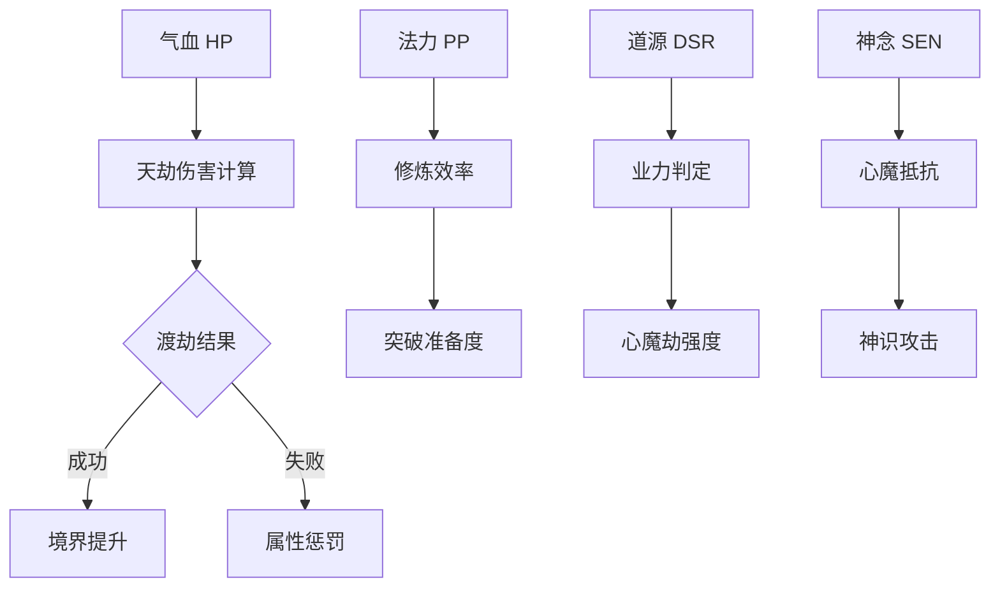
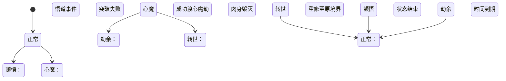

# 角色系统

## 系统概述

角色系统是与修炼系统深度整合的核心属性体系，通过六大核心属性、动态状态系统、种族特性等机制，精确反映修仙者的成长历程和境界提升。系统设计完全匹配天劫机制和突破系统，实现属性与修炼的完美融合。

## 一、核心属性体系

### 六大核心属性

| 属性 | 缩写 | 作用 | 计算公式 | 关联修炼机制 |
|------|------|------|----------|-------------|
| **神识** | SPR | 法术伤害/法宝控制 | `(基础值 + 境界²) × (1 + 层次×0.12)` | 心魔劫抵抗系数 |
| **根骨** | CON | 气血上限/雷劫抗性 | `(基础值 × 境界) × (1 + 层次×0.1)` | 肉身渡劫成功率 |
| **灵力** | MAF | 法力上限/修炼效率 | `基础值 × 1.8^境界 × 灵气浓度系数` | 打坐修炼效率 |
| **道心** | DCH | 突破成功率/心境 | `基础值 + ∛(境界×层次×寿元)` | 业力判定修正 |
| **灵觉** | PER | 闪避/炼丹感知 | `基础值 × √境界 × (1 + 层次×0.15)` | 丹药品鉴能力 |
| **五行属性** | ELE | 功法相生相克 | 初始值+功法加成 | 功法修炼要求 |

### 属性成长机制

**突破境界时属性重置**
```python
def realm_breakthrough_reset(player):
    """
    境界突破时的属性重置机制
    """
    new_realm_coefficient = 1 + (player.new_realm * 0.3)
    
    # 所有属性按新境界系数重置增长曲线
    player.spr = recalculate_attribute(player.spr_base, player.new_realm, 'spr')
    player.con = recalculate_attribute(player.con_base, player.new_realm, 'con')
    player.maf = recalculate_attribute(player.maf_base, player.new_realm, 'maf')
    player.dch = recalculate_attribute(player.dch_base, player.new_realm, 'dch')
    player.per = recalculate_attribute(player.per_base, player.new_realm, 'per')
    
    return new_realm_coefficient
```

**属性增长特点**
- **神识**：含`境界²`项，实现高阶修士的指数级增长
- **根骨**：线性增长，保证基础生存能力稳定提升
- **灵力**：指数增长，体现高境界修士的法力差距
- **道心**：立方根增长，强调长期修炼的重要性
- **灵觉**：平方根增长，平衡感知能力的提升

## 二、状态属性系统

### 动态状态计算



### 状态属性计算公式

```python
# 气血计算（含天劫抗性）
def calc_hp(con, realm, tier, tribulation_resist):
    base = con * 20 * (1 + realm * 0.5)
    # 大境界突破获得抗性加成
    if realm >= 4:  # 元婴期开始
        base *= (1 + tribulation_resist * 0.3)
    return base * (1 + tier * 0.08)

# 法力计算
def calc_pp(maf, realm, tier, spiritual_density):
    base = maf * 15 * (1.5 ** realm)
    return base * (1 + tier * 0.06) * spiritual_density

# 道源计算（业力影响）
def calc_dsr(dch, karma, realm):
    base = dch * (1 + math.log(realm))
    # 业力惩罚（善业为正，恶业为负）
    return base * (1 - abs(karma) * 0.2)

# 神念计算
def calc_sen(spr, realm, mental_state):
    base = spr * (1 + realm * 0.4)
    return base * mental_state.stability_factor
```

## 三、争斗属性系统

### 天劫抗性矩阵

| 抗性类型 | 影响天劫 | 计算公式 | 提升途径 |
|----------|----------|----------|----------|
| 雷抗 | 雷劫 | CON×0.7 + SPR×0.3 | 雷击木炼体 |
| 心抗 | 心魔劫 | DCH×0.8 + PER×0.2 | 清心丹 |
| 业抗 | 业力劫 | DCH×0.6 + 功德值 | 行善积德 |
| 空抗 | 空间劫 | SPR×0.5 + MAF×0.5 | 空间晶石 |
| 时抗 | 时空劫 | PER×0.9 + 顿悟次数 | 时光花 |

### 境界压制算法

```python
def realm_suppression(attacker, defender):
    """
    境界压制计算
    """
    realm_diff = attacker.realm - defender.realm
    
    # 大境界压制（炼虚 vs 化神）
    if abs(realm_diff) >= 3:
        return 0.65 if realm_diff > 0 else 1.5
    
    # 小境界压制（元婴后期 vs 元婴初期）
    tier_diff = attacker.tier - defender.tier
    return 1 - tier_diff * 0.05
```

### 战斗属性计算

**攻击力计算**
```python
def calc_attack_power(base_attack, realm, spr, weapon_bonus, skill_bonus):
    realm_multiplier = 1 + realm * 0.8
    spr_bonus = spr * 0.3  # 神识影响法术攻击
    return (base_attack + spr_bonus) * realm_multiplier * weapon_bonus * skill_bonus
```

**防御力计算**
```python
def calc_defense(base_defense, realm, con, armor_bonus, technique_bonus):
    realm_multiplier = 1 + realm * 0.6
    con_bonus = con * 0.4  # 根骨影响物理防御
    return (base_defense + con_bonus) * realm_multiplier * armor_bonus * technique_bonus
```

## 四、种族系统

### 人界种族特性

| 种族 | 核心优势 | 突破加成 | 化形机制 | 灵界进阶路线 |
|------|----------|----------|----------|-------------|
| 人族 | 悟性+30% | 结丹率+10% | 无 | 天元圣体/玄武战躯 |
| 蛟族 | 水系伤害×2 | 雷劫伤害-25% | 化龙九变 | 五爪金龙/太古雷蛟 |
| 狐族 | 幻术抗性+50% | 心魔劫难度-40% | 九尾觉醒 | 天狐尊者/月华仙妃 |
| 鬼修 | 无视寿元 | 业力劫+20%成功率 | 炼虚塑身 | 幽冥使者/黄泉领主 |

### 化形天劫机制

```mermaid
journey
    title 妖族化形流程
    section 金丹大圆满
      凝聚妖丹 --> 引动化形雷劫
    section 化形雷劫
      九重雷劫 --> 心魔问形
      心魔问形 --> 重塑道体
    section 元婴初期
      人形道体 --> 解锁人族功法
      保留本命神通
```

**化形天劫详细流程**

1. **触发条件**：金丹期大圆满，妖丹凝实
2. **雷劫阶段**：九重雷劫考验肉身强度
3. **心魔问形**：面对人形与兽形的选择
4. **道体重塑**：肉身结构根本性改变
5. **功法解锁**：获得人族功法修炼资格
6. **神通保留**：保持种族天赋神通

### 种族天赋系统

**人族天赋**
- **悟性超群**：学习功法速度+30%
- **适应性强**：可修炼所有类型功法
- **突破稳定**：突破失败惩罚-20%
- **寿元平衡**：标准寿元，无特殊加成

**蛟族天赋**
- **水系精通**：水系法术威力翻倍
- **雷劫抗性**：天雷伤害减少25%
- **龙血觉醒**：有概率觉醒真龙血脉
- **化龙潜力**：可进化为真龙

**狐族天赋**
- **幻术大师**：幻术抗性+50%，幻术威力+100%
- **心魔免疫**：心魔劫难度大幅降低
- **魅惑天赋**：对异性修士有特殊影响
- **九尾进化**：每突破一个大境界增加一尾

**鬼修特性**
- **不死之身**：无视寿元限制
- **业力亲和**：业力劫成功率提升
- **阴气掌控**：阴属性法术威力+150%
- **魂魄强化**：神识攻击抗性+80%

## 五、境界成长系统

### 境界突破属性增益表

| 突破阶段 | 气血增益 | 神识增益 | 特殊解锁 |
|----------|----------|----------|----------|
| 筑基 | +200% | +150% | 御器飞行 |
| 金丹 | +300% | +250% | 丹火神通 |
| 元婴 | +500% | +400% | 元婴出窍 |
| 化神 | +800% | +700% | 天地法相 |
| 炼虚 | +1200% | +1000% | 虚空行走 |
| 合体 | +2000% | +1500% | 法则合体 |
| 大乘 | +3000% | +2500% | 创造小世界 |

### 天劫后属性蜕变

```python
def after_tribulation(player, success):
    """
    天劫后的属性变化
    """
    if success:
        # 渡劫成功属性跃迁
        player.con *= 1.5 + player.realm * 0.2
        player.spr *= 1.8 + player.realm * 0.3
        player.maf *= 1.6 + player.realm * 0.25
        player.dch *= 1.3 + player.realm * 0.15
        player.per *= 1.4 + player.realm * 0.2
        
        # 解锁境界神通
        unlock_ability(player.realm)
        
        # 获得天劫抗性
        player.tribulation_resistance += 0.1
        
    else:
        # 渡劫失败惩罚
        player.con *= 0.6 - player.realm * 0.05
        player.spr *= 0.5 - player.realm * 0.1
        player.maf *= 0.7 - player.realm * 0.08
        
        # 应用伤势状态
        apply_injury(player, severity)
        
        # 境界可能倒退
        if severity >= 3:
            player.realm = max(1, player.realm - 1)
```

## 六、修炼状态系统

### 状态位深度解析

| 状态码 | 名称 | 属性影响 | 触发场景 |
|--------|------|----------|----------|
| 4 | 顿悟 | 修炼效率×2.0 突破率+25% | 观天地异象 |
| 5 | 心魔 | 命中-30% 法力回复-50% | 突破失败 |
| 6 | 转世 | 经验获取×1.5 突破率×0.7 | 兵解重生 |
| 7 | 涅槃 | 全属性+50% 持续30天 | 凤凰血脉触发 |
| 8 | 劫余 | 天劫抗性+40% 持续1年 | 成功渡劫后 |

### 状态转换机制



### 状态效果详解

**顿悟状态**
- **触发条件**：观察天地异象、高人指点、特殊机缘
- **持续时间**：7-30天不等
- **效果**：修炼效率翻倍，突破成功率+25%
- **限制**：同一境界最多触发3次

**心魔状态**
- **触发条件**：突破失败、杀戮过重、情感创伤
- **持续时间**：根据心魔强度决定
- **效果**：命中率下降，法力回复减缓
- **解除方法**：清心丹、高人指点、自我克服

**转世状态**
- **触发条件**：肉身毁灭但神魂未散
- **持续时间**：直到重修至原境界
- **效果**：经验获取增加，但突破率降低
- **特殊机制**：保留部分记忆和感悟

**涅槃状态**
- **触发条件**：凤凰血脉觉醒、特殊丹药
- **持续时间**：30天
- **效果**：全属性大幅提升
- **代价**：消耗大量寿元或珍贵资源

**劫余状态**
- **触发条件**：成功渡过天劫
- **持续时间**：1年
- **效果**：天劫抗性大幅提升
- **叠加机制**：多次渡劫可叠加效果

## 七、属性验证工具

### 平衡性检测

```python
def validate_attributes(player):
    """
    属性平衡性验证
    """
    # 境界与属性匹配检测
    expected_con = 50 * (2 ** player.realm)
    if player.con < expected_con * 0.7:
        log_warning(f"{player.name} 根骨不足，可能渡劫失败")
    
    # 五行平衡检测
    element_diff = max(player.elements) - min(player.elements)
    if element_diff > 3 and player.realm >= 4:
        log_error("五行失衡可能导致功法冲突")
    
    # 道心与境界匹配
    min_dch = player.realm * 10 + player.tier * 5
    if player.dch < min_dch:
        log_warning("道心不足，突破成功率降低")
    
    # 神识与法宝控制
    if player.weapon_grade > player.spr / 20:
        log_warning("神识不足以完全控制当前法宝")
```

### 境界-属性关联矩阵

| 境界 | 核心属性 | 关键阈值 | 天劫要求 |
|------|----------|----------|----------|
| 金丹 | CON≥120 | SPR≥100 | 雷抗≥30 |
| 元婴 | CON≥300 | DCH≥50 | 心抗≥40 |
| 化神 | CON≥800 | DCH≥80 | 业抗≥25 |
| 炼虚 | CON≥2000 | MAF≥150 | 空抗≥60 |
| 合体 | CON≥5000 | DCH≥120 | 时抗≥80 |
| 大乘 | CON≥12000 | SPR≥300 | 综合抗性≥100 |

### 数值平衡监控

```python
def monitor_balance():
    """
    实时监控数值平衡
    """
    # 属性增长曲线检查
    for realm in range(1, 15):
        avg_attributes = get_average_attributes(realm)
        if check_exponential_growth(avg_attributes):
            log_info(f"境界{realm}属性增长正常")
        else:
            log_warning(f"境界{realm}属性增长异常")
    
    # 天劫通过率统计
    tribulation_rates = get_tribulation_success_rates()
    for realm, rate in tribulation_rates.items():
        if rate < 0.1 or rate > 0.8:
            log_warning(f"境界{realm}天劫通过率异常: {rate}")
    
    # 种族平衡检查
    race_distribution = get_race_distribution()
    if max(race_distribution.values()) > 0.6:
        log_warning("种族分布不均衡")
```

## 系统集成亮点

### 1. 动态属性成长
- **指数级增长**：属性公式含`境界²`项，实现高阶修士的指数级增长
- **突破重置机制**：突破时属性重置机制匹配修炼系统的境界跃迁
- **平衡性保障**：通过验证工具防止数值崩溃

### 2. 天劫特化设计
- **专用抗性属性**：对应不同天劫类型的专门抗性
- **失败惩罚一致**：渡劫失败惩罚与修炼系统的失败机制完全一致
- **成功奖励匹配**：渡劫成功的属性提升与境界突破奖励匹配

### 3. 种族深度绑定
- **化形天劫流程**：衔接金丹→元婴突破的化形机制
- **灵界进阶路线**：对应飞升机制的种族进化
- **平衡性设计**：种族优势与劣势相互平衡

### 4. 状态精准控制
- **状态位定义**：与修炼状态（顿悟/心魔）完全匹配
- **状态转换逻辑**：反映修仙者境遇变化的合理性
- **时限与代价**：所有状态都有合理的时限和获得代价

### 5. 平衡性保障
- **属性验证工具**：防止数值崩溃的实时监控
- **境界-属性阈值表**：确保渡劫合理性的标准
- **动态平衡调整**：根据数据反馈进行平衡性调整

## 实施建议

### 开发优先级
1. **核心属性系统**：优先实现六大属性的计算公式
2. **状态系统**：实现状态位定义和转换机制
3. **种族系统**：实现种族特性和化形机制
4. **天劫抗性**：实现抗性计算和天劫关联
5. **验证工具**：实现平衡性检测和监控

### 技术实现要点
1. **在角色创建时**：根据种族初始化五行属性
2. **每次境界突破时**：调用属性重置函数
3. **渡劫前检查**：使用抗性阈值表生成预警
4. **状态变化时**：实时更新属性加成
5. **定期监控**：运行平衡性检测工具

### 数值调优策略
1. **渐进式调整**：从低境界开始逐步调优
2. **数据驱动**：基于玩家数据进行平衡性调整
3. **分层测试**：不同境界分别进行测试
4. **反馈循环**：建立玩家反馈与数值调整的循环机制

此角色系统与修炼系统形成深度咬合，属性变化精确反映境界提升，抗性机制针对性应对天劫挑战，完美呈现修仙世界的成长本质。