# 流程图与架构图使用指南

## 概述

本文档系统支持使用Mermaid语法创建各种类型的图表，包括流程图、架构图、时序图等。这些图表可以帮助更好地展示系统设计、业务流程和技术架构。

## Mermaid支持状态

✅ **当前支持的图表类型**：
- 流程图 (Flowchart)
- 时序图 (Sequence Diagram)
- 甘特图 (Gantt Chart)
- 类图 (Class Diagram)
- 状态图 (State Diagram)
- 用户旅程图 (User Journey)
- Git图 (Git Graph)
- 饼图 (Pie Chart)

## 基础语法示例

### 1. 流程图 (Flowchart)

#### 基础流程图
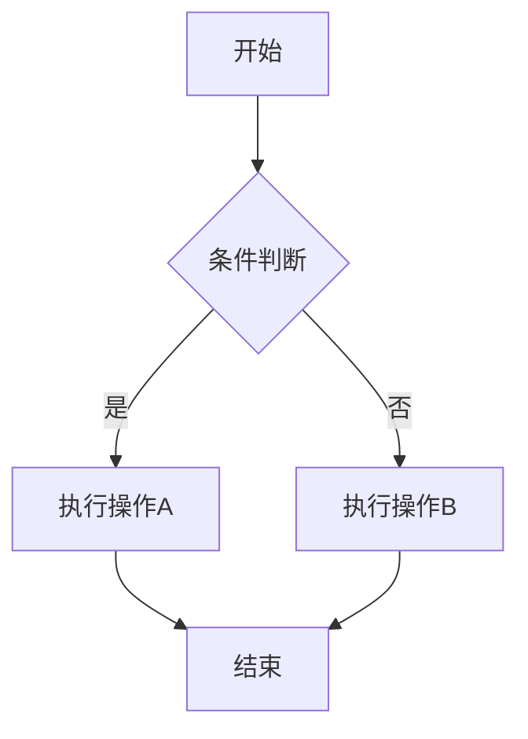

#### 复杂业务流程（修仙系统示例）
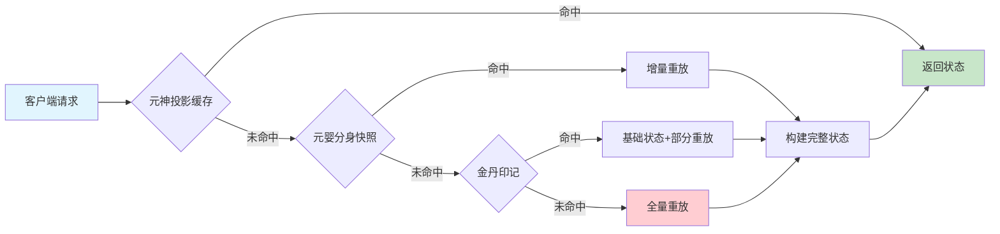

### 2. 系统架构图

#### 微服务架构
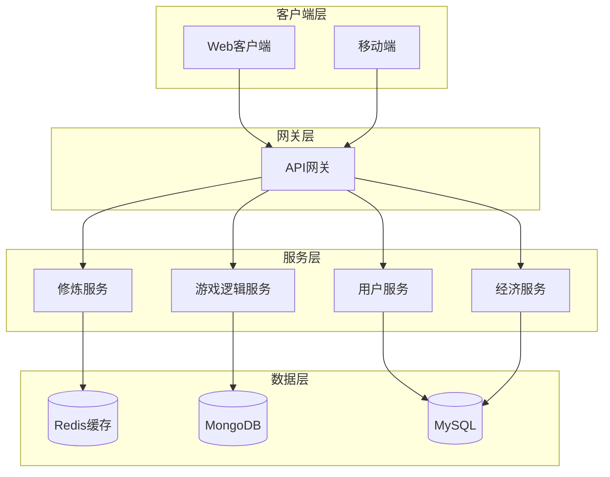

### 3. 时序图 (Sequence Diagram)

#### 用户登录时序
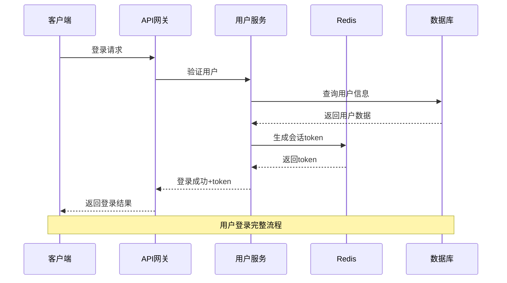

#### 修炼系统交互时序
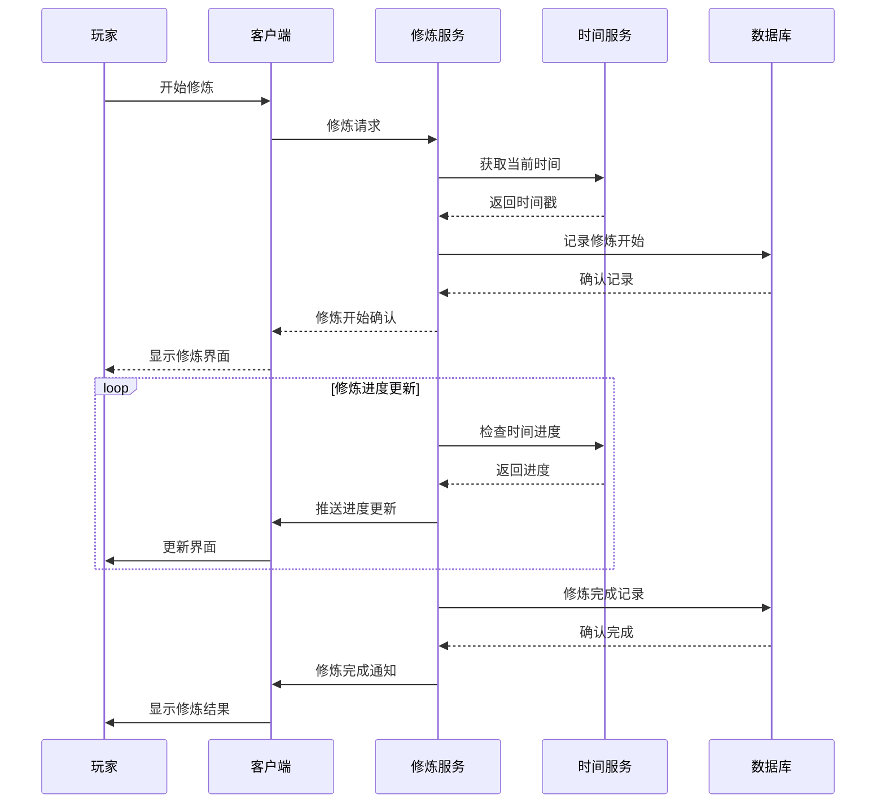

### 4. 状态图 (State Diagram)

#### 角色状态转换
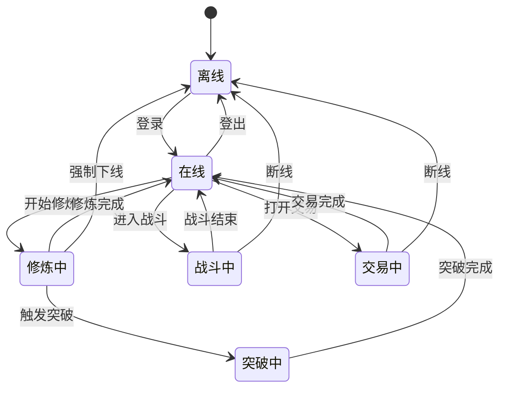

### 5. 类图 (Class Diagram)

#### 角色系统类设计
```mermaid
classDiagram
    class Character {
        +String id
        +String name
        +Int level
        +Int cultivation_stage
        +Float spiritual_power
        +Float health
        +Float mana
        +cultivate()
        +levelUp()
        +takeDamage(amount)
    }
    
    class Equipment {
        +String id
        +String name
        +Int quality
        +Int enhancement_level
        +Map attributes
        +enhance()
        +repair()
    }
    
    class Skill {
        +String id
        +String name
        +Int level
        +Float cooldown
        +Float mana_cost
        +cast(target)
        +upgrade()
    }
    
    class Inventory {
        +Int capacity
        +List items
        +addItem(item)
        +removeItem(item)
        +findItem(id)
    }
    
    Character ||--o{ Equipment : 装备
    Character ||--o{ Skill : 拥有技能
    Character ||--|| Inventory : 拥有背包
```

### 6. 甘特图 (Gantt Chart)

#### 项目开发计划
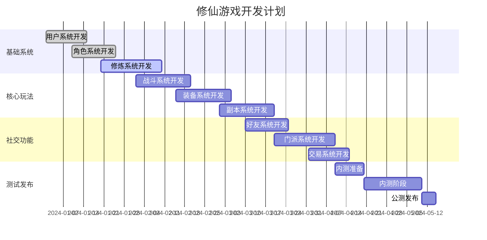

### 7. 用户旅程图 (User Journey)

#### 新手玩家体验旅程
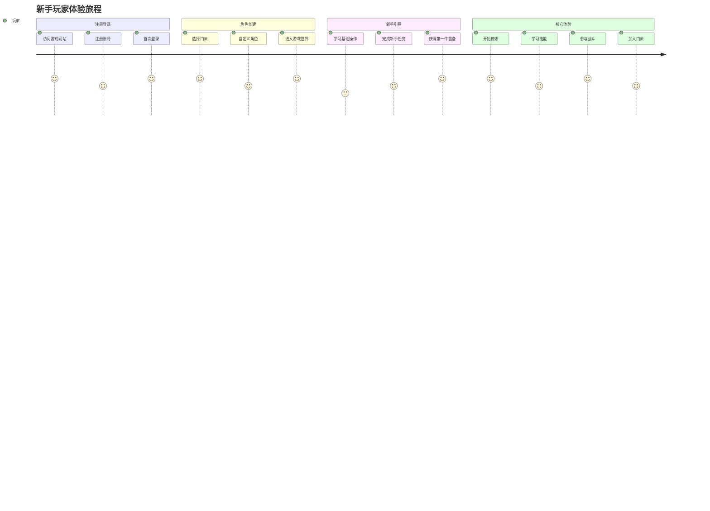

### 8. 饼图 (Pie Chart)

#### 玩家活跃度分布
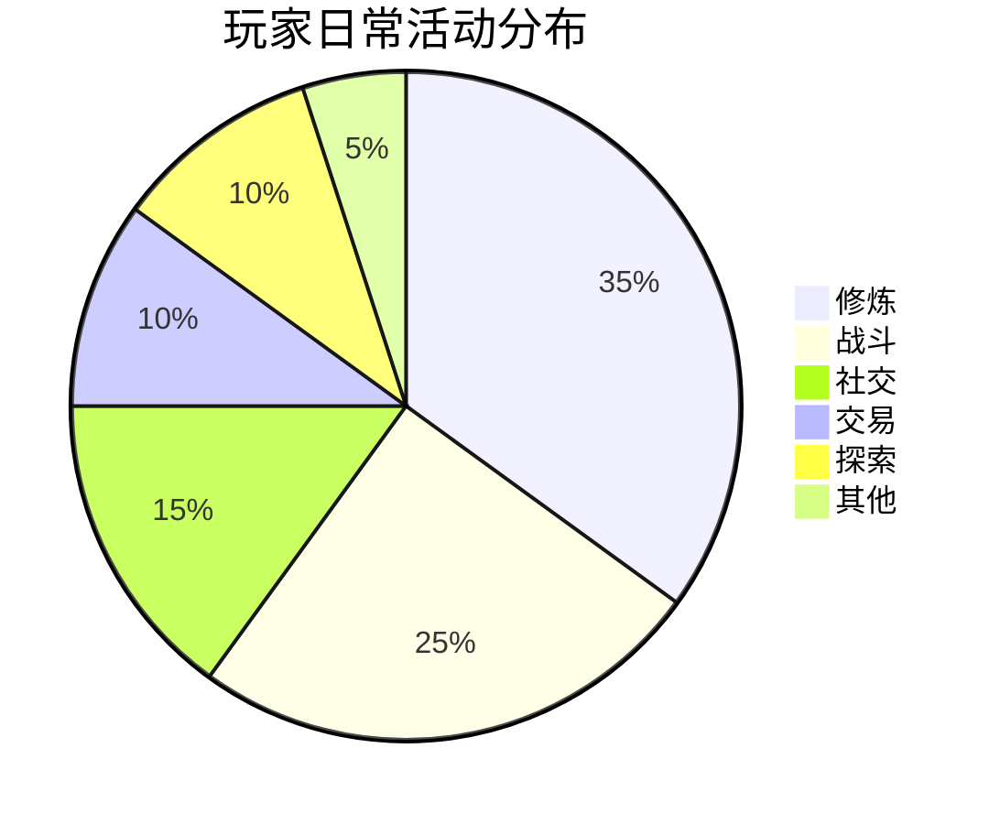

## 高级技巧

### 1. 样式自定义

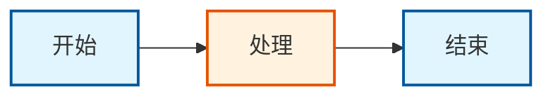

### 2. 子图分组

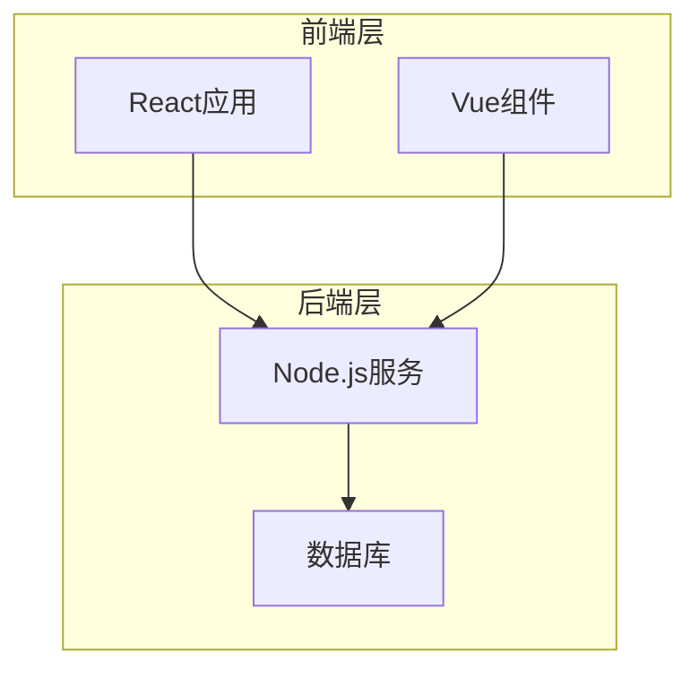

### 3. 链接样式


## 最佳实践

### 1. 图表设计原则
- **简洁明了**：避免过于复杂的图表
- **逻辑清晰**：流程方向要明确
- **标注完整**：重要节点要有说明
- **样式统一**：保持视觉风格一致

### 2. 性能考虑
- 大型图表考虑分页或分层展示
- 避免在单个图表中包含过多节点
- 合理使用子图进行分组

### 3. 维护建议
- 定期更新图表内容
- 保持图表与实际系统同步
- 添加版本说明和更新日期

## 常见问题

### Q: 图表不显示怎么办？
A: 检查Mermaid语法是否正确，确保代码块使用```mermaid标记。

### Q: 如何自定义图表样式？
A: 使用classDef定义样式类，然后用class应用到节点上。

### Q: 支持哪些图表类型？
A: 支持flowchart、sequence、gantt、class、state、journey、pie等多种类型。

### Q: 图表太大如何处理？
A: 可以使用子图分组，或者将大图拆分为多个小图。

## 参考资源

- [Mermaid官方文档](https://mermaid.js.org/)
- [VitePress Mermaid支持](https://vitepress.dev/guide/markdown#mermaid)
- [图表设计最佳实践](https://mermaid.js.org/config/theming.html)

---

通过以上示例和指南，你可以在文档中创建各种类型的图表来更好地展示系统设计和业务流程。记住保持图表简洁明了，并定期更新以保持与实际系统的同步。