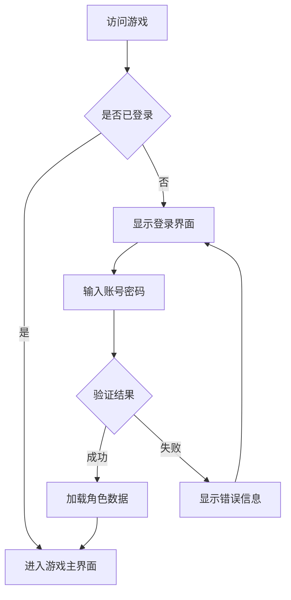
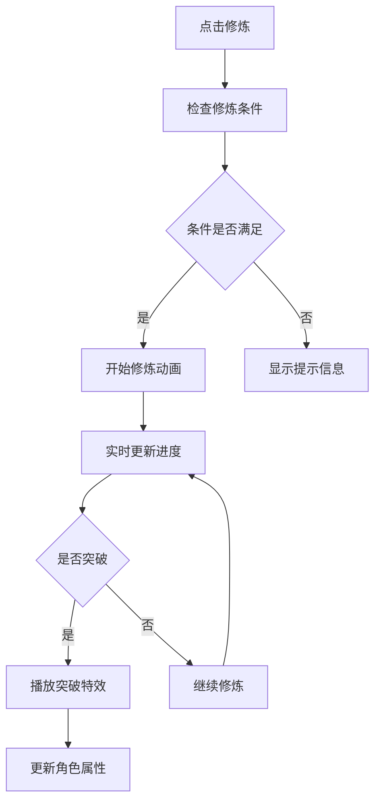
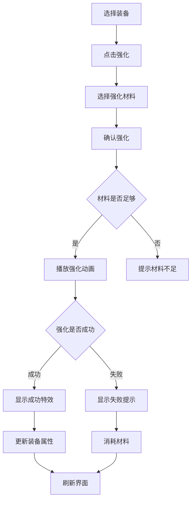

# 交互设计

## 交互原则

### 直观性
- **符合用户习惯**: 遵循Web应用常见交互模式
- **视觉引导**: 通过颜色、大小、位置引导用户操作
- **即时反馈**: 每个操作都有明确的视觉反馈

### 一致性
- **操作一致**: 相同功能在不同页面保持一致的操作方式
- **视觉一致**: 统一的按钮样式、颜色方案、字体规范
- **行为一致**: 相似元素具有相似的交互行为

### 效率性
- **快捷操作**: 提供键盘快捷键和右键菜单
- **批量操作**: 支持多选和批量处理
- **记忆功能**: 记住用户的操作偏好

## 核心交互流程

### 用户登录流程

### 修炼系统交互

### 装备强化流程

## 页面交互设计

### 主界面交互

#### 导航交互
- **悬停效果**: 菜单项悬停时显示子菜单
- **激活状态**: 当前页面菜单项高亮显示
- **面包屑**: 显示当前位置路径

#### 快捷操作
- **右键菜单**: 常用功能快捷入口
- **拖拽操作**: 装备、道具的拖拽使用
- **双击操作**: 快速使用或装备物品

### 列表交互

#### 数据表格
- **排序**: 点击表头进行排序
- **筛选**: 提供筛选条件
- **分页**: 大数据量分页显示
- **多选**: 支持批量操作

#### 虚拟滚动
- **无限滚动**: 自动加载更多数据
- **回到顶部**: 快速返回列表顶部
- **位置记忆**: 记住滚动位置

### 表单交互

#### 输入验证
- **实时验证**: 输入时即时验证
- **错误提示**: 明确的错误信息
- **成功反馈**: 验证通过的视觉反馈

#### 自动完成
- **搜索建议**: 输入时显示相关建议
- **历史记录**: 显示历史输入
- **智能匹配**: 模糊匹配功能

## 手势和快捷键

### 键盘快捷键

#### 全局快捷键
- `Ctrl + /`: 显示快捷键帮助
- `Ctrl + K`: 快速搜索
- `Esc`: 关闭当前弹窗
- `F5`: 刷新当前页面

#### 功能快捷键
- `C`: 打开角色面板
- `I`: 打开背包界面
- `M`: 打开地图
- `T`: 打开任务列表
- `G`: 打开公会界面
- `P`: 打开PVP界面

#### 修炼快捷键
- `Space`: 开始/停止修炼
- `1-9`: 快速选择功法
- `Q`: 使用丹药辅助

### 鼠标交互

#### 基础操作
- **左键**: 选择、点击
- **右键**: 上下文菜单
- **中键**: 滚动、平移
- **双击**: 快速操作

#### 拖拽操作
- **装备拖拽**: 装备到角色身上
- **道具拖拽**: 使用或移动道具
- **技能拖拽**: 设置技能快捷栏

### 触摸交互（移动端）

#### 基础手势
- **点击**: 选择操作
- **长按**: 显示详细信息
- **滑动**: 切换页面或滚动
- **双击**: 快速操作

#### 多点触控
- **缩放**: 地图缩放
- **旋转**: 3D模型查看

## 反馈机制

### 视觉反馈

#### 状态指示
- **加载状态**: 进度条、旋转图标
- **成功状态**: 绿色勾选、成功动画
- **错误状态**: 红色警告、错误图标
- **警告状态**: 黄色提醒、注意图标

#### 动画效果
- **页面切换**: 平滑过渡动画
- **元素出现**: 淡入、滑入效果
- **操作反馈**: 按钮按压、悬停效果
- **数据更新**: 高亮闪烁、数值变化动画

### 音效反馈

#### 操作音效
- **点击音效**: 按钮点击声
- **成功音效**: 操作成功提示音
- **错误音效**: 操作失败警告音
- **特殊音效**: 突破、获得稀有物品等

#### 环境音效
- **背景音乐**: 符合场景的背景音
- **环境音**: 修炼、战斗等环境音效

### 触觉反馈（移动端）

#### 震动反馈
- **轻微震动**: 按钮点击
- **中等震动**: 重要操作确认
- **强烈震动**: 警告或特殊事件

## 错误处理

### 错误预防

#### 输入验证
- **格式检查**: 确保输入格式正确
- **范围检查**: 确保数值在有效范围内
- **必填检查**: 确保必要信息已填写

#### 操作确认
- **危险操作**: 删除、消费等操作需要确认
- **不可逆操作**: 提供明确的警告信息
- **批量操作**: 显示操作影响范围

### 错误恢复

#### 自动恢复
- **网络重连**: 自动重试网络请求
- **数据同步**: 自动同步本地数据
- **状态恢复**: 恢复用户操作状态

#### 手动恢复
- **重试按钮**: 提供重试操作选项
- **刷新功能**: 手动刷新页面或数据
- **回退功能**: 撤销错误操作

### 错误提示

#### 提示内容
- **错误原因**: 明确说明错误原因
- **解决方案**: 提供具体的解决建议
- **联系方式**: 提供技术支持联系方式

#### 提示方式
- **弹窗提示**: 重要错误信息
- **内联提示**: 表单验证错误
- **状态栏提示**: 一般性提示信息

## 性能优化

### 交互性能

#### 响应时间
- **即时反馈**: <100ms 的视觉反馈
- **快速响应**: <300ms 的操作响应
- **可接受延迟**: <1s 的数据加载

#### 动画性能
- **硬件加速**: 使用CSS3 transform
- **帧率控制**: 保持60fps流畅动画
- **动画优化**: 避免重排和重绘

### 内存优化

#### 事件管理
- **事件委托**: 减少事件监听器数量
- **及时清理**: 移除不需要的事件监听
- **防抖节流**: 控制事件触发频率

#### 资源管理
- **按需加载**: 只加载当前需要的资源
- **缓存策略**: 合理缓存常用资源
- **内存释放**: 及时释放不用的资源