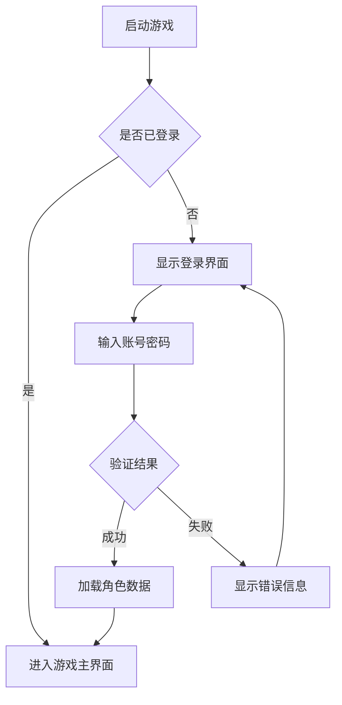
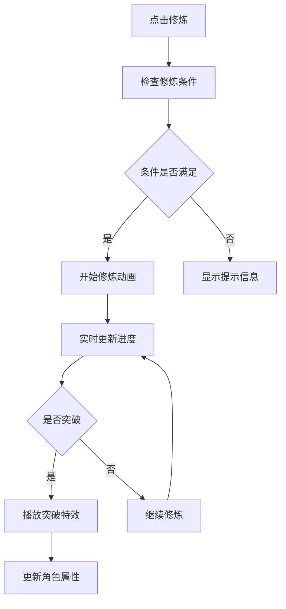
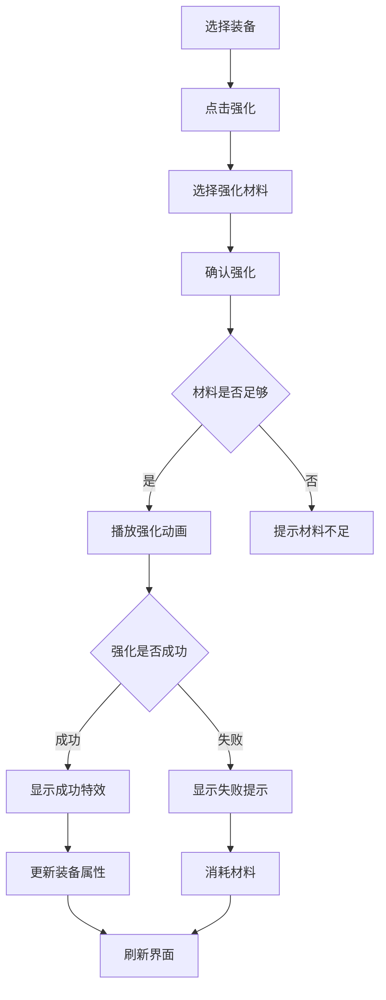

# 交互设计

## 交互原则

### 直观性
- **符合用户习惯**: 遵循游戏常见交互模式
- **视觉引导**: 通过颜色、大小、位置引导用户操作
- **即时反馈**: 每个操作都有明确的视觉反馈

### 一致性
- **操作一致**: 相同功能在不同界面保持一致的操作方式
- **视觉一致**: 统一的按钮样式、颜色方案、字体规范
- **行为一致**: 相似元素具有相似的交互行为

### 效率性
- **快捷操作**: 提供键盘快捷键和右键菜单
- **批量操作**: 支持多选和批量处理
- **记忆功能**: 记住用户的操作偏好

## 核心交互流程

### 用户登录流程


```mermaid
flowchart TD
    A[启动游戏] --> B{是否已登录}
    B -->|是| C[进入游戏主界面]
    B -->|否| D[显示登录界面]
    D --> E[输入账号密码]
    E --> F{验证结果}
    F -->|成功| G[加载角色数据]
    F -->|失败| H[显示错误信息]
    H --> D
    G --> C
```

### 修炼系统交互


```mermaid
flowchart TD
    A[点击修炼] --> B[检查修炼条件]
    B --> C{条件是否满足}
    C -->|是| D[开始修炼动画]
    C -->|否| E[显示提示信息]
    D --> F[实时更新进度]
    F --> G{是否突破}
    G -->|是| H[播放突破特效]
    G -->|否| I[继续修炼]
    H --> J[更新角色属性]
    I --> F
```

### 装备强化流程


```mermaid
flowchart TD
    A[选择装备] --> B[点击强化]
    B --> C[选择强化材料]
    C --> D[确认强化]
    D --> E{材料是否足够}
    E -->|是| F[播放强化动画]
    E -->|否| G[提示材料不足]
    F --> H{强化是否成功}
    H -->|成功| I[显示成功特效]
    H -->|失败| J[显示失败提示]
    I --> K[更新装备属性]
    J --> L[消耗材料]
    K --> M[刷新界面]
    L --> M
```

## 界面交互设计

### 主界面交互

#### 导航交互
- **悬停效果**: 菜单项悬停时显示子菜单（Unity Event Trigger / IPointerEnterHandler）
- **激活状态**: 当前界面菜单项高亮显示（UGUI Button selection state）
- **面包屑**: 显示当前位置路径（UGUI Text层级显示）

#### 快捷操作
- **右键菜单**: 常用功能快捷入口（Unity Context Menu / IPointerClickHandler）
- **拖拽操作**: 装备、道具的拖拽使用（IBeginDragHandler, IDragHandler, IEndDragHandler）
- **双击操作**: 快速使用或装备物品（IPointerClickHandler检测双击）

### 列表交互

#### 数据表格
- **排序**: 点击表头进行排序（UGUI Button + C#排序逻辑）
- **筛选**: 提供筛选条件（UGUI Dropdown + Toggle）
- **分页**: 大数据量分页显示（C#分页逻辑 + UGUI Button）
- **多选**: 支持批量操作（UGUI Toggle + ToggleGroup）

#### ScrollRect优化
- **无限滚动**: 对象池自动回收复用（Unity ScrollRect + 对象池模式）
- **回到顶部**: 快速返回列表顶部（DOTween动画滚动到顶部）
- **位置记忆**: 记住滚动位置（C#记录normalizedPosition）

### 表单交互

#### 输入验证
- **实时验证**: 输入时即时验证（UGUI InputField onValueChanged事件）
- **错误提示**: 明确的错误信息（UGUI Text显示错误提示）
- **成功反馈**: 验证通过的视觉反馈（UGUI Image颜色变化）

#### 自动完成
- **搜索建议**: 输入时显示相关建议（C#模糊匹配 + UGUI动态列表）
- **历史记录**: 显示历史输入（ScriptableObject持久化存储）
- **智能匹配**: 模糊匹配功能（C#字符串匹配算法）

## 手势和快捷键

### 键盘快捷键

#### 全局快捷键
- `Ctrl + /`: 显示快捷键帮助
- `Ctrl + K`: 快速搜索
- `Esc`: 关闭当前弹窗
- `F5`: 刷新当前界面

```csharp
// 全局快捷键处理（C# MonoBehaviour）
using UnityEngine;

public class GlobalHotkeys : MonoBehaviour
{
    private void Update()
    {
        // 显示快捷键帮助
        if (Input.GetKey(KeyCode.LeftControl) && Input.GetKeyDown(KeyCode.Slash))
        {
            UIManager.Instance.ShowHotkeyHelp();
        }

        // 快速搜索
        if (Input.GetKey(KeyCode.LeftControl) && Input.GetKeyDown(KeyCode.K))
        {
            UIManager.Instance.OpenSearchPanel();
        }

        // 关闭弹窗
        if (Input.GetKeyDown(KeyCode.Escape))
        {
            UIManager.Instance.CloseTopPanel();
        }

        // 刷新界面
        if (Input.GetKeyDown(KeyCode.F5))
        {
            UIManager.Instance.RefreshCurrentView();
        }
    }
}
```

#### 功能快捷键
- `C`: 打开角色面板
- `I`: 打开背包界面
- `M`: 打开地图
- `T`: 打开任务列表
- `G`: 打开公会界面
- `P`: 打开PVP界面

```csharp
// 功能快捷键处理
using UnityEngine;

public class FunctionHotkeys : MonoBehaviour
{
    private void Update()
    {
        if (Input.GetKeyDown(KeyCode.C)) UIManager.Instance.OpenPanel(PanelType.Character);
        if (Input.GetKeyDown(KeyCode.I)) UIManager.Instance.OpenPanel(PanelType.Inventory);
        if (Input.GetKeyDown(KeyCode.M)) UIManager.Instance.OpenPanel(PanelType.Map);
        if (Input.GetKeyDown(KeyCode.T)) UIManager.Instance.OpenPanel(PanelType.Quest);
        if (Input.GetKeyDown(KeyCode.G)) UIManager.Instance.OpenPanel(PanelType.Guild);
        if (Input.GetKeyDown(KeyCode.P)) UIManager.Instance.OpenPanel(PanelType.PvP);
    }
}
```

#### 修炼快捷键
- `Space`: 开始/停止修炼
- `1-9`: 快速选择功法
- `Q`: 使用丹药辅助

```csharp
// 修炼快捷键处理
using UnityEngine;

public class CultivationHotkeys : MonoBehaviour
{
    private void Update()
    {
        if (Input.GetKeyDown(KeyCode.Space))
        {
            CultivationManager.Instance.ToggleCultivation();
        }

        // 数字键1-9选择功法
        for (int i = 1; i <= 9; i++)
        {
            if (Input.GetKeyDown(KeyCode.Alpha0 + i) || Input.GetKeyDown(KeyCode.Keypad0 + i))
            {
                CultivationManager.Instance.SelectTechnique(i - 1);
            }
        }

        if (Input.GetKeyDown(KeyCode.Q))
        {
            CultivationManager.Instance.UsePillAssist();
        }
    }
}
```

### 鼠标交互

#### 基础操作
- **左键**: 选择、点击（IPointerClickHandler）
- **右键**: 上下文菜单（IPointerClickHandler检测右键）
- **中键**: 滚动、平移（IScrollHandler）
- **双击**: 快速操作（IPointerClickHandler检测双击）

```csharp
// 鼠标交互处理（C# MonoBehaviour + Unity Event System）
using UnityEngine;
using UnityEngine.EventSystems;

public class ItemSlotInteraction : MonoBehaviour,
    IPointerClickHandler, IPointerEnterHandler, IPointerExitHandler
{
    [SerializeField] private ItemData item;

    public void OnPointerClick(PointerEventData eventData)
    {
        if (eventData.button == PointerEventData.InputButton.Left)
        {
            if (eventData.clickCount == 2)
            {
                // 双击 - 快速使用
                InventoryManager.Instance.UseItem(item);
            }
            else
            {
                // 单击 - 选中
                InventoryManager.Instance.SelectItem(item);
            }
        }
        else if (eventData.button == PointerEventData.InputButton.Right)
        {
            // 右键 - 显示上下文菜单
            ContextMenuManager.Instance.ShowMenu(item, eventData.position);
        }
    }

    public void OnPointerEnter(PointerEventData eventData)
    {
        // 悬停 - 显示Tooltip
        TooltipManager.Instance.Show(item.GetTooltipText());
    }

    public void OnPointerExit(PointerEventData eventData)
    {
        TooltipManager.Instance.Hide();
    }
}
```

#### 拖拽操作
- **装备拖拽**: 装备到角色身上
- **道具拖拽**: 使用或移动道具
- **技能拖拽**: 设置技能快捷栏

```csharp
// 拖拽操作处理（Unity Event System 拖拽接口）
using UnityEngine;
using UnityEngine.EventSystems;
using UnityEngine.UI;

public class DraggableItem : MonoBehaviour, IBeginDragHandler, IDragHandler, IEndDragHandler, IDropHandler
{
    [SerializeField] private Image icon;
    [SerializeField] private ItemData item;

    private Transform originalParent;
    private Vector3 originalPosition;

    public void OnBeginDrag(PointerEventData eventData)
    {
        originalParent = transform.parent;
        originalPosition = transform.position;
        // 拖拽时置顶显示
        transform.SetParent(UIManager.Instance.DragLayer);
        icon.raycastTarget = false;
    }

    public void OnDrag(PointerEventData eventData)
    {
        transform.position = Input.mousePosition;
    }

    public void OnEndDrag(PointerEventData eventData)
    {
        icon.raycastTarget = true;
        // 如果未放置到有效目标，回到原位
        if (transform.parent == UIManager.Instance.DragLayer)
        {
            transform.SetParent(originalParent);
            transform.position = originalPosition;
        }
    }

    public void OnDrop(PointerEventData eventData)
    {
        var draggedItem = eventData.pointerDrag.GetComponent<DraggableItem>();
        if (draggedItem != null)
        {
            // 交换道具位置
            InventoryManager.Instance.SwapItems(this.item, draggedItem.item);
        }
    }
}
```

### 触摸交互（移动端）

#### 基础手势
- **点击**: 选择操作（Unity TouchPhase.Began）
- **长按**: 显示详细信息（TouchPhase.Stationary + 时间判定）
- **滑动**: 切换页面或滚动（TouchPhase.Moved）
- **双击**: 快速操作（双次TouchPhase.Began检测）

```csharp
// 触摸交互处理（C# MonoBehaviour + Unity Input）
using UnityEngine;

public class TouchInteraction : MonoBehaviour
{
    [SerializeField] private float longPressThreshold = 0.5f;
    [SerializeField] private float doubleClickThreshold = 0.3f;

    private float touchTimer;
    private float lastClickTime;

    private void Update()
    {
        if (Input.touchCount == 1)
        {
            Touch touch = Input.GetTouch(0);

            switch (touch.phase)
            {
                case TouchPhase.Began:
                    touchTimer = 0f;
                    break;

                case TouchPhase.Stationary:
                    touchTimer += Time.deltaTime;
                    if (touchTimer >= longPressThreshold)
                    {
                        // 长按 - 显示详细信息
                        ShowItemDetails();
                    }
                    break;

                case TouchPhase.Ended:
                    if (touchTimer < longPressThreshold)
                    {
                        // 短按 - 判断单击或双击
                        if (Time.time - lastClickTime < doubleClickThreshold)
                        {
                            // 双击 - 快速操作
                            QuickAction();
                        }
                        else
                        {
                            // 单击 - 选择操作
                            SelectItem();
                        }
                        lastClickTime = Time.time;
                    }
                    break;

                case TouchPhase.Moved:
                    // 滑动 - 切换页面或滚动
                    HandleSwipe(touch.deltaPosition);
                    break;
            }
        }
    }

    private void ShowItemDetails() { /* ... */ }
    private void QuickAction() { /* ... */ }
    private void SelectItem() { /* ... */ }
    private void HandleSwipe(Vector2 delta) { /* ... */ }
}
```

#### 多点触控
- **缩放**: 地图缩放（双指Pinch手势）
- **旋转**: 3D模型查看（双指旋转手势）

## 反馈机制

### 视觉反馈

#### 状态指示
- **加载状态**: 进度条、旋转图标（UGUI Slider + 旋转动画）
- **成功状态**: 绿色勾选、成功动画（Sprite切换 + DOTween）
- **错误状态**: 红色警告、错误图标（Sprite切换 + 抖动动画）
- **警告状态**: 黄色提醒、注意图标

#### 动画效果
- **界面切换**: 平滑过渡动画（DOTween淡入淡出）
- **元素出现**: 淡入、滑入效果（DOTween移动+透明度）
- **操作反馈**: 按钮按压、悬停效果（DOTween缩放+颜色变化）
- **数据更新**: 高亮闪烁、数值变化动画（DOTween颜色循环+数值滚动）

### 音效反馈

#### 操作音效
- **点击音效**: 按钮点击声（AudioSource.PlayOneShot）
- **成功音效**: 操作成功提示音
- **错误音效**: 操作失败警告音
- **特殊音效**: 突破、获得稀有物品等

```csharp
// 音效管理器（C# Singleton Manager）
using UnityEngine;

public class AudioManager : MonoBehaviour
{
    public static AudioManager Instance { get; private set; }

    [SerializeField] private AudioSource audioSource;
    [SerializeField] private AudioClip buttonClickClip;
    [SerializeField] private AudioClip successClip;
    [SerializeField] private AudioClip errorClip;
    [SerializeField] private AudioClip breakthroughClip;

    private void Awake()
    {
        if (Instance == null) Instance = this;
    }

    public void PlayButtonClick()
    {
        audioSource.PlayOneShot(buttonClickClip);
    }

    public void PlaySuccess()
    {
        audioSource.PlayOneShot(successClip);
    }

    public void PlayError()
    {
        audioSource.PlayOneShot(errorClip);
    }

    public void PlayBreakthrough()
    {
        audioSource.PlayOneShot(breakthroughClip);
    }
}
```

#### 环境音效
- **背景音乐**: 符合场景的背景音（AudioSource循环播放）
- **环境音**: 修炼、战斗等环境音效

### 触觉反馈（移动端）

#### 震动反馈
- **轻微震动**: 按钮点击（Handheld.Vibrate短震动）
- **中等震动**: 重要操作确认
- **强烈震动**: 警告或特殊事件

```csharp
// 触觉反馈（C# MonoBehaviour）
using UnityEngine;

public class HapticFeedback : MonoBehaviour
{
    public void LightVibration()
    {
        #if UNITY_ANDROID || UNITY_IOS
        Handheld.Vibrate();
        #endif
    }

    // Android可使用更精细的震动控制
    public void Vibrate(long milliseconds)
    {
        #if UNITY_ANDROID
        var vibrator = new AndroidJavaObject("android.os.Vibrator");
        vibrator.Call("vibrate", milliseconds);
        #endif
    }
}
```

## 错误处理

### 错误预防

#### 输入验证
- **格式检查**: 确保输入格式正确（C#正则表达式验证）
- **范围检查**: 确保数值在有效范围内（C#范围校验）
- **必填检查**: 确保必要信息已填写

```csharp
// 输入验证逻辑
using UnityEngine;
using System.Text.RegularExpressions;

public class InputValidator : MonoBehaviour
{
    public bool ValidateUsername(string input)
    {
        // 格式检查
        if (string.IsNullOrEmpty(input))
        {
            ShowError("用户名不能为空");
            return false;
        }

        if (input.Length < 3 || input.Length > 20)
        {
            ShowError("用户名长度需在3-20个字符之间");
            return false;
        }

        if (!Regex.IsMatch(input, @"^[a-zA-Z0-9_\u4e00-\u9fa5]+$"))
        {
            ShowError("用户名只能包含字母、数字、下划线和中文");
            return false;
        }

        return true;
    }

    public bool ValidateNumber(string input, float min, float max)
    {
        if (!float.TryParse(input, out float value))
        {
            ShowError("请输入有效数字");
            return false;
        }

        if (value < min || value > max)
        {
            ShowError($"数值需在{min}-{max}之间");
            return false;
        }

        return true;
    }

    private void ShowError(string message)
    {
        UIManager.Instance.ShowMessage(message, MessageType.Error);
    }
}
```

#### 操作确认
- **危险操作**: 删除、消费等操作需要确认（UGUI确认弹窗）
- **不可逆操作**: 提供明确的警告信息
- **批量操作**: 显示操作影响范围

### 错误恢复

#### 自动恢复
- **网络重连**: 自动重试网络请求（Unity Transport重连逻辑）
- **数据同步**: 自动同步本地数据（ScriptableObject状态同步）
- **状态恢复**: 恢复用户操作状态

```csharp
// 网络重连逻辑
using UnityEngine;
using System.Collections;

public class NetworkRecovery : MonoBehaviour
{
    [SerializeField] private float reconnectDelay = 2f;
    [SerializeField] private int maxRetryCount = 5;

    private int retryCount = 0;

    public void AttemptReconnect()
    {
        StartCoroutine(ReconnectRoutine());
    }

    private IEnumerator ReconnectRoutine()
    {
        while (retryCount < maxRetryCount)
        {
            UIManager.Instance.ShowMessage($"正在重新连接...({retryCount + 1}/{maxRetryCount})", MessageType.Info);

            yield return new WaitForSeconds(reconnectDelay);

            bool connected = NetworkManager.Instance.TryConnect();
            if (connected)
            {
                UIManager.Instance.ShowMessage("连接成功", MessageType.Success);
                // 同步本地数据
                yield return StartCoroutine(DataSyncManager.Instance.SyncAllData());
                yield break;
            }

            retryCount++;
            reconnectDelay *= 1.5f; // 指数退避
        }

        UIManager.Instance.ShowMessage("连接失败，请检查网络后重试", MessageType.Error);
    }
}
```

#### 手动恢复
- **重试按钮**: 提供重试操作选项（UGUI Button）
- **刷新功能**: 手动刷新界面或数据（重新加载场景/Panel）
- **回退功能**: 撤销错误操作

### 错误提示

#### 提示内容
- **错误原因**: 明确说明错误原因
- **解决方案**: 提供具体的解决建议
- **联系方式**: 提供技术支持联系方式

#### 提示方式
- **弹窗提示**: 重要错误信息（UGUI Modal Panel）
- **内联提示**: 表单验证错误（UGUI Text内联显示）
- **状态栏提示**: 一般性提示信息（底部状态栏Text）

## 性能优化

### 交互性能

#### 响应时间
- **即时反馈**: <100ms 的视觉反馈
- **快速响应**: <300ms 的操作响应
- **可接受延迟**: <1s 的数据加载

#### 动画性能
- **GPU加速**: 使用Unity Animation/DOTween的GPU加速
- **帧率控制**: 保持60fps流畅动画（Application.targetFrameRate = 60）
- **动画优化**: 避免频繁的UGUI布局重建

```csharp
// 动画性能优化
using UnityEngine;
using DG.Tweening;

public class AnimationOptimizer : MonoBehaviour
{
    private void Start()
    {
        // 设置目标帧率
        Application.targetFrameRate = 60;

        // DOTween全局优化设置
        DOTween.Init(false, true, LogBehaviour.ErrorsOnly);
        DOTween.SetTweensCapacity(500, 50);
    }

    // 使用缓存Transform避免重复查找
    private Transform cachedTransform;
    private void Awake()
    {
        cachedTransform = transform;
    }

    public void PlayButtonPress()
    {
        // 使用缓存的Transform和SetEase优化
        cachedTransform.DOScale(0.95f, 0.1f)
            .SetEase(Ease.OutQuad)
            .OnComplete(() =>
            {
                cachedTransform.DOScale(1f, 0.1f).SetEase(Ease.OutQuad);
            });
    }
}
```

### 内存优化

#### 事件管理
- **事件委托**: 使用Unity Event System统一管理事件（减少监听器数量）
- **及时清理**: 移除不需要的事件监听（OnDestroy中注销事件）
- **防抖节流**: 控制事件触发频率（C#协程延迟）

```csharp
// 事件防抖处理
using UnityEngine;
using System.Collections;

public class EventDebouncer : MonoBehaviour
{
    private Coroutine debounceCoroutine;

    public void OnSearchInputChanged(string input)
    {
        // 取消之前的防抖协程
        if (debounceCoroutine != null)
        {
            StopCoroutine(debounceCoroutine);
        }

        // 启动新的防抖协程
        debounceCoroutine = StartCoroutine(SearchAfterDelay(input, 0.3f));
    }

    private IEnumerator SearchAfterDelay(string input, float delay)
    {
        yield return new WaitForSeconds(delay);
        // 执行搜索
        SearchManager.Instance.Search(input);
        debounceCoroutine = null;
    }
}
```

#### 资源管理
- **按需加载**: 只加载当前需要的资源（AssetBundle / Addressables）
- **缓存策略**: 合理缓存常用资源（ScriptableObject缓存）
- **内存释放**: 及时释放不用的资源（Resources.UnloadUnusedAssets）