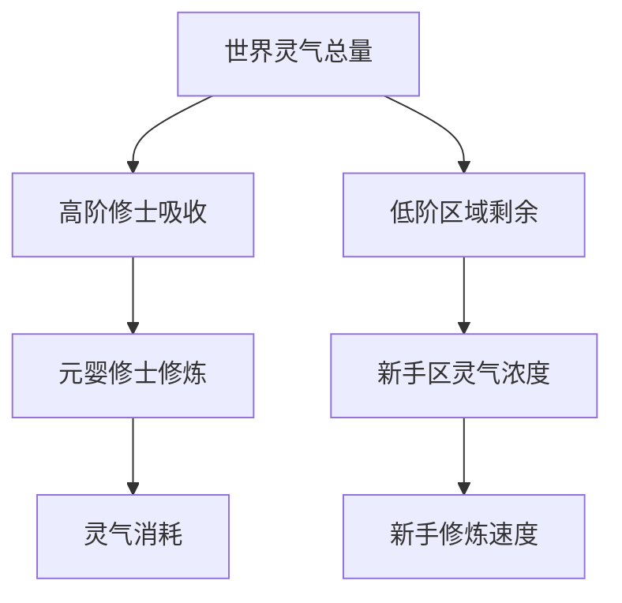
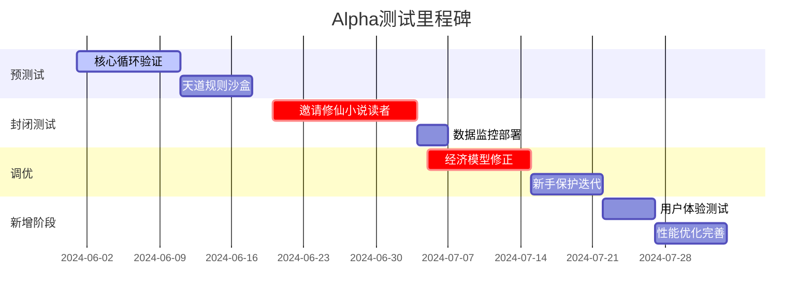

# Alpha版本开发计划

## 📋 计划概述

本文档详细规划了《凡人修仙传》Web RPG游戏Alpha版本的开发计划，基于"用规则替代数值，用时间沉淀替代付费捷径"的核心理念，重点验证时间维度革命、天道法则系统等创新机制。

### 🎯 Alpha版本目标
- **用户规模**：1000人封闭测试
- **开发周期**：12-15周
- **核心验证**：时间系统、天道法则、因果业力、灵气守恒
- **技术目标**：单服务器稳定支撑1000在线用户

## 一、核心机制验证沙盒（2-3周）

### 1. 时间系统原型

**构建最小化时间流模型**：

```python
# 伪代码：真实时间-游戏时间转换
def game_time(real_time):
    # 1现实秒 = 1游戏日
    game_years = real_time * 365 / (24*60*60)
    return game_years

# 改进建议：增加时间加速调试模式
def debug_game_time(real_time, acceleration=1):
    # 支持时间加速，便于快速验证长周期事件
    game_years = real_time * 365 * acceleration / (24*60*60)
    return game_years
```

**测试用例**：
- 玩家离线24小时后，修为增长是否符合预期？
- 洞府灵草成熟周期是否与设定同步（如霓裳草需现实2小时）？
- **新增**：服务器重启后时间校准是否正确？
- **新增**：客户端时间篡改检测是否有效？

**改进建议**：
- 增加"时间加速"调试模式，便于快速验证长周期事件
- 考虑添加服务器时间同步机制，防止客户端时间篡改
- 增加时间异常恢复机制（如服务器重启后的时间校准）

### 2. 天道规则模拟器

| 规则 | 触发条件 | 预期效果 | 测试工具 | 改进建议 |
|------|----------|----------|----------|----------|
| 业火焚身 | 单日杀怪>100只 | HP每秒-1% | 自动化脚本刷怪测试 | 增加天道预警系统 |
| 天罚雷劫 | 高境攻击低境(>2阶) | 攻击者寿元-10年 | 玩家PK测试场景 | 增加天道容错机制 |
| 灵气枯竭 | 区域修士密度>50人/平方公里 | 修炼速度-30% | 压力测试机器人集群 | 动态调整接口 |

**改进建议**：
- 增加"天道容错"机制，避免规则过于严苛导致玩家流失
- 考虑添加"天道预警"系统，让玩家了解即将触发的规则
- 增加规则动态调整接口，便于运营期间平衡性调优

### 3. 经济系统压力测试

**资源守恒模型**：


**极端测试**：
- 模拟1000名元婴修士同时吸收灵气，检测新手区灵气值是否归零
- **新增**：测试灵气恢复机制是否正常工作
- **新增**：验证灵气分布算法的性能表现

## 二、内容生产管线搭建（2-3周）

### 1. 自动化文档→游戏数据转换


**工具链**：
- **Markdown解析**：markdown-it
- **坐标转换**：Turf.js(地理空间计算)
- **技能逻辑**：Node-RED(可视化规则编排)
- **新增**：内容版本管理系统
- **新增**：内容校验工具，防止配置错误

### 2. 美术资产轻量化规范

| 资产类型 | 规格 | 示例 | 生成工具 | 改进建议 |
|----------|------|------|----------|----------|
| 角色头像 | 128x128 SVG | 🧑‍🦳[境界:元婴] | Figma+SVG导出 | 增加自动化生成脚本 |
| 技能特效 | CSS动画+Emoji组合 | 🔥→🐉(火蛇术) | Anime.js | 建立特效库模板 |
| 世界地图 | 矢量SVG分层渲染 | 灵脉区域用💎波纹动画 | D3.js | 支持动态加载 |

## 三、技术风险攻坚清单（2-3周）

### 1. 单服务器承载验证

| 测试项目 | 目标值 | 验证方法 | 改进建议 |
|----------|--------|----------|----------|
| 实时状态同步 | 1000人同地图无卡顿 | Locust压力测试 | 增加实时监控面板 |
| 事件回溯能力 | 精确到秒的时间线追溯 | 注入错误日志后重建世界状态 | 实现数据版本控制 |
| 数据压缩率 | 传输包<5KB/操作 | Snappy压缩算法测试 | 添加压缩率监控 |

**新增监控指标**：
- 内存使用率告警（>80%触发）
- 响应时间监控（>100ms告警）
- 数据库连接池状态
- 实时在线用户数统计

### 2. 时间敏感型事务设计

```javascript
// 时间锚定示例：天劫倒计时
class HeavenlyTribulation {
  constructor(player) {
    this.startTime = Date.now(); // 现实开始时间
    this.duration = 72 * 3600 * 1000; // 现实72小时=游戏72年
    this.player = player;
  }
  
  checkTrigger() {
    if (Date.now() > this.startTime + this.duration) {
      this.triggerTribulation(); // 自动触发天劫
    }
  }
  
  // 改进：增加异常恢复机制
  recoverFromCrash(lastCheckpoint) {
    const elapsed = Date.now() - lastCheckpoint;
    if (elapsed > this.duration) {
      this.triggerTribulation();
    }
  }
}
```

**改进建议**：
- 增加异常情况模拟（网络中断、服务器故障等）
- 考虑添加恶意行为测试（外挂、刷量等）
- 增加长期运行稳定性测试

## 四、法律与合规预审（1周）

### 真实时间消耗机制
- 向玩家明示关键时间规则（如：突破需现实7天）
- 用户协议注明："闭关期间角色不可转移"
- **新增**：增加防沉迷条款适配性审核
- **新增**：时间消耗机制的用户体验优化

### 经济系统合规
- 寿元交易需声明"虚拟商品不可兑换现实货币"
- 聘请律师审核防沉迷条款适配性
- **新增**：建立虚拟货币监管合规机制
- **新增**：用户资产安全保护措施

## 五、Alpha测试路线图（4-5周）



### 测试阶段详细规划

#### 第一阶段：核心验证（2-3周）
**目标**：验证核心机制可行性
- 时间系统稳定性测试
- 天道法则触发准确性
- 基础因果系统验证
- 灵气守恒算法测试

**成功标准**：
- 时间系统零误差运行72小时
- 天道法则触发率>95%
- 因果关系追踪无遗漏
- 灵气分布算法性能<10ms

#### 第二阶段：封闭测试（2周）
**目标**：真实用户环境验证
- 邀请100名修仙小说读者
- 收集用户体验反馈
- 监控系统性能表现
- 验证新手引导流程

**成功标准**：
- 用户留存率>70%
- 系统稳定性>99%
- 新手完成率>80%
- 核心玩法理解度>85%

#### 第三阶段：调优优化（2-3周）
**目标**：基于反馈优化系统
- 经济模型平衡性调整
- 新手保护机制优化
- 性能瓶颈解决
- UI/UX体验改进

**成功标准**：
- 经济通胀率<5%/月
- 新手保护有效性>90%
- 响应时间<50ms
- 用户满意度>4.0/5.0

## 六、风险控制与应急预案

### 技术风险
| 风险类型 | 概率 | 影响 | 应对措施 | 应急预案 |
|----------|------|------|----------|----------|
| 单服务器性能瓶颈 | 中 | 高 | 性能优化、代码重构 | 准备分布式架构方案 |
| 时间系统异常 | 低 | 高 | 多重校验、异常恢复 | 手动时间重置机制 |
| 数据丢失 | 低 | 极高 | 实时备份、版本控制 | 数据恢复SOP流程 |

### 进度风险
- **缓冲时间**：每个阶段预留20%缓冲时间
- **里程碑检查**：每周进行进度评估
- **决策机制**：关键节点设置Go/No-Go决策点

### 质量风险
- **测试覆盖率**：核心功能测试覆盖率>90%
- **代码审查**：所有核心代码必须经过审查
- **用户反馈**：建立快速反馈收集机制

## 七、成功标准与验收条件

### Alpha版本验收标准

#### 功能完整性
- ✅ 时间系统：现实时间=游戏时间映射正确
- ✅ 天道法则：基础规则触发准确
- ✅ 因果系统：杀戮业力、基础报应
- ✅ 灵气守恒：区域灵气浓度影响修炼
- ✅ 新手保护：天道法则保护机制

#### 性能指标
- 支持1000并发用户
- 响应时间<100ms
- 系统稳定性>99%
- 内存使用率<80%

#### 用户体验
- 新手引导完成率>80%
- 核心玩法理解度>85%
- 用户留存率>70%
- 用户满意度>4.0/5.0

### 进入Beta版本条件
- 所有Alpha验收标准达成
- 无P0级别Bug
- 用户反馈积极（满意度>4.0）
- 技术架构稳定可扩展

## 八、资源需求与团队配置

### 开发团队
- **技术负责人**：1人（架构设计、核心开发）
- **后端开发**：2人（服务器逻辑、数据库）
- **前端开发**：2人（UI/UX、客户端逻辑）
- **测试工程师**：1人（自动化测试、性能测试）
- **运维工程师**：1人（部署、监控、运维）

### 硬件资源
- **开发环境**：4核8GB×5台
- **测试环境**：8核16GB×2台
- **生产环境**：8核32GB×1台（可扩展）

### 时间投入
- **总开发时间**：12-15周
- **每周工作量**：40小时/人
- **总人力投入**：约2800-3500人时

---

**项目座右铭**：用规则替代数值，用时间沉淀替代付费捷径。通过严格的Alpha测试验证，确保核心创新机制的可行性和用户体验的优秀性。