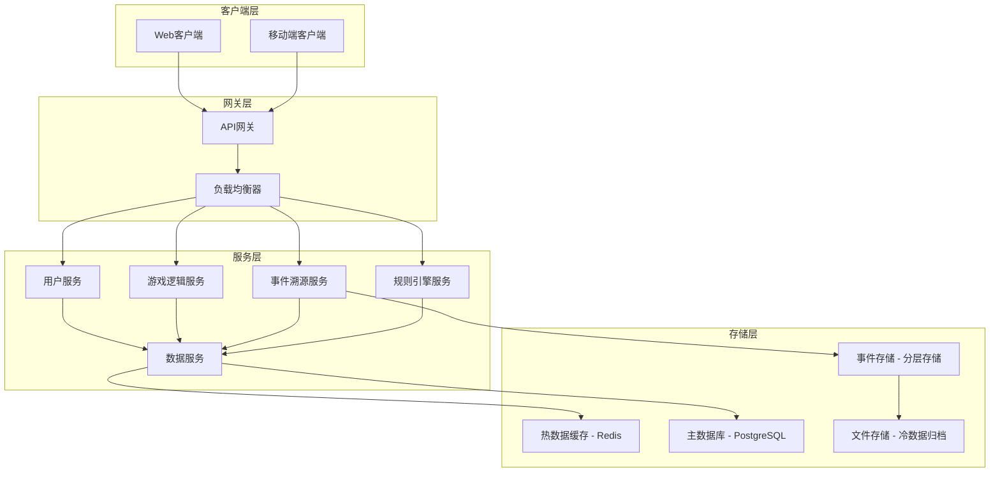
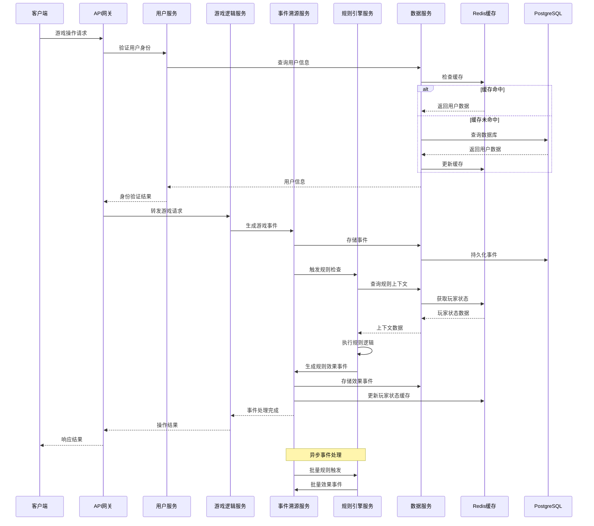
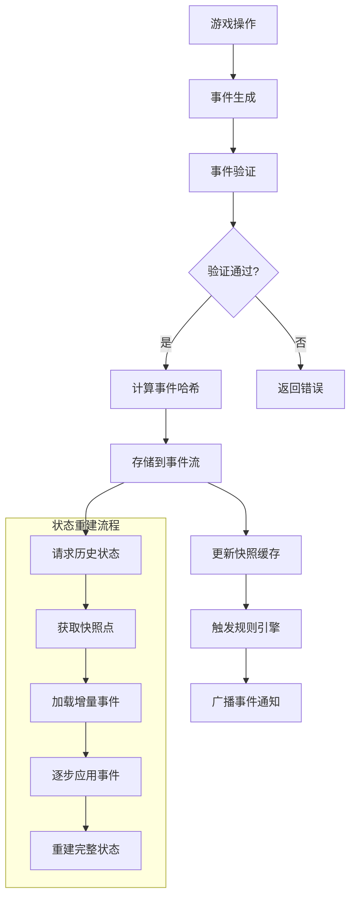
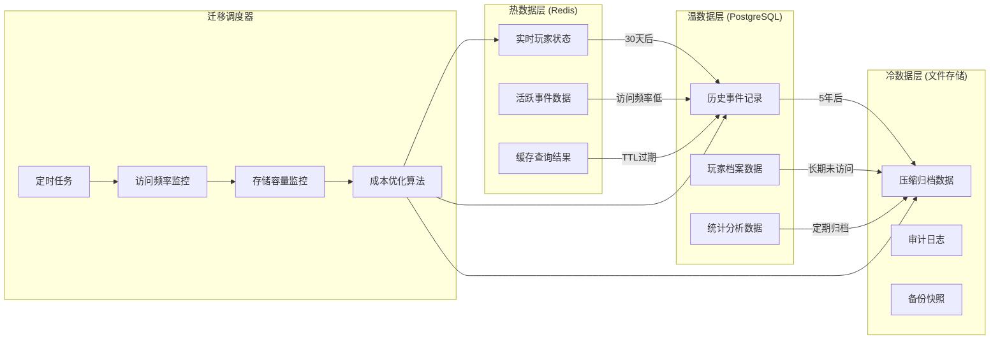
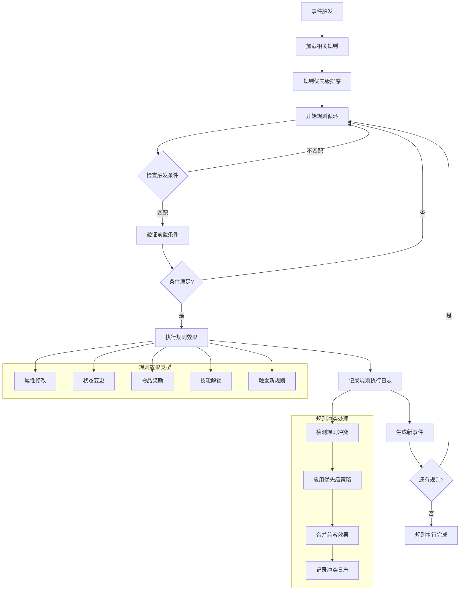

# Immortality游戏技术架构设计

## 架构概览

基于DeepSeek修仙MMO技术方案的深度分析，结合Immortality项目的实际需求，我们制定了以下技术架构：



## 系统交互流程

**完整请求处理流程**:


## 核心技术组件

### 1. 事件溯源系统

**设计理念**: 采用事件驱动架构，所有游戏状态变更都通过事件记录，支持完整的时间回溯功能。

**核心特性**:
- 事件版本兼容机制
- 增量快照系统
- 状态重建能力
- 时间旅行调试

**事件处理流程**:


**技术实现**:
```javascript
// 事件结构标准
const GameEvent = {
    id: 'uuid',
    playerId: 'uuid',
    eventType: 'CULTIVATION_PROGRESS',
    eventData: {
        experience: 1000,
        level: 5,
        timestamp: Date.now()
    },
    schemaVersion: '1.0',
    hash: 'sha256'
};
```

### 2. 分层存储架构

**存储策略**: 根据数据访问频率和重要性，采用三层存储架构。

| 存储层级 | 数据类型 | 保留期 | 访问延迟 | 成本 |
|----------|----------|--------|----------|------|
| 热数据层 | 活跃玩家状态、实时事件 | 30天 | <10ms | 高 |
| 温数据层 | 历史事件、玩家档案 | 5年 | <100ms | 中 |
| 冷数据层 | 归档数据、审计日志 | 永久 | 分钟级 | 低 |

**数据迁移流程**:


**数据迁移规则**:
- 自动化数据生命周期管理
- 基于访问频率的智能迁移
- 领域感知的数据压缩
- 成本效益优化算法

### 3. 轻量级规则引擎

**设计目标**: 支持声明式游戏规则配置，降低开发复杂度。

**规则执行流程**:


**规则配置示例**:
```yaml
# 修炼规则配置
cultivation_rules:
  - name: "境界突破"
    priority: 100
    trigger:
      type: "experience_threshold"
      value: 10000
    conditions:
      - type: "level"
        operator: ">="
        value: 10
      - type: "cultivation_base"
        operator: ">="
        value: "foundation"
    effects:
      - type: "level_up"
        value: 1
      - type: "unlock_skill"
        skill_id: "fire_ball"
      - type: "trigger_event"
        event_type: "breakthrough_ceremony"
    
  - name: "心魔劫难"
    priority: 200
    trigger:
      type: "kill_count"
      value: 100
      period: "7d"
    conditions:
      - type: "karma_level"
        operator: ">"
        value: 50
    effects:
      - type: "cultivation_penalty"
        value: "-20%"
        duration: "24h"
      - type: "spawn_heart_demon"
        difficulty: "hard"
```

### 4. 性能优化策略

**缓存策略**:
- Redis热数据缓存
- 玩家状态快照缓存
- 查询结果缓存

**数据库优化**:
- 读写分离
- 分区表设计
- 索引优化

**压缩算法**:
- 事件数据差分压缩
- JSON数据结构优化
- 批量操作合并

## 技术栈选择

### 后端技术
- **运行时**: Node.js 18+ / TypeScript
- **Web框架**: Express.js / Fastify
- **数据库**: PostgreSQL 15+ (主库) + Redis 7+ (缓存)
- **消息队列**: Redis Streams / RabbitMQ
- **监控**: Prometheus + Grafana

### 前端技术
- **框架**: React 18+ / Vue 3+
- **状态管理**: Redux Toolkit / Pinia
- **UI库**: Ant Design / Element Plus
- **图表**: D3.js / ECharts
- **实时通信**: Socket.io / WebSocket

### 开发工具
- **容器化**: Docker + Docker Compose
- **CI/CD**: GitHub Actions
- **代码质量**: ESLint + Prettier + Husky
- **测试**: Jest + Cypress

## 架构优势

### 1. 可扩展性
- 微服务架构支持水平扩展
- 事件驱动设计便于功能扩展
- 模块化组件易于维护

### 2. 可靠性
- 事件溯源保证数据完整性
- 分层存储提供数据冗余
- 自动故障恢复机制

### 3. 性能
- 多级缓存提升响应速度
- 数据压缩降低存储成本
- 异步处理提高并发能力

### 4. 开发效率
- 声明式规则配置
- 自动化测试和部署
- 完善的监控和调试工具

## 成本控制

### 存储成本优化
- 分层存储降低91%存储成本
- 智能数据压缩
- 自动化数据生命周期管理

### 开发成本控制
- 复用现有技术栈
- 渐进式架构升级
- 开源工具优先

### 运维成本优化
- 自动化部署和监控
- 容器化标准化环境
- 云原生架构设计

## 风险评估与缓解

### 技术风险
- **学习曲线**: 提供充分的技术培训和文档
- **性能风险**: 分阶段上线，实时监控
- **数据安全**: 多重备份和加密机制

### 业务风险
- **需求变更**: 灵活的架构设计支持快速调整
- **用户增长**: 弹性扩展能力
- **竞争压力**: 快速迭代和功能创新

## 质量保证

### 测试策略
- 单元测试覆盖率 > 80%
- 集成测试自动化
- 性能测试基准
- 安全测试检查

### 监控体系
- 应用性能监控(APM)
- 业务指标监控
- 错误日志聚合
- 用户行为分析

---

**总结**: 本架构设计融合了DeepSeek方案的核心优势，同时适配Immortality项目的实际需求和资源约束。通过事件溯源、分层存储和轻量级规则引擎，我们能够构建一个高性能、可扩展、成本可控的游戏后端系统。