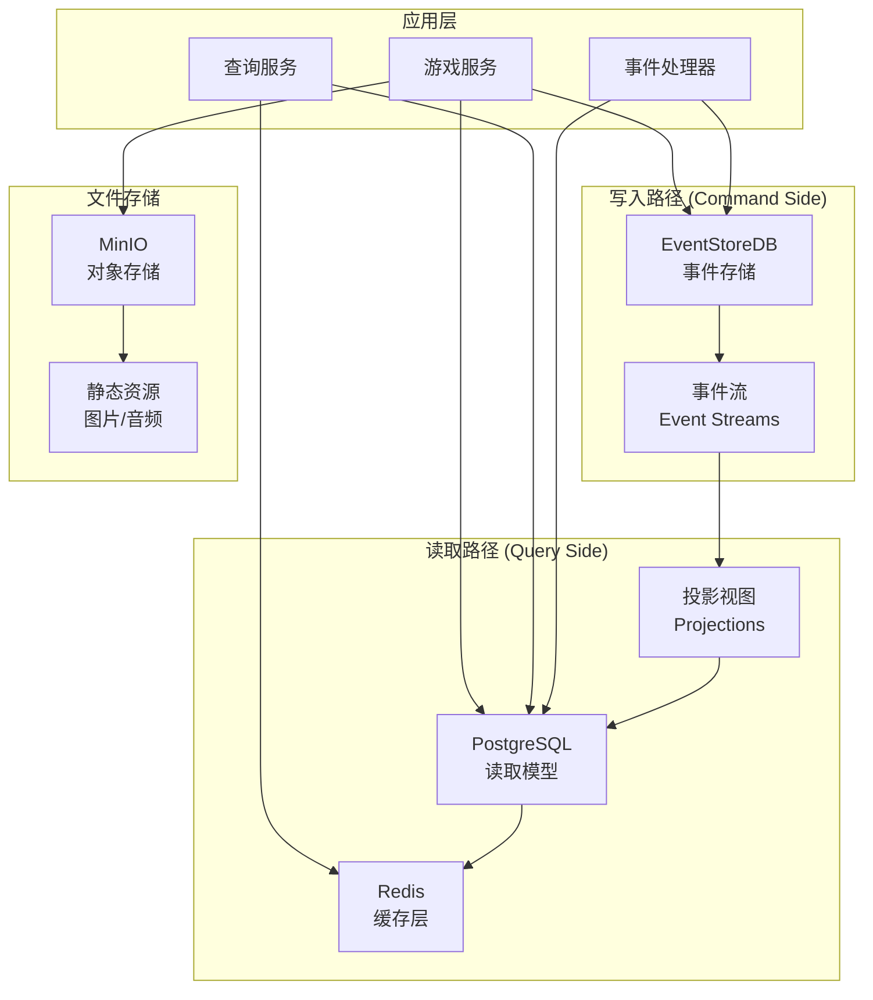
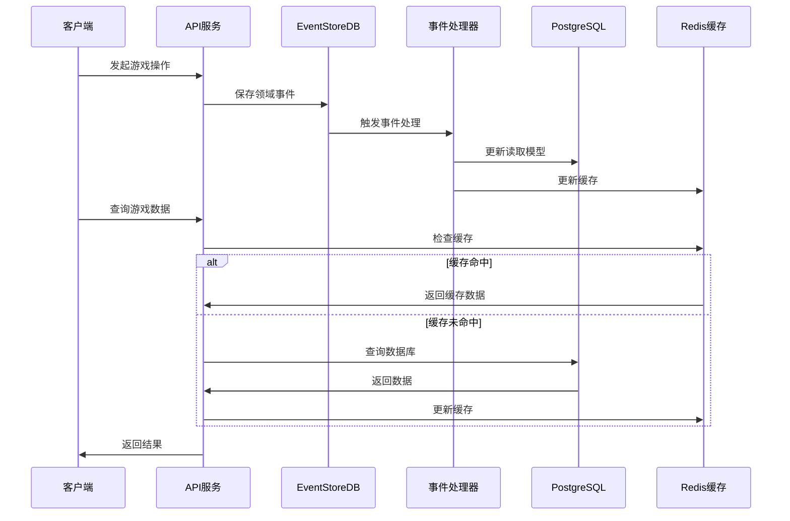

# 数据库设计

## 概述

Immortality修仙游戏采用混合数据库架构，结合EventStoreDB事件溯源和PostgreSQL关系型数据库的优势，实现高性能的读写分离、完整的数据审计追踪和灵活的查询能力。这种设计确保了游戏数据的一致性、可追溯性和高可用性。

## 🏗️ **架构总览**

### 数据存储策略



### 数据流向



## 📊 **EventStoreDB 事件存储设计**

### 事件流结构

```typescript
// 事件流命名规范
const StreamNaming = {
  // 玩家聚合流
  player: (playerId: string) => `player-${playerId}`,
  
  // 修炼会话流
  cultivation: (sessionId: string) => `cultivation-${sessionId}`,
  
  // 战斗会话流
  combat: (combatId: string) => `combat-${combatId}`,
  
  // 物品交易流
  trade: (tradeId: string) => `trade-${tradeId}`,
  
  // 公会活动流
  guild: (guildId: string) => `guild-${guildId}`,
  
  // 系统事件流
  system: () => 'system-events',
  
  // 分类事件流
  category: (category: string) => `$ce-${category}`
};
```

### 核心事件定义

```typescript
// 基础事件接口
interface DomainEvent {
  eventId: string;
  eventType: string;
  aggregateId: string;
  aggregateType: string;
  eventVersion: number;
  timestamp: Date;
  causationId?: string;
  correlationId?: string;
  metadata?: Record<string, any>;
}

// 玩家相关事件
interface PlayerCreatedEvent extends DomainEvent {
  eventType: 'PlayerCreated';
  data: {
    playerId: string;
    userId: string;
    playerName: string;
    initialRealm: string;
    initialLevel: number;
    createdAt: Date;
  };
}

interface PlayerLevelUpEvent extends DomainEvent {
  eventType: 'PlayerLevelUp';
  data: {
    playerId: string;
    oldLevel: number;
    newLevel: number;
    oldRealm: string;
    newRealm: string;
    experienceGained: number;
    timestamp: Date;
  };
}

interface PlayerEnergyChangedEvent extends DomainEvent {
  eventType: 'PlayerEnergyChanged';
  data: {
    playerId: string;
    oldEnergy: number;
    newEnergy: number;
    changeReason: 'cultivation' | 'combat' | 'rest' | 'item_use';
    timestamp: Date;
  };
}

// 修炼相关事件
interface CultivationStartedEvent extends DomainEvent {
  eventType: 'CultivationStarted';
  data: {
    sessionId: string;
    playerId: string;
    techniqueId: string;
    startTime: Date;
    expectedDuration: number;
    energyCost: number;
    location?: string;
  };
}

interface CultivationProgressEvent extends DomainEvent {
  eventType: 'CultivationProgress';
  data: {
    sessionId: string;
    playerId: string;
    progress: number; // 0-1
    experienceGained: number;
    currentStage: string;
    timestamp: Date;
  };
}

interface CultivationCompletedEvent extends DomainEvent {
  eventType: 'CultivationCompleted';
  data: {
    sessionId: string;
    playerId: string;
    completedAt: Date;
    totalDuration: number;
    totalExperienceGained: number;
    breakthroughAchieved: boolean;
    newInsights?: string[];
  };
}

// 战斗相关事件
interface CombatInitiatedEvent extends DomainEvent {
  eventType: 'CombatInitiated';
  data: {
    combatId: string;
    challengerId: string;
    defenderId: string;
    combatType: 'duel' | 'arena' | 'tournament' | 'monster';
    location: string;
    initiatedAt: Date;
  };
}

interface CombatActionEvent extends DomainEvent {
  eventType: 'CombatAction';
  data: {
    combatId: string;
    actorId: string;
    actionType: 'attack' | 'defend' | 'skill' | 'item';
    targetId: string;
    skillId?: string;
    itemId?: string;
    damage?: number;
    healing?: number;
    effects?: string[];
    timestamp: Date;
  };
}

interface CombatEndedEvent extends DomainEvent {
  eventType: 'CombatEnded';
  data: {
    combatId: string;
    winnerId: string;
    loserId: string;
    endReason: 'victory' | 'surrender' | 'timeout' | 'draw';
    duration: number;
    rewards: {
      experience: number;
      items: string[];
      reputation: number;
    };
    endedAt: Date;
  };
}

// 物品相关事件
interface ItemObtainedEvent extends DomainEvent {
  eventType: 'ItemObtained';
  data: {
    playerId: string;
    itemId: string;
    itemType: string;
    quantity: number;
    source: 'combat' | 'cultivation' | 'trade' | 'quest' | 'system';
    sourceId?: string;
    obtainedAt: Date;
  };
}

interface ItemUsedEvent extends DomainEvent {
  eventType: 'ItemUsed';
  data: {
    playerId: string;
    itemId: string;
    quantity: number;
    effects: {
      energyRestore?: number;
      experienceBoost?: number;
      temporaryBuffs?: string[];
    };
    usedAt: Date;
  };
}

interface ItemTradedEvent extends DomainEvent {
  eventType: 'ItemTraded';
  data: {
    tradeId: string;
    sellerId: string;
    buyerId: string;
    itemId: string;
    quantity: number;
    price: number;
    currency: 'gold' | 'spirit_stones';
    tradedAt: Date;
  };
}
```

### 事件存储配置

```typescript
// eventstore.config.ts
export const EventStoreConfig = {
  // 连接配置
  connection: {
    connectionString: process.env.EVENTSTORE_CONNECTION_STRING,
    defaultCredentials: {
      username: 'admin',
      password: process.env.EVENTSTORE_PASSWORD
    },
    gossipTimeout: 3000,
    discoverAttempts: 3,
    maxDiscoverAttempts: 10,
    requireMaster: false,
    reconnectionDelay: 100,
    operationTimeout: 7000,
    operationTimeoutCheckPeriod: 1000
  },
  
  // 流配置
  streams: {
    // 最大事件数限制
    maxCount: 10000,
    
    // 快照配置
    snapshotFrequency: 100, // 每100个事件创建快照
    
    // 分片配置
    partitioning: {
      enabled: true,
      strategy: 'hash', // hash | range | time
      partitionCount: 16
    }
  },
  
  // 投影配置
  projections: {
    // 系统投影
    system: {
      '$by_category': true,
      '$by_event_type': true,
      '$stream_by_category': true
    },
    
    // 自定义投影
    custom: [
      'player-statistics',
      'cultivation-leaderboard',
      'combat-rankings',
      'item-market-data',
      'guild-activities'
    ]
  }
};
```

### 投影定义

```javascript
// 玩家统计投影
const playerStatisticsProjection = `
fromCategory('player')
.when({
  'PlayerCreated': function(state, event) {
    linkTo('player-statistics', event);
  },
  'PlayerLevelUp': function(state, event) {
    linkTo('player-statistics', event);
  },
  'CultivationCompleted': function(state, event) {
    linkTo('player-statistics', event);
  },
  'CombatEnded': function(state, event) {
    linkTo('player-statistics', event);
  }
});
`;

// 修炼排行榜投影
const cultivationLeaderboardProjection = `
fromStreams(['$ce-cultivation'])
.when({
  'CultivationCompleted': function(state, event) {
    const data = event.data;
    
    if (!state.leaderboard) {
      state.leaderboard = {};
    }
    
    if (!state.leaderboard[data.playerId]) {
      state.leaderboard[data.playerId] = {
        totalExperience: 0,
        totalSessions: 0,
        totalDuration: 0,
        breakthroughs: 0
      };
    }
    
    const player = state.leaderboard[data.playerId];
    player.totalExperience += data.totalExperienceGained;
    player.totalSessions += 1;
    player.totalDuration += data.totalDuration;
    
    if (data.breakthroughAchieved) {
      player.breakthroughs += 1;
    }
    
    // 发出更新事件
    emit('cultivation-leaderboard-updated', {
      playerId: data.playerId,
      stats: player,
      timestamp: new Date()
    });
  }
});
`;

// 战斗排名投影
const combatRankingsProjection = `
fromStreams(['$ce-combat'])
.when({
  'CombatEnded': function(state, event) {
    const data = event.data;
    
    if (!state.rankings) {
      state.rankings = {};
    }
    
    // 更新胜利者统计
    if (!state.rankings[data.winnerId]) {
      state.rankings[data.winnerId] = {
        wins: 0,
        losses: 0,
        totalCombats: 0,
        winRate: 0,
        totalRewards: 0
      };
    }
    
    // 更新失败者统计
    if (!state.rankings[data.loserId]) {
      state.rankings[data.loserId] = {
        wins: 0,
        losses: 0,
        totalCombats: 0,
        winRate: 0,
        totalRewards: 0
      };
    }
    
    const winner = state.rankings[data.winnerId];
    const loser = state.rankings[data.loserId];
    
    winner.wins += 1;
    winner.totalCombats += 1;
    winner.totalRewards += data.rewards.experience;
    winner.winRate = winner.wins / winner.totalCombats;
    
    loser.losses += 1;
    loser.totalCombats += 1;
    loser.winRate = loser.wins / loser.totalCombats;
    
    // 发出排名更新事件
    emit('combat-rankings-updated', {
      winnerId: data.winnerId,
      loserId: data.loserId,
      winnerStats: winner,
      loserStats: loser,
      timestamp: new Date()
    });
  }
});
`;
```

## 🗄️ **PostgreSQL 读取模型设计**

### 核心表结构

```sql
-- 用户表
CREATE TABLE users (
    id UUID PRIMARY KEY DEFAULT gen_random_uuid(),
    username VARCHAR(50) UNIQUE NOT NULL,
    email VARCHAR(255) UNIQUE NOT NULL,
    password_hash VARCHAR(255) NOT NULL,
    is_active BOOLEAN DEFAULT true,
    created_at TIMESTAMP WITH TIME ZONE DEFAULT CURRENT_TIMESTAMP,
    updated_at TIMESTAMP WITH TIME ZONE DEFAULT CURRENT_TIMESTAMP,
    last_login_at TIMESTAMP WITH TIME ZONE,
    
    -- 索引
    CONSTRAINT users_username_check CHECK (length(username) >= 3),
    CONSTRAINT users_email_check CHECK (email ~* '^[A-Za-z0-9._%+-]+@[A-Za-z0-9.-]+\.[A-Za-z]{2,}$')
);

CREATE INDEX idx_users_username ON users(username);
CREATE INDEX idx_users_email ON users(email);
CREATE INDEX idx_users_active ON users(is_active) WHERE is_active = true;

-- 玩家表
CREATE TABLE players (
    id UUID PRIMARY KEY DEFAULT gen_random_uuid(),
    user_id UUID NOT NULL REFERENCES users(id) ON DELETE CASCADE,
    name VARCHAR(50) NOT NULL,
    level INTEGER DEFAULT 1 CHECK (level > 0),
    realm VARCHAR(50) DEFAULT '练气期',
    experience BIGINT DEFAULT 0 CHECK (experience >= 0),
    energy INTEGER DEFAULT 100 CHECK (energy >= 0),
    max_energy INTEGER DEFAULT 100 CHECK (max_energy > 0),
    status VARCHAR(20) DEFAULT 'idle' CHECK (status IN ('idle', 'cultivating', 'combat', 'trading', 'offline')),
    
    -- 属性点
    strength INTEGER DEFAULT 10 CHECK (strength > 0),
    agility INTEGER DEFAULT 10 CHECK (agility > 0),
    intelligence INTEGER DEFAULT 10 CHECK (intelligence > 0),
    constitution INTEGER DEFAULT 10 CHECK (constitution > 0),
    
    -- 资源
    gold BIGINT DEFAULT 1000 CHECK (gold >= 0),
    spirit_stones INTEGER DEFAULT 0 CHECK (spirit_stones >= 0),
    
    -- 位置信息
    current_location VARCHAR(100) DEFAULT 'newbie_village',
    coordinates POINT,
    
    -- 时间戳
    created_at TIMESTAMP WITH TIME ZONE DEFAULT CURRENT_TIMESTAMP,
    updated_at TIMESTAMP WITH TIME ZONE DEFAULT CURRENT_TIMESTAMP,
    last_active_at TIMESTAMP WITH TIME ZONE DEFAULT CURRENT_TIMESTAMP,
    
    CONSTRAINT players_name_unique UNIQUE (name),
    CONSTRAINT players_energy_check CHECK (energy <= max_energy)
);

CREATE INDEX idx_players_user_id ON players(user_id);
CREATE INDEX idx_players_name ON players(name);
CREATE INDEX idx_players_level ON players(level);
CREATE INDEX idx_players_realm ON players(realm);
CREATE INDEX idx_players_status ON players(status);
CREATE INDEX idx_players_location ON players(current_location);
CREATE INDEX idx_players_coordinates ON players USING GIST(coordinates);

-- 修炼记录表
CREATE TABLE cultivation_records (
    id UUID PRIMARY KEY DEFAULT gen_random_uuid(),
    session_id VARCHAR(100) UNIQUE NOT NULL,
    player_id UUID NOT NULL REFERENCES players(id) ON DELETE CASCADE,
    technique_id VARCHAR(100) NOT NULL,
    technique_name VARCHAR(100) NOT NULL,
    
    -- 修炼信息
    start_time TIMESTAMP WITH TIME ZONE NOT NULL,
    end_time TIMESTAMP WITH TIME ZONE,
    duration_seconds INTEGER,
    progress DECIMAL(5,4) DEFAULT 0 CHECK (progress >= 0 AND progress <= 1),
    
    -- 收益
    experience_gained INTEGER DEFAULT 0 CHECK (experience_gained >= 0),
    energy_consumed INTEGER DEFAULT 0 CHECK (energy_consumed >= 0),
    breakthrough_achieved BOOLEAN DEFAULT false,
    insights_gained TEXT[],
    
    -- 状态
    status VARCHAR(20) DEFAULT 'active' CHECK (status IN ('active', 'completed', 'interrupted', 'failed')),
    end_reason VARCHAR(50),
    
    -- 环境因素
    location VARCHAR(100),
    weather_bonus DECIMAL(3,2) DEFAULT 1.0,
    time_bonus DECIMAL(3,2) DEFAULT 1.0,
    
    created_at TIMESTAMP WITH TIME ZONE DEFAULT CURRENT_TIMESTAMP,
    updated_at TIMESTAMP WITH TIME ZONE DEFAULT CURRENT_TIMESTAMP
);

CREATE INDEX idx_cultivation_records_player_id ON cultivation_records(player_id);
CREATE INDEX idx_cultivation_records_session_id ON cultivation_records(session_id);
CREATE INDEX idx_cultivation_records_technique_id ON cultivation_records(technique_id);
CREATE INDEX idx_cultivation_records_start_time ON cultivation_records(start_time);
CREATE INDEX idx_cultivation_records_status ON cultivation_records(status);

-- 战斗记录表
CREATE TABLE combat_records (
    id UUID PRIMARY KEY DEFAULT gen_random_uuid(),
    combat_id VARCHAR(100) UNIQUE NOT NULL,
    combat_type VARCHAR(20) NOT NULL CHECK (combat_type IN ('duel', 'arena', 'tournament', 'monster', 'boss')),
    
    -- 参与者
    challenger_id UUID NOT NULL REFERENCES players(id),
    defender_id UUID REFERENCES players(id), -- 可为空，怪物战斗时
    monster_id VARCHAR(100), -- 怪物ID
    
    -- 战斗信息
    start_time TIMESTAMP WITH TIME ZONE NOT NULL,
    end_time TIMESTAMP WITH TIME ZONE,
    duration_seconds INTEGER,
    
    -- 结果
    winner_id UUID REFERENCES players(id),
    end_reason VARCHAR(20) CHECK (end_reason IN ('victory', 'surrender', 'timeout', 'draw', 'disconnect')),
    
    -- 奖励
    experience_reward INTEGER DEFAULT 0,
    gold_reward INTEGER DEFAULT 0,
    items_reward JSONB DEFAULT '[]',
    reputation_change INTEGER DEFAULT 0,
    
    -- 位置
    location VARCHAR(100),
    
    created_at TIMESTAMP WITH TIME ZONE DEFAULT CURRENT_TIMESTAMP
);

CREATE INDEX idx_combat_records_combat_id ON combat_records(combat_id);
CREATE INDEX idx_combat_records_challenger_id ON combat_records(challenger_id);
CREATE INDEX idx_combat_records_defender_id ON combat_records(defender_id);
CREATE INDEX idx_combat_records_winner_id ON combat_records(winner_id);
CREATE INDEX idx_combat_records_start_time ON combat_records(start_time);
CREATE INDEX idx_combat_records_type ON combat_records(combat_type);

-- 战斗动作表
CREATE TABLE combat_actions (
    id UUID PRIMARY KEY DEFAULT gen_random_uuid(),
    combat_id VARCHAR(100) NOT NULL,
    sequence_number INTEGER NOT NULL,
    
    -- 动作信息
    actor_id UUID NOT NULL REFERENCES players(id),
    target_id UUID REFERENCES players(id),
    action_type VARCHAR(20) NOT NULL CHECK (action_type IN ('attack', 'defend', 'skill', 'item', 'flee')),
    
    -- 技能/物品
    skill_id VARCHAR(100),
    skill_name VARCHAR(100),
    item_id VARCHAR(100),
    item_name VARCHAR(100),
    
    -- 效果
    damage_dealt INTEGER DEFAULT 0,
    healing_done INTEGER DEFAULT 0,
    energy_cost INTEGER DEFAULT 0,
    effects_applied JSONB DEFAULT '[]',
    
    -- 结果
    hit_success BOOLEAN DEFAULT true,
    critical_hit BOOLEAN DEFAULT false,
    damage_blocked INTEGER DEFAULT 0,
    
    action_time TIMESTAMP WITH TIME ZONE DEFAULT CURRENT_TIMESTAMP,
    
    CONSTRAINT combat_actions_combat_sequence UNIQUE (combat_id, sequence_number)
);

CREATE INDEX idx_combat_actions_combat_id ON combat_actions(combat_id);
CREATE INDEX idx_combat_actions_actor_id ON combat_actions(actor_id);
CREATE INDEX idx_combat_actions_sequence ON combat_actions(combat_id, sequence_number);

-- 物品表
CREATE TABLE items (
    id UUID PRIMARY KEY DEFAULT gen_random_uuid(),
    item_id VARCHAR(100) UNIQUE NOT NULL, -- 物品模板ID
    name VARCHAR(100) NOT NULL,
    description TEXT,
    item_type VARCHAR(50) NOT NULL CHECK (item_type IN ('weapon', 'armor', 'accessory', 'consumable', 'material', 'technique', 'treasure')),
    rarity VARCHAR(20) DEFAULT 'common' CHECK (rarity IN ('common', 'uncommon', 'rare', 'epic', 'legendary', 'mythical')),
    
    -- 属性
    level_requirement INTEGER DEFAULT 1,
    realm_requirement VARCHAR(50),
    
    -- 效果
    effects JSONB DEFAULT '{}',
    stats_bonus JSONB DEFAULT '{}',
    
    -- 经济
    base_price INTEGER DEFAULT 0,
    max_stack_size INTEGER DEFAULT 1,
    
    -- 获取方式
    obtainable_from JSONB DEFAULT '[]', -- ['combat', 'cultivation', 'shop', 'quest']
    
    -- 元数据
    icon_url VARCHAR(255),
    is_tradeable BOOLEAN DEFAULT true,
    is_consumable BOOLEAN DEFAULT false,
    
    created_at TIMESTAMP WITH TIME ZONE DEFAULT CURRENT_TIMESTAMP,
    updated_at TIMESTAMP WITH TIME ZONE DEFAULT CURRENT_TIMESTAMP
);

CREATE INDEX idx_items_item_id ON items(item_id);
CREATE INDEX idx_items_type ON items(item_type);
CREATE INDEX idx_items_rarity ON items(rarity);
CREATE INDEX idx_items_level_req ON items(level_requirement);

-- 玩家物品库存表
CREATE TABLE player_inventory (
    id UUID PRIMARY KEY DEFAULT gen_random_uuid(),
    player_id UUID NOT NULL REFERENCES players(id) ON DELETE CASCADE,
    item_id VARCHAR(100) NOT NULL REFERENCES items(item_id),
    quantity INTEGER NOT NULL DEFAULT 1 CHECK (quantity > 0),
    
    -- 物品状态
    is_equipped BOOLEAN DEFAULT false,
    equipment_slot VARCHAR(20), -- 'weapon', 'armor_head', 'armor_body', 'accessory_ring1', etc.
    
    -- 强化信息
    enhancement_level INTEGER DEFAULT 0 CHECK (enhancement_level >= 0),
    enhancement_bonus JSONB DEFAULT '{}',
    
    -- 获取信息
    obtained_at TIMESTAMP WITH TIME ZONE DEFAULT CURRENT_TIMESTAMP,
    obtained_from VARCHAR(50),
    obtained_source_id VARCHAR(100),
    
    CONSTRAINT player_inventory_unique UNIQUE (player_id, item_id),
    CONSTRAINT player_inventory_equipment_unique UNIQUE (player_id, equipment_slot) DEFERRABLE INITIALLY DEFERRED
);

CREATE INDEX idx_player_inventory_player_id ON player_inventory(player_id);
CREATE INDEX idx_player_inventory_item_id ON player_inventory(item_id);
CREATE INDEX idx_player_inventory_equipped ON player_inventory(player_id, is_equipped) WHERE is_equipped = true;

-- 技能表
CREATE TABLE techniques (
    id UUID PRIMARY KEY DEFAULT gen_random_uuid(),
    technique_id VARCHAR(100) UNIQUE NOT NULL,
    name VARCHAR(100) NOT NULL,
    description TEXT,
    technique_type VARCHAR(50) NOT NULL CHECK (technique_type IN ('cultivation', 'combat', 'movement', 'utility', 'passive')),
    
    -- 等级要求
    level_requirement INTEGER DEFAULT 1,
    realm_requirement VARCHAR(50),
    prerequisite_techniques JSONB DEFAULT '[]',
    
    -- 修炼信息
    cultivation_time_hours INTEGER DEFAULT 1,
    energy_cost INTEGER DEFAULT 10,
    experience_gain INTEGER DEFAULT 100,
    
    -- 战斗信息
    damage_multiplier DECIMAL(3,2) DEFAULT 1.0,
    energy_cost_combat INTEGER DEFAULT 5,
    cooldown_seconds INTEGER DEFAULT 0,
    
    -- 效果
    effects JSONB DEFAULT '{}',
    passive_bonuses JSONB DEFAULT '{}',
    
    -- 获取方式
    obtainable_from JSONB DEFAULT '[]',
    rarity VARCHAR(20) DEFAULT 'common',
    
    created_at TIMESTAMP WITH TIME ZONE DEFAULT CURRENT_TIMESTAMP,
    updated_at TIMESTAMP WITH TIME ZONE DEFAULT CURRENT_TIMESTAMP
);

CREATE INDEX idx_techniques_technique_id ON techniques(technique_id);
CREATE INDEX idx_techniques_type ON techniques(technique_type);
CREATE INDEX idx_techniques_level_req ON techniques(level_requirement);
CREATE INDEX idx_techniques_rarity ON techniques(rarity);

-- 玩家技能表
CREATE TABLE player_techniques (
    id UUID PRIMARY KEY DEFAULT gen_random_uuid(),
    player_id UUID NOT NULL REFERENCES players(id) ON DELETE CASCADE,
    technique_id VARCHAR(100) NOT NULL REFERENCES techniques(technique_id),
    
    -- 熟练度
    proficiency_level INTEGER DEFAULT 1 CHECK (proficiency_level > 0),
    proficiency_experience INTEGER DEFAULT 0 CHECK (proficiency_experience >= 0),
    max_proficiency_level INTEGER DEFAULT 10,
    
    -- 学习信息
    learned_at TIMESTAMP WITH TIME ZONE DEFAULT CURRENT_TIMESTAMP,
    learned_from VARCHAR(50), -- 'master', 'book', 'enlightenment', 'system'
    
    -- 使用统计
    times_used INTEGER DEFAULT 0,
    last_used_at TIMESTAMP WITH TIME ZONE,
    
    CONSTRAINT player_techniques_unique UNIQUE (player_id, technique_id)
);

CREATE INDEX idx_player_techniques_player_id ON player_techniques(player_id);
CREATE INDEX idx_player_techniques_technique_id ON player_techniques(technique_id);
CREATE INDEX idx_player_techniques_proficiency ON player_techniques(proficiency_level);
```

### 视图和聚合查询

```sql
-- 玩家统计视图
CREATE VIEW player_statistics AS
SELECT 
    p.id,
    p.name,
    p.level,
    p.realm,
    p.experience,
    p.gold,
    p.spirit_stones,
    
    -- 修炼统计
    COALESCE(cs.total_cultivation_sessions, 0) as total_cultivation_sessions,
    COALESCE(cs.total_cultivation_time, 0) as total_cultivation_time_hours,
    COALESCE(cs.total_experience_from_cultivation, 0) as total_experience_from_cultivation,
    COALESCE(cs.breakthroughs_achieved, 0) as breakthroughs_achieved,
    
    -- 战斗统计
    COALESCE(bs.total_combats, 0) as total_combats,
    COALESCE(bs.wins, 0) as combat_wins,
    COALESCE(bs.losses, 0) as combat_losses,
    COALESCE(bs.win_rate, 0) as combat_win_rate,
    COALESCE(bs.total_experience_from_combat, 0) as total_experience_from_combat,
    
    -- 物品统计
    COALESCE(is.total_items, 0) as total_items,
    COALESCE(is.equipped_items, 0) as equipped_items,
    COALESCE(is.legendary_items, 0) as legendary_items,
    
    -- 技能统计
    COALESCE(ts.total_techniques, 0) as total_techniques,
    COALESCE(ts.master_level_techniques, 0) as master_level_techniques,
    
    p.created_at,
    p.last_active_at
FROM players p
LEFT JOIN (
    SELECT 
        player_id,
        COUNT(*) as total_cultivation_sessions,
        SUM(duration_seconds) / 3600.0 as total_cultivation_time,
        SUM(experience_gained) as total_experience_from_cultivation,
        SUM(CASE WHEN breakthrough_achieved THEN 1 ELSE 0 END) as breakthroughs_achieved
    FROM cultivation_records 
    WHERE status = 'completed'
    GROUP BY player_id
) cs ON p.id = cs.player_id
LEFT JOIN (
    SELECT 
        player_id,
        total_combats,
        wins,
        losses,
        CASE WHEN total_combats > 0 THEN wins::DECIMAL / total_combats ELSE 0 END as win_rate,
        total_experience_from_combat
    FROM (
        SELECT 
            COALESCE(challenger_id, defender_id) as player_id,
            COUNT(*) as total_combats,
            SUM(CASE WHEN winner_id = COALESCE(challenger_id, defender_id) THEN 1 ELSE 0 END) as wins,
            SUM(CASE WHEN winner_id != COALESCE(challenger_id, defender_id) THEN 1 ELSE 0 END) as losses,
            SUM(experience_reward) as total_experience_from_combat
        FROM combat_records
        WHERE end_time IS NOT NULL
        GROUP BY COALESCE(challenger_id, defender_id)
    ) combat_stats
) bs ON p.id = bs.player_id
LEFT JOIN (
    SELECT 
        pi.player_id,
        COUNT(*) as total_items,
        SUM(CASE WHEN pi.is_equipped THEN 1 ELSE 0 END) as equipped_items,
        SUM(CASE WHEN i.rarity IN ('legendary', 'mythical') THEN 1 ELSE 0 END) as legendary_items
    FROM player_inventory pi
    JOIN items i ON pi.item_id = i.item_id
    GROUP BY pi.player_id
) is ON p.id = is.player_id
LEFT JOIN (
    SELECT 
        player_id,
        COUNT(*) as total_techniques,
        SUM(CASE WHEN proficiency_level >= 10 THEN 1 ELSE 0 END) as master_level_techniques
    FROM player_techniques
    GROUP BY player_id
) ts ON p.id = ts.player_id;

-- 修炼排行榜视图
CREATE VIEW cultivation_leaderboard AS
SELECT 
    ROW_NUMBER() OVER (ORDER BY total_experience_from_cultivation DESC) as rank,
    p.id,
    p.name,
    p.level,
    p.realm,
    cs.total_cultivation_sessions,
    cs.total_cultivation_time_hours,
    cs.total_experience_from_cultivation,
    cs.breakthroughs_achieved,
    cs.avg_session_duration,
    cs.cultivation_efficiency
FROM players p
JOIN (
    SELECT 
        player_id,
        COUNT(*) as total_cultivation_sessions,
        SUM(duration_seconds) / 3600.0 as total_cultivation_time_hours,
        SUM(experience_gained) as total_experience_from_cultivation,
        SUM(CASE WHEN breakthrough_achieved THEN 1 ELSE 0 END) as breakthroughs_achieved,
        AVG(duration_seconds) / 3600.0 as avg_session_duration,
        CASE 
            WHEN SUM(duration_seconds) > 0 
            THEN SUM(experience_gained)::DECIMAL / (SUM(duration_seconds) / 3600.0)
            ELSE 0 
        END as cultivation_efficiency
    FROM cultivation_records 
    WHERE status = 'completed'
    GROUP BY player_id
    HAVING SUM(experience_gained) > 0
) cs ON p.id = cs.player_id
ORDER BY cs.total_experience_from_cultivation DESC;

-- 战斗排行榜视图
CREATE VIEW combat_leaderboard AS
SELECT 
    ROW_NUMBER() OVER (ORDER BY win_rate DESC, total_combats DESC) as rank,
    p.id,
    p.name,
    p.level,
    p.realm,
    bs.total_combats,
    bs.wins,
    bs.losses,
    bs.win_rate,
    bs.total_experience_from_combat,
    bs.avg_combat_duration
FROM players p
JOIN (
    SELECT 
        player_id,
        total_combats,
        wins,
        losses,
        win_rate,
        total_experience_from_combat,
        avg_combat_duration
    FROM (
        SELECT 
            COALESCE(challenger_id, defender_id) as player_id,
            COUNT(*) as total_combats,
            SUM(CASE WHEN winner_id = COALESCE(challenger_id, defender_id) THEN 1 ELSE 0 END) as wins,
            SUM(CASE WHEN winner_id != COALESCE(challenger_id, defender_id) THEN 1 ELSE 0 END) as losses,
            CASE 
                WHEN COUNT(*) > 0 
                THEN SUM(CASE WHEN winner_id = COALESCE(challenger_id, defender_id) THEN 1 ELSE 0 END)::DECIMAL / COUNT(*)
                ELSE 0 
            END as win_rate,
            SUM(experience_reward) as total_experience_from_combat,
            AVG(duration_seconds) / 60.0 as avg_combat_duration
        FROM combat_records
        WHERE end_time IS NOT NULL
        GROUP BY COALESCE(challenger_id, defender_id)
        HAVING COUNT(*) >= 5 -- 至少5场战斗才能上榜
    ) combat_stats
) bs ON p.id = bs.player_id
ORDER BY bs.win_rate DESC, bs.total_combats DESC;
```

## 🚀 **Redis 缓存策略**

### 缓存键命名规范

```typescript
// cache-keys.ts
export const CacheKeys = {
  // 玩家相关
  player: (playerId: string) => `player:${playerId}`,
  playerStats: (playerId: string) => `player:stats:${playerId}`,
  playerInventory: (playerId: string) => `player:inventory:${playerId}`,
  playerTechniques: (playerId: string) => `player:techniques:${playerId}`,
  
  // 在线状态
  onlinePlayer: (playerId: string) => `online:${playerId}`,
  onlinePlayers: () => 'online:players',
  
  // 修炼相关
  cultivationSession: (playerId: string) => `cultivation:${playerId}`,
  cultivationQueue: () => 'cultivation:queue',
  
  // 战斗相关
  combatSession: (combatId: string) => `combat:${combatId}`,
  combatQueue: () => 'combat:queue',
  
  // 排行榜
  leaderboard: (type: string) => `leaderboard:${type}`,
  
  // 市场数据
  marketPrices: () => 'market:prices',
  itemMarket: (itemId: string) => `market:item:${itemId}`,
  
  // 系统配置
  gameConfig: () => 'config:game',
  serverStatus: () => 'status:server',
  
  // 会话相关
  userSession: (userId: string) => `session:${userId}`,
  socketSession: (socketId: string) => `socket:${socketId}`,
  
  // 临时数据
  tempData: (key: string) => `temp:${key}`,
  lockKey: (resource: string) => `lock:${resource}`
};
```

### 缓存配置

```typescript
// cache.config.ts
export const CacheConfig = {
  // 默认TTL设置（秒）
  ttl: {
    // 玩家数据
    playerData: 300, // 5分钟
    playerStats: 600, // 10分钟
    playerInventory: 180, // 3分钟
    
    // 在线状态
    onlineStatus: 60, // 1分钟
    
    // 游戏会话
    cultivationSession: 3600, // 1小时
    combatSession: 1800, // 30分钟
    
    // 排行榜
    leaderboard: 300, // 5分钟
    
    // 市场数据
    marketData: 120, // 2分钟
    
    // 配置数据
    gameConfig: 3600, // 1小时
    
    // 临时数据
    tempData: 60, // 1分钟
    
    // 分布式锁
    lockTtl: 30 // 30秒
  },
  
  // 缓存策略
  strategies: {
    // 写入策略
    writeThrough: ['playerData', 'playerStats'],
    writeBack: ['playerInventory', 'marketData'],
    writeAround: ['tempData'],
    
    // 失效策略
    lru: ['playerData', 'playerStats'],
    lfu: ['gameConfig', 'leaderboard'],
    ttl: ['onlineStatus', 'tempData']
  },
  
  // 预热配置
  warmup: {
    enabled: true,
    keys: [
      'config:game',
      'leaderboard:cultivation',
      'leaderboard:combat',
      'market:prices'
    ]
  }
};
```

### 缓存服务实现

```typescript
// cache.service.ts
@Injectable()
export class CacheService {
  constructor(
    @Inject(CACHE_MANAGER)
    private cacheManager: Cache,
    private configService: ConfigService
  ) {}
  
  // 获取缓存
  async get<T>(key: string): Promise<T | null> {
    try {
      const value = await this.cacheManager.get<T>(key);
      return value || null;
    } catch (error) {
      console.error(`Cache get error for key ${key}:`, error);
      return null;
    }
  }
  
  // 设置缓存
  async set<T>(key: string, value: T, ttl?: number): Promise<void> {
    try {
      const defaultTtl = this.getDefaultTtl(key);
      await this.cacheManager.set(key, value, ttl || defaultTtl);
    } catch (error) {
      console.error(`Cache set error for key ${key}:`, error);
    }
  }
  
  // 删除缓存
  async del(key: string): Promise<void> {
    try {
      await this.cacheManager.del(key);
    } catch (error) {
      console.error(`Cache delete error for key ${key}:`, error);
    }
  }
  
  // 批量删除
  async delPattern(pattern: string): Promise<void> {
    try {
      const keys = await this.getKeys(pattern);
      if (keys.length > 0) {
        await Promise.all(keys.map(key => this.cacheManager.del(key)));
      }
    } catch (error) {
      console.error(`Cache delete pattern error for ${pattern}:`, error);
    }
  }
  
  // 获取或设置缓存
  async getOrSet<T>(
    key: string,
    factory: () => Promise<T>,
    ttl?: number
  ): Promise<T> {
    let value = await this.get<T>(key);
    
    if (value === null) {
      value = await factory();
      await this.set(key, value, ttl);
    }
    
    return value;
  }
  
  // 分布式锁
  async acquireLock(
    resource: string,
    ttl: number = 30,
    retryDelay: number = 100,
    maxRetries: number = 10
  ): Promise<string | null> {
    const lockKey = CacheKeys.lockKey(resource);
    const lockValue = uuidv4();
    
    for (let i = 0; i < maxRetries; i++) {
      try {
        const result = await this.cacheManager.store.set(
          lockKey,
          lockValue,
          'PX',
          ttl * 1000,
          'NX'
        );
        
        if (result === 'OK') {
          return lockValue;
        }
        
        await new Promise(resolve => setTimeout(resolve, retryDelay));
      } catch (error) {
        console.error(`Lock acquisition error for ${resource}:`, error);
      }
    }
    
    return null;
  }
  
  // 释放锁
  async releaseLock(resource: string, lockValue: string): Promise<boolean> {
    const lockKey = CacheKeys.lockKey(resource);
    
    try {
      const script = `
        if redis.call('get', KEYS[1]) == ARGV[1] then
          return redis.call('del', KEYS[1])
        else
          return 0
        end
      `;
      
      const result = await this.cacheManager.store.eval(
        script,
        1,
        lockKey,
        lockValue
      );
      
      return result === 1;
    } catch (error) {
      console.error(`Lock release error for ${resource}:`, error);
      return false;
    }
  }
  
  // 缓存预热
  async warmupCache(): Promise<void> {
    const warmupKeys = CacheConfig.warmup.keys;
    
    for (const key of warmupKeys) {
      try {
        await this.warmupKey(key);
      } catch (error) {
        console.error(`Cache warmup error for key ${key}:`, error);
      }
    }
  }
  
  private async warmupKey(key: string): Promise<void> {
    switch (key) {
      case 'config:game':
        // 预热游戏配置
        break;
      case 'leaderboard:cultivation':
        // 预热修炼排行榜
        break;
      case 'leaderboard:combat':
        // 预热战斗排行榜
        break;
      case 'market:prices':
        // 预热市场价格
        break;
    }
  }
  
  private getDefaultTtl(key: string): number {
    // 根据键名确定默认TTL
    if (key.startsWith('player:')) return CacheConfig.ttl.playerData;
    if (key.startsWith('online:')) return CacheConfig.ttl.onlineStatus;
    if (key.startsWith('cultivation:')) return CacheConfig.ttl.cultivationSession;
    if (key.startsWith('combat:')) return CacheConfig.ttl.combatSession;
    if (key.startsWith('leaderboard:')) return CacheConfig.ttl.leaderboard;
    if (key.startsWith('market:')) return CacheConfig.ttl.marketData;
    if (key.startsWith('config:')) return CacheConfig.ttl.gameConfig;
    if (key.startsWith('temp:')) return CacheConfig.ttl.tempData;
    
    return 300; // 默认5分钟
  }
  
  private async getKeys(pattern: string): Promise<string[]> {
    // 实现键模式匹配
    // 注意：在生产环境中应该避免使用KEYS命令
    return [];
  }
}
```

## 📊 **数据一致性策略**

### 最终一致性模型

```typescript
// consistency.service.ts
@Injectable()
export class ConsistencyService {
  constructor(
    private eventStore: EventStoreService,
    private cacheService: CacheService,
    @InjectRepository(Player)
    private playerRepository: Repository<Player>
  ) {}
  
  // 确保玩家数据一致性
  async ensurePlayerConsistency(playerId: string): Promise<void> {
    const lockValue = await this.cacheService.acquireLock(
      `player-consistency-${playerId}`,
      30
    );
    
    if (!lockValue) {
      throw new Error('无法获取一致性锁');
    }
    
    try {
      // 从事件流重建玩家状态
      const events = await this.eventStore.readStream(`player-${playerId}`);
      const playerState = this.rebuildPlayerState(events);
      
      // 更新数据库
      await this.playerRepository.update(playerId, playerState);
      
      // 清除缓存，强制重新加载
      await this.cacheService.del(CacheKeys.player(playerId));
      await this.cacheService.del(CacheKeys.playerStats(playerId));
      
    } finally {
      await this.cacheService.releaseLock(
        `player-consistency-${playerId}`,
        lockValue
      );
    }
  }
  
  // 从事件重建玩家状态
  private rebuildPlayerState(events: DomainEvent[]): Partial<Player> {
    const state: Partial<Player> = {};
    
    for (const event of events) {
      switch (event.eventType) {
        case 'PlayerCreated':
          Object.assign(state, event.data);
          break;
        case 'PlayerLevelUp':
          state.level = event.data.newLevel;
          state.realm = event.data.newRealm;
          break;
        case 'PlayerEnergyChanged':
          state.energy = event.data.newEnergy;
          break;
        // 处理其他事件类型
      }
    }
    
    return state;
  }
  
  // 数据修复
  async repairDataInconsistency(): Promise<void> {
    // 检查并修复数据不一致问题
    const inconsistentPlayers = await this.findInconsistentPlayers();
    
    for (const playerId of inconsistentPlayers) {
      try {
        await this.ensurePlayerConsistency(playerId);
        console.log(`修复玩家 ${playerId} 的数据一致性`);
      } catch (error) {
        console.error(`修复玩家 ${playerId} 数据失败:`, error);
      }
    }
  }
  
  private async findInconsistentPlayers(): Promise<string[]> {
    // 实现数据一致性检查逻辑
    // 比较事件流和数据库状态
    return [];
  }
}
```

## 🔧 **数据库优化**

### 性能优化策略

```sql
-- 分区表设计（按时间分区）
CREATE TABLE cultivation_records_partitioned (
    LIKE cultivation_records INCLUDING ALL
) PARTITION BY RANGE (start_time);

-- 创建月度分区
CREATE TABLE cultivation_records_2024_01 PARTITION OF cultivation_records_partitioned
    FOR VALUES FROM ('2024-01-01') TO ('2024-02-01');

CREATE TABLE cultivation_records_2024_02 PARTITION OF cultivation_records_partitioned
    FOR VALUES FROM ('2024-02-01') TO ('2024-03-01');

-- 自动分区管理函数
CREATE OR REPLACE FUNCTION create_monthly_partition(table_name TEXT, start_date DATE)
RETURNS VOID AS $$
DECLARE
    partition_name TEXT;
    end_date DATE;
BEGIN
    partition_name := table_name || '_' || to_char(start_date, 'YYYY_MM');
    end_date := start_date + INTERVAL '1 month';
    
    EXECUTE format('CREATE TABLE IF NOT EXISTS %I PARTITION OF %I FOR VALUES FROM (%L) TO (%L)',
                   partition_name, table_name, start_date, end_date);
END;
$$ LANGUAGE plpgsql;

-- 索引优化
-- 复合索引
CREATE INDEX CONCURRENTLY idx_cultivation_records_player_time 
    ON cultivation_records (player_id, start_time DESC);

CREATE INDEX CONCURRENTLY idx_combat_records_participants_time 
    ON combat_records (challenger_id, defender_id, start_time DESC);

-- 部分索引
CREATE INDEX CONCURRENTLY idx_players_active_high_level 
    ON players (level DESC) 
    WHERE status != 'offline' AND level >= 50;

CREATE INDEX CONCURRENTLY idx_cultivation_active_sessions 
    ON cultivation_records (player_id, start_time) 
    WHERE status = 'active';

-- 表达式索引
CREATE INDEX CONCURRENTLY idx_players_experience_rank 
    ON players ((experience::BIGINT)) 
    WHERE experience > 0;

-- 统计信息更新
CREATE OR REPLACE FUNCTION update_table_statistics()
RETURNS VOID AS $$
BEGIN
    ANALYZE players;
    ANALYZE cultivation_records;
    ANALYZE combat_records;
    ANALYZE player_inventory;
    ANALYZE player_techniques;
END;
$$ LANGUAGE plpgsql;

-- 定期执行统计更新
SELECT cron.schedule('update-stats', '0 2 * * *', 'SELECT update_table_statistics();');
```

### 数据归档策略

```sql
-- 历史数据归档表
CREATE TABLE cultivation_records_archive (
    LIKE cultivation_records INCLUDING ALL
);

CREATE TABLE combat_records_archive (
    LIKE combat_records INCLUDING ALL
);

-- 数据归档函数
CREATE OR REPLACE FUNCTION archive_old_records(days_old INTEGER DEFAULT 90)
RETURNS INTEGER AS $$
DECLARE
    archived_count INTEGER := 0;
    cutoff_date TIMESTAMP WITH TIME ZONE;
BEGIN
    cutoff_date := CURRENT_TIMESTAMP - INTERVAL '1 day' * days_old;
    
    -- 归档修炼记录
    WITH archived AS (
        DELETE FROM cultivation_records 
        WHERE start_time < cutoff_date 
        AND status IN ('completed', 'failed')
        RETURNING *
    )
    INSERT INTO cultivation_records_archive 
    SELECT * FROM archived;
    
    GET DIAGNOSTICS archived_count = ROW_COUNT;
    
    -- 归档战斗记录
    WITH archived AS (
        DELETE FROM combat_records 
        WHERE start_time < cutoff_date 
        AND end_time IS NOT NULL
        RETURNING *
    )
    INSERT INTO combat_records_archive 
    SELECT * FROM archived;
    
    GET DIAGNOSTICS archived_count = archived_count + ROW_COUNT;
    
    RETURN archived_count;
END;
$$ LANGUAGE plpgsql;

-- 定期归档任务
SELECT cron.schedule('archive-old-data', '0 3 * * 0', 'SELECT archive_old_records(90);');
```

## 📋 **数据库管理规范**

### 1. 备份策略
- 每日全量备份
- 每小时增量备份
- WAL日志连续归档
- 跨地域备份存储

### 2. 监控指标
- 连接数使用率
- 查询性能指标
- 锁等待时间
- 缓存命中率
- 磁盘空间使用

### 3. 安全规范
- 数据加密存储
- 访问权限控制
- SQL注入防护
- 审计日志记录

### 4. 性能要求
- 查询响应时间<100ms
- 事务处理能力>1000 TPS
- 缓存命中率>90%
- 数据一致性延迟<1秒

通过这套混合数据库架构设计，我们能够充分发挥事件溯源和关系型数据库的各自优势，为修仙游戏提供高性能、高可用、可扩展的数据存储解决方案。