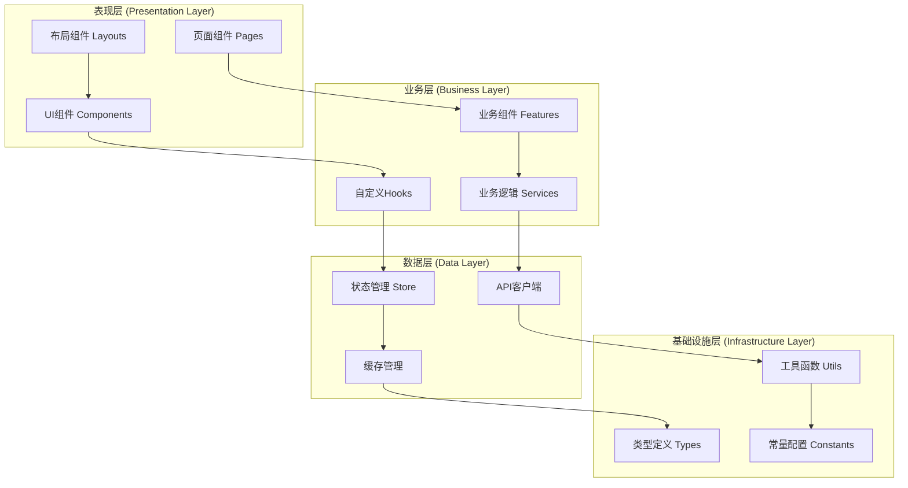

# 前端架构设计

## 概述

Immortality修仙游戏前端采用现代React生态系统，基于TypeScript构建类型安全的组件化架构，使用Tailwind CSS实现响应式设计，通过模块化和分层设计确保代码的可维护性和扩展性。

## 🏗️ **架构总览**

### 技术栈

```typescript
const FrontendStack = {
  // 核心框架
  framework: 'React 18',
  language: 'TypeScript 5.0+',
  bundler: 'Vite 4.0+',
  
  // 样式方案
  styling: 'Tailwind CSS 3.0+',
  components: 'Headless UI + Ant Design',
  
  // 状态管理
  state: 'Zustand + React Query',
  
  // 路由
  routing: 'React Router 6',
  
  // 图形渲染
  graphics: 'SVG.js + react-konva + Framer Motion',
  
  // 实时通信
  websocket: 'Socket.IO Client',
  
  // 开发工具
  testing: 'Jest + Testing Library',
  linting: 'ESLint + Prettier',
  
  // 构建优化
  optimization: 'Code Splitting + Tree Shaking'
};
```

### 架构分层



## 📁 **项目结构**

```
src/
├── components/           # 通用UI组件
│   ├── ui/              # 基础UI组件
│   │   ├── Button/
│   │   ├── Input/
│   │   ├── Modal/
│   │   └── index.ts
│   ├── graphics/        # 图形组件
│   │   ├── SVGComponents/
│   │   ├── CanvasComponents/
│   │   ├── AnimationComponents/
│   │   └── index.ts
│   └── layout/          # 布局组件
│       ├── Header/
│       ├── Sidebar/
│       ├── Footer/
│       └── index.ts
├── features/            # 业务功能模块
│   ├── auth/           # 认证模块
│   │   ├── components/
│   │   ├── hooks/
│   │   ├── services/
│   │   ├── types/
│   │   └── index.ts
│   ├── cultivation/    # 修炼系统
│   ├── combat/         # 战斗系统
│   ├── character/      # 角色系统
│   ├── inventory/      # 背包系统
│   └── world/          # 世界地图
├── hooks/              # 通用自定义Hooks
│   ├── useAuth.ts
│   ├── useWebSocket.ts
│   ├── useLocalStorage.ts
│   └── index.ts
├── services/           # API服务
│   ├── api/
│   │   ├── auth.ts
│   │   ├── game.ts
│   │   └── index.ts
│   ├── websocket/
│   └── storage/
├── store/              # 状态管理
│   ├── slices/
│   │   ├── authSlice.ts
│   │   ├── gameSlice.ts
│   │   └── uiSlice.ts
│   ├── index.ts
│   └── types.ts
├── pages/              # 页面组件
│   ├── Home/
│   ├── Game/
│   ├── Profile/
│   └── index.ts
├── utils/              # 工具函数
│   ├── helpers.ts
│   ├── constants.ts
│   ├── validators.ts
│   └── formatters.ts
├── types/              # 类型定义
│   ├── api.ts
│   ├── game.ts
│   ├── user.ts
│   └── index.ts
├── styles/             # 样式文件
│   ├── globals.css
│   ├── components.css
│   └── animations.css
├── App.tsx
├── main.tsx
└── vite-env.d.ts
```

## 🧩 **组件设计原则**

### 1. 组件分类

#### **基础UI组件 (ui/)**
```typescript
// 按钮组件示例
interface ButtonProps {
  variant: 'primary' | 'secondary' | 'danger' | 'ghost';
  size: 'sm' | 'md' | 'lg';
  children: React.ReactNode;
  onClick?: () => void;
  disabled?: boolean;
  loading?: boolean;
  icon?: React.ReactNode;
  className?: string;
}

const Button: React.FC<ButtonProps> = ({
  variant = 'primary',
  size = 'md',
  children,
  onClick,
  disabled = false,
  loading = false,
  icon,
  className = ''
}) => {
  const baseClasses = 'inline-flex items-center justify-center font-medium transition-all duration-200 focus:outline-none focus:ring-2 focus:ring-offset-2';
  
  const variantClasses = {
    primary: 'bg-blue-600 text-white hover:bg-blue-700 focus:ring-blue-500',
    secondary: 'bg-gray-600 text-white hover:bg-gray-700 focus:ring-gray-500',
    danger: 'bg-red-600 text-white hover:bg-red-700 focus:ring-red-500',
    ghost: 'bg-transparent text-gray-700 hover:bg-gray-100 focus:ring-gray-500'
  };
  
  const sizeClasses = {
    sm: 'px-3 py-1.5 text-sm rounded-md',
    md: 'px-4 py-2 text-base rounded-lg',
    lg: 'px-6 py-3 text-lg rounded-xl'
  };
  
  const disabledClasses = disabled || loading ? 'opacity-50 cursor-not-allowed' : 'cursor-pointer';
  
  return (
    <button
      className={`${baseClasses} ${variantClasses[variant]} ${sizeClasses[size]} ${disabledClasses} ${className}`}
      onClick={onClick}
      disabled={disabled || loading}
    >
      {loading && (
        <svg className="animate-spin -ml-1 mr-2 h-4 w-4" fill="none" viewBox="0 0 24 24">
          <circle className="opacity-25" cx="12" cy="12" r="10" stroke="currentColor" strokeWidth="4" />
          <path className="opacity-75" fill="currentColor" d="M4 12a8 8 0 018-8V0C5.373 0 0 5.373 0 12h4zm2 5.291A7.962 7.962 0 014 12H0c0 3.042 1.135 5.824 3 7.938l3-2.647z" />
        </svg>
      )}
      {icon && !loading && <span className="mr-2">{icon}</span>}
      {children}
    </button>
  );
};

export default Button;
```

#### **图形组件 (graphics/)**
```typescript
// 修炼进度组件
interface CultivationProgressProps {
  level: number;
  experience: number;
  maxExperience: number;
  realm: string;
  isActive: boolean;
  className?: string;
}

const CultivationProgress: React.FC<CultivationProgressProps> = ({
  level,
  experience,
  maxExperience,
  realm,
  isActive,
  className = ''
}) => {
  const progress = (experience / maxExperience) * 100;
  const circumference = 2 * Math.PI * 45; // 半径45的圆周长
  const strokeDasharray = `${(progress / 100) * circumference} ${circumference}`;
  
  return (
    <div className={`relative w-32 h-32 ${className}`}>
      {/* SVG进度环 */}
      <svg className="w-full h-full transform -rotate-90" viewBox="0 0 100 100">
        {/* 背景圆环 */}
        <circle
          cx="50"
          cy="50"
          r="45"
          fill="none"
          stroke="#e5e7eb"
          strokeWidth="4"
        />
        
        {/* 进度圆环 */}
        <circle
          cx="50"
          cy="50"
          r="45"
          fill="none"
          stroke="#3b82f6"
          strokeWidth="4"
          strokeLinecap="round"
          strokeDasharray={strokeDasharray}
          className="transition-all duration-500 ease-out"
        />
      </svg>
      
      {/* 中心内容 */}
      <div className="absolute inset-0 flex flex-col items-center justify-center">
        <span className="text-lg font-bold text-gray-800">{realm}</span>
        <span className="text-sm text-gray-600">{level}级</span>
        <span className="text-xs text-gray-500">{experience}/{maxExperience}</span>
      </div>
      
      {/* 修炼状态指示 */}
      {isActive && (
        <div className="absolute inset-0 rounded-full bg-blue-400 opacity-20 animate-pulse" />
      )}
    </div>
  );
};

export default CultivationProgress;
```

#### **业务组件 (features/)**
```typescript
// 修炼系统主组件
interface CultivationSystemProps {
  playerId: string;
}

const CultivationSystem: React.FC<CultivationSystemProps> = ({ playerId }) => {
  const { data: playerData, isLoading } = usePlayerData(playerId);
  const { startCultivation, stopCultivation } = useCultivation();
  const [isActive, setIsActive] = useState(false);
  
  const handleToggleCultivation = () => {
    if (isActive) {
      stopCultivation();
    } else {
      startCultivation();
    }
    setIsActive(!isActive);
  };
  
  if (isLoading) {
    return <LoadingSpinner />;
  }
  
  if (!playerData) {
    return <ErrorMessage message="无法加载角色数据" />;
  }
  
  return (
    <div className="cultivation-system p-6 bg-white rounded-lg shadow-lg">
      <h2 className="text-2xl font-bold mb-4">修炼系统</h2>
      
      {/* 修炼进度 */}
      <div className="mb-6">
        <CultivationProgress
          level={playerData.level}
          experience={playerData.experience}
          maxExperience={playerData.maxExperience}
          realm={playerData.realm}
          isActive={isActive}
        />
      </div>
      
      {/* 修炼控制 */}
      <div className="flex gap-4">
        <Button
          variant={isActive ? 'danger' : 'primary'}
          onClick={handleToggleCultivation}
          disabled={playerData.energy < 10}
        >
          {isActive ? '停止修炼' : '开始修炼'}
        </Button>
        
        <Button variant="secondary">
          查看功法
        </Button>
      </div>
      
      {/* 修炼信息 */}
      <div className="mt-4 p-4 bg-gray-50 rounded-lg">
        <div className="grid grid-cols-2 gap-4 text-sm">
          <div>
            <span className="text-gray-600">当前境界：</span>
            <span className="font-medium">{playerData.realm}</span>
          </div>
          <div>
            <span className="text-gray-600">修炼速度：</span>
            <span className="font-medium">{playerData.cultivationSpeed}/小时</span>
          </div>
          <div>
            <span className="text-gray-600">灵力值：</span>
            <span className="font-medium">{playerData.energy}/{playerData.maxEnergy}</span>
          </div>
          <div>
            <span className="text-gray-600">突破概率：</span>
            <span className="font-medium">{playerData.breakthroughChance}%</span>
          </div>
        </div>
      </div>
    </div>
  );
};

export default CultivationSystem;
```

### 2. 自定义Hooks设计

#### **数据获取Hooks**
```typescript
// 玩家数据Hook
export const usePlayerData = (playerId: string) => {
  return useQuery({
    queryKey: ['player', playerId],
    queryFn: () => gameApi.getPlayer(playerId),
    staleTime: 30000, // 30秒内不重新获取
    cacheTime: 300000, // 5分钟缓存
    refetchOnWindowFocus: false
  });
};

// 修炼系统Hook
export const useCultivation = () => {
  const queryClient = useQueryClient();
  const { socket } = useWebSocket();
  
  const startCultivation = useMutation({
    mutationFn: gameApi.startCultivation,
    onSuccess: (data) => {
      // 更新本地缓存
      queryClient.setQueryData(['player', data.playerId], data);
      
      // 发送WebSocket事件
      socket?.emit('cultivation:start', { playerId: data.playerId });
      
      // 显示成功提示
      toast.success('开始修炼');
    },
    onError: (error) => {
      toast.error('修炼失败：' + error.message);
    }
  });
  
  const stopCultivation = useMutation({
    mutationFn: gameApi.stopCultivation,
    onSuccess: (data) => {
      queryClient.setQueryData(['player', data.playerId], data);
      socket?.emit('cultivation:stop', { playerId: data.playerId });
      toast.success('停止修炼');
    }
  });
  
  return {
    startCultivation: startCultivation.mutate,
    stopCultivation: stopCultivation.mutate,
    isStarting: startCultivation.isLoading,
    isStopping: stopCultivation.isLoading
  };
};
```

#### **WebSocket通信Hook**
```typescript
// WebSocket连接Hook
export const useWebSocket = () => {
  const [socket, setSocket] = useState<Socket | null>(null);
  const [isConnected, setIsConnected] = useState(false);
  const { user } = useAuthStore();
  
  useEffect(() => {
    if (user?.token) {
      const newSocket = io(WS_URL, {
        auth: {
          token: user.token
        },
        transports: ['websocket']
      });
      
      newSocket.on('connect', () => {
        setIsConnected(true);
        console.log('WebSocket连接成功');
      });
      
      newSocket.on('disconnect', () => {
        setIsConnected(false);
        console.log('WebSocket连接断开');
      });
      
      newSocket.on('error', (error) => {
        console.error('WebSocket错误:', error);
        toast.error('连接错误');
      });
      
      setSocket(newSocket);
      
      return () => {
        newSocket.close();
      };
    }
  }, [user?.token]);
  
  return { socket, isConnected };
};

// 游戏事件监听Hook
export const useGameEvents = () => {
  const { socket } = useWebSocket();
  const queryClient = useQueryClient();
  
  useEffect(() => {
    if (!socket) return;
    
    // 修炼进度更新
    socket.on('cultivation:progress', (data) => {
      queryClient.setQueryData(['player', data.playerId], (old: any) => ({
        ...old,
        experience: data.experience,
        level: data.level
      }));
    });
    
    // 境界突破
    socket.on('cultivation:breakthrough', (data) => {
      queryClient.setQueryData(['player', data.playerId], (old: any) => ({
        ...old,
        realm: data.newRealm,
        level: data.newLevel
      }));
      
      toast.success(`恭喜突破到${data.newRealm}！`);
    });
    
    // 战斗结果
    socket.on('combat:result', (data) => {
      // 处理战斗结果
      if (data.victory) {
        toast.success('战斗胜利！');
      } else {
        toast.error('战斗失败！');
      }
    });
    
    return () => {
      socket.off('cultivation:progress');
      socket.off('cultivation:breakthrough');
      socket.off('combat:result');
    };
  }, [socket, queryClient]);
};
```

### 3. 状态管理架构

#### **Zustand Store设计**
```typescript
// 认证状态
interface AuthState {
  user: User | null;
  token: string | null;
  isAuthenticated: boolean;
  login: (credentials: LoginCredentials) => Promise<void>;
  logout: () => void;
  refreshToken: () => Promise<void>;
}

export const useAuthStore = create<AuthState>((set, get) => ({
  user: null,
  token: localStorage.getItem('token'),
  isAuthenticated: false,
  
  login: async (credentials) => {
    try {
      const response = await authApi.login(credentials);
      const { user, token } = response.data;
      
      localStorage.setItem('token', token);
      set({ user, token, isAuthenticated: true });
      
      toast.success('登录成功');
    } catch (error) {
      toast.error('登录失败');
      throw error;
    }
  },
  
  logout: () => {
    localStorage.removeItem('token');
    set({ user: null, token: null, isAuthenticated: false });
    toast.info('已退出登录');
  },
  
  refreshToken: async () => {
    try {
      const token = get().token;
      if (!token) throw new Error('No token');
      
      const response = await authApi.refreshToken(token);
      const newToken = response.data.token;
      
      localStorage.setItem('token', newToken);
      set({ token: newToken });
    } catch (error) {
      get().logout();
      throw error;
    }
  }
}));

// 游戏状态
interface GameState {
  currentScene: 'home' | 'cultivation' | 'combat' | 'world';
  isLoading: boolean;
  error: string | null;
  setScene: (scene: GameState['currentScene']) => void;
  setLoading: (loading: boolean) => void;
  setError: (error: string | null) => void;
}

export const useGameStore = create<GameState>((set) => ({
  currentScene: 'home',
  isLoading: false,
  error: null,
  
  setScene: (scene) => set({ currentScene: scene }),
  setLoading: (loading) => set({ isLoading: loading }),
  setError: (error) => set({ error })
}));

// UI状态
interface UIState {
  sidebarOpen: boolean;
  theme: 'light' | 'dark';
  notifications: Notification[];
  toggleSidebar: () => void;
  setTheme: (theme: 'light' | 'dark') => void;
  addNotification: (notification: Omit<Notification, 'id'>) => void;
  removeNotification: (id: string) => void;
}

export const useUIStore = create<UIState>((set, get) => ({
  sidebarOpen: false,
  theme: 'light',
  notifications: [],
  
  toggleSidebar: () => set((state) => ({ sidebarOpen: !state.sidebarOpen })),
  
  setTheme: (theme) => {
    localStorage.setItem('theme', theme);
    set({ theme });
  },
  
  addNotification: (notification) => {
    const id = Date.now().toString();
    const newNotification = { ...notification, id };
    
    set((state) => ({
      notifications: [...state.notifications, newNotification]
    }));
    
    // 自动移除通知
    setTimeout(() => {
      get().removeNotification(id);
    }, 5000);
  },
  
  removeNotification: (id) => {
    set((state) => ({
      notifications: state.notifications.filter(n => n.id !== id)
    }));
  }
}));
```

## 🎨 **样式系统设计**

### Tailwind CSS配置

```javascript
// tailwind.config.js
module.exports = {
  content: [
    "./index.html",
    "./src/**/*.{js,ts,jsx,tsx}",
  ],
  theme: {
    extend: {
      colors: {
        // 修仙主题色彩
        cultivation: {
          50: '#f0f9ff',
          100: '#e0f2fe',
          200: '#bae6fd',
          300: '#7dd3fc',
          400: '#38bdf8',
          500: '#0ea5e9',
          600: '#0284c7',
          700: '#0369a1',
          800: '#075985',
          900: '#0c4a6e'
        },
        realm: {
          'qi-refining': '#8B4513',
          'foundation': '#4169E1',
          'golden-core': '#FFD700',
          'nascent-soul': '#9370DB',
          'spirit-transformation': '#FF6347',
          'void-refinement': '#00CED1',
          'body-integration': '#FF1493',
          'mahayana': '#00FF7F',
          'tribulation': '#FF4500'
        }
      },
      fontFamily: {
        'cultivation': ['Noto Serif SC', 'serif'],
        'modern': ['Inter', 'sans-serif']
      },
      animation: {
        'pulse-slow': 'pulse 3s cubic-bezier(0.4, 0, 0.6, 1) infinite',
        'float': 'float 6s ease-in-out infinite',
        'glow': 'glow 2s ease-in-out infinite alternate'
      },
      keyframes: {
        float: {
          '0%, 100%': { transform: 'translateY(0px)' },
          '50%': { transform: 'translateY(-10px)' }
        },
        glow: {
          '0%': { boxShadow: '0 0 5px rgba(59, 130, 246, 0.5)' },
          '100%': { boxShadow: '0 0 20px rgba(59, 130, 246, 0.8)' }
        }
      }
    },
  },
  plugins: [
    require('@tailwindcss/forms'),
    require('@tailwindcss/typography'),
    require('@tailwindcss/aspect-ratio')
  ],
}
```

### 组件样式规范

```css
/* globals.css */
@tailwind base;
@tailwind components;
@tailwind utilities;

/* 修仙主题基础样式 */
@layer base {
  body {
    @apply font-modern text-gray-900 bg-gray-50;
  }
  
  h1, h2, h3, h4, h5, h6 {
    @apply font-cultivation;
  }
}

/* 组件样式 */
@layer components {
  .btn-cultivation {
    @apply px-4 py-2 rounded-lg font-medium transition-all duration-200;
    @apply bg-gradient-to-r from-cultivation-500 to-cultivation-600;
    @apply text-white hover:from-cultivation-600 hover:to-cultivation-700;
    @apply focus:outline-none focus:ring-2 focus:ring-cultivation-500 focus:ring-offset-2;
    @apply disabled:opacity-50 disabled:cursor-not-allowed;
  }
  
  .card-cultivation {
    @apply bg-white rounded-xl shadow-lg border border-gray-200;
    @apply hover:shadow-xl transition-shadow duration-300;
  }
  
  .progress-ring {
    @apply transition-all duration-500 ease-out;
    transform-origin: center;
  }
  
  .spiritual-glow {
    @apply animate-glow;
    filter: drop-shadow(0 0 10px rgba(59, 130, 246, 0.5));
  }
}

/* 工具样式 */
@layer utilities {
  .text-realm-qi {
    @apply text-realm-qi-refining;
  }
  
  .bg-realm-foundation {
    @apply bg-realm-foundation;
  }
  
  .animate-cultivation {
    animation: cultivation 4s ease-in-out infinite;
  }
  
  @keyframes cultivation {
    0%, 100% {
      opacity: 0.7;
      transform: scale(1);
    }
    50% {
      opacity: 1;
      transform: scale(1.05);
    }
  }
}
```

## 🔧 **开发工具配置**

### TypeScript配置

```json
// tsconfig.json
{
  "compilerOptions": {
    "target": "ES2020",
    "useDefineForClassFields": true,
    "lib": ["ES2020", "DOM", "DOM.Iterable"],
    "module": "ESNext",
    "skipLibCheck": true,
    "moduleResolution": "bundler",
    "allowImportingTsExtensions": true,
    "resolveJsonModule": true,
    "isolatedModules": true,
    "noEmit": true,
    "jsx": "react-jsx",
    "strict": true,
    "noUnusedLocals": true,
    "noUnusedParameters": true,
    "noFallthroughCasesInSwitch": true,
    "baseUrl": ".",
    "paths": {
      "@/*": ["./src/*"],
      "@/components/*": ["./src/components/*"],
      "@/features/*": ["./src/features/*"],
      "@/hooks/*": ["./src/hooks/*"],
      "@/services/*": ["./src/services/*"],
      "@/store/*": ["./src/store/*"],
      "@/utils/*": ["./src/utils/*"],
      "@/types/*": ["./src/types/*"]
    }
  },
  "include": ["src"],
  "references": [{ "path": "./tsconfig.node.json" }]
}
```

### Vite配置

```typescript
// vite.config.ts
import { defineConfig } from 'vite';
import react from '@vitejs/plugin-react';
import path from 'path';

export default defineConfig({
  plugins: [react()],
  resolve: {
    alias: {
      '@': path.resolve(__dirname, './src'),
      '@/components': path.resolve(__dirname, './src/components'),
      '@/features': path.resolve(__dirname, './src/features'),
      '@/hooks': path.resolve(__dirname, './src/hooks'),
      '@/services': path.resolve(__dirname, './src/services'),
      '@/store': path.resolve(__dirname, './src/store'),
      '@/utils': path.resolve(__dirname, './src/utils'),
      '@/types': path.resolve(__dirname, './src/types')
    }
  },
  server: {
    port: 3000,
    proxy: {
      '/api': {
        target: 'http://localhost:3001',
        changeOrigin: true
      },
      '/socket.io': {
        target: 'http://localhost:3001',
        ws: true
      }
    }
  },
  build: {
    rollupOptions: {
      output: {
        manualChunks: {
          vendor: ['react', 'react-dom'],
          ui: ['@headlessui/react', 'framer-motion'],
          graphics: ['@svgdotjs/svg.js', 'konva', 'react-konva']
        }
      }
    }
  }
});
```

## 🧪 **测试策略**

### 组件测试

```typescript
// Button.test.tsx
import { render, screen, fireEvent } from '@testing-library/react';
import { describe, it, expect, vi } from 'vitest';
import Button from '../Button';

describe('Button Component', () => {
  it('renders with correct text', () => {
    render(<Button variant="primary">Click me</Button>);
    expect(screen.getByText('Click me')).toBeInTheDocument();
  });
  
  it('calls onClick when clicked', () => {
    const handleClick = vi.fn();
    render(
      <Button variant="primary" onClick={handleClick}>
        Click me
      </Button>
    );
    
    fireEvent.click(screen.getByText('Click me'));
    expect(handleClick).toHaveBeenCalledTimes(1);
  });
  
  it('is disabled when loading', () => {
    render(
      <Button variant="primary" loading>
        Click me
      </Button>
    );
    
    const button = screen.getByRole('button');
    expect(button).toBeDisabled();
  });
  
  it('applies correct variant classes', () => {
    render(<Button variant="danger">Delete</Button>);
    const button = screen.getByRole('button');
    expect(button).toHaveClass('bg-red-600');
  });
});
```

### Hook测试

```typescript
// useCultivation.test.ts
import { renderHook, waitFor } from '@testing-library/react';
import { QueryClient, QueryClientProvider } from '@tanstack/react-query';
import { describe, it, expect, vi } from 'vitest';
import { useCultivation } from '../useCultivation';

const createWrapper = () => {
  const queryClient = new QueryClient({
    defaultOptions: {
      queries: { retry: false },
      mutations: { retry: false }
    }
  });
  
  return ({ children }: { children: React.ReactNode }) => (
    <QueryClientProvider client={queryClient}>
      {children}
    </QueryClientProvider>
  );
};

describe('useCultivation Hook', () => {
  it('starts cultivation successfully', async () => {
    const { result } = renderHook(() => useCultivation(), {
      wrapper: createWrapper()
    });
    
    result.current.startCultivation();
    
    await waitFor(() => {
      expect(result.current.isStarting).toBe(false);
    });
  });
});
```

## 📱 **响应式设计**

### 断点系统

```typescript
// 响应式Hook
export const useBreakpoint = () => {
  const [breakpoint, setBreakpoint] = useState<'sm' | 'md' | 'lg' | 'xl'>('lg');
  
  useEffect(() => {
    const updateBreakpoint = () => {
      const width = window.innerWidth;
      if (width < 640) setBreakpoint('sm');
      else if (width < 768) setBreakpoint('md');
      else if (width < 1024) setBreakpoint('lg');
      else setBreakpoint('xl');
    };
    
    updateBreakpoint();
    window.addEventListener('resize', updateBreakpoint);
    
    return () => window.removeEventListener('resize', updateBreakpoint);
  }, []);
  
  return {
    breakpoint,
    isMobile: breakpoint === 'sm',
    isTablet: breakpoint === 'md',
    isDesktop: breakpoint === 'lg' || breakpoint === 'xl'
  };
};

// 响应式布局组件
const ResponsiveLayout: React.FC<{ children: React.ReactNode }> = ({ children }) => {
  const { isMobile, isTablet } = useBreakpoint();
  
  return (
    <div className={`
      ${isMobile ? 'px-4' : 'px-8'}
      ${isTablet ? 'max-w-4xl' : 'max-w-7xl'}
      mx-auto
    `}>
      {children}
    </div>
  );
};
```

## 🚀 **性能优化**

### 代码分割

```typescript
// 路由懒加载
import { lazy, Suspense } from 'react';
import { Routes, Route } from 'react-router-dom';
import LoadingSpinner from '@/components/ui/LoadingSpinner';

const Home = lazy(() => import('@/pages/Home'));
const Game = lazy(() => import('@/pages/Game'));
const Profile = lazy(() => import('@/pages/Profile'));

const AppRoutes = () => {
  return (
    <Suspense fallback={<LoadingSpinner />}>
      <Routes>
        <Route path="/" element={<Home />} />
        <Route path="/game" element={<Game />} />
        <Route path="/profile" element={<Profile />} />
      </Routes>
    </Suspense>
  );
};
```

### 组件优化

```typescript
// 使用React.memo优化组件
const CultivationProgress = React.memo<CultivationProgressProps>(({ 
  level, experience, maxExperience, realm, isActive 
}) => {
  // 组件实现
}, (prevProps, nextProps) => {
  // 自定义比较函数
  return (
    prevProps.level === nextProps.level &&
    prevProps.experience === nextProps.experience &&
    prevProps.maxExperience === nextProps.maxExperience &&
    prevProps.realm === nextProps.realm &&
    prevProps.isActive === nextProps.isActive
  );
});

// 使用useMemo缓存计算结果
const ExpensiveComponent: React.FC<{ data: any[] }> = ({ data }) => {
  const processedData = useMemo(() => {
    return data.map(item => ({
      ...item,
      calculated: heavyCalculation(item)
    }));
  }, [data]);
  
  return (
    <div>
      {processedData.map(item => (
        <div key={item.id}>{item.calculated}</div>
      ))}
    </div>
  );
};
```

## 📋 **开发规范**

### 1. 命名规范
- **组件**: PascalCase (CultivationSystem)
- **文件**: kebab-case (cultivation-system.tsx)
- **变量/函数**: camelCase (startCultivation)
- **常量**: UPPER_SNAKE_CASE (MAX_LEVEL)
- **类型**: PascalCase (CultivationData)

### 2. 文件组织
- 每个组件一个文件夹
- index.ts作为导出入口
- 相关类型定义在同一文件夹
- 测试文件与源文件同级

### 3. 代码质量
- 使用TypeScript严格模式
- 100%类型覆盖
- 单元测试覆盖率>80%
- ESLint + Prettier代码格式化

### 4. 性能要求
- 首屏加载时间<3秒
- 组件渲染时间<16ms
- 内存使用<100MB
- 包体积<2MB

通过这套前端架构设计，我们能够构建一个高性能、可维护、可扩展的修仙游戏前端应用，为用户提供流畅的游戏体验。