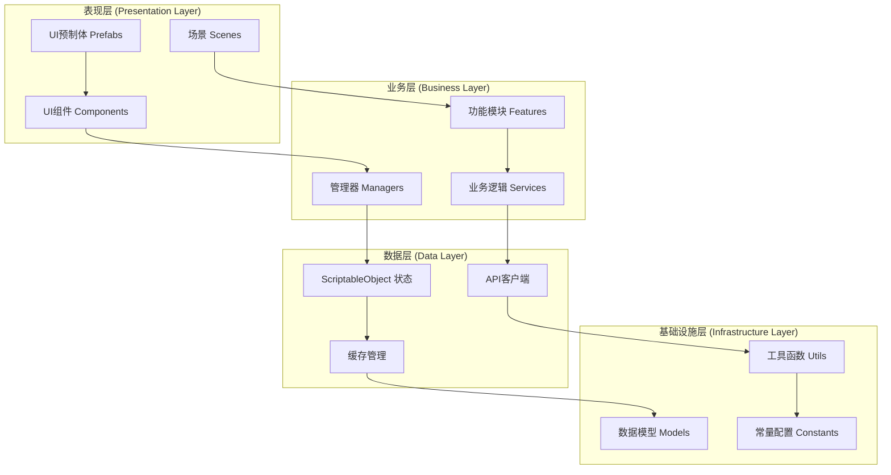

# 客户端架构设计

## 概述

Immortality修仙游戏客户端采用Tuanjie引擎（团结引擎）生态系统，基于C#构建类型安全的组件化架构，使用Unity UI styling (USS / UGUI)实现响应式设计，通过模块化和分层设计确保代码的可维护性和扩展性。

## 🏗️ **架构总览**

### 技术栈

```csharp
// 客户端技术栈配置
public static class ClientStack
{
    // 核心框架
    public const string Framework = "Tuanjie Engine (UGUI / UI Toolkit)";
    public const string Language = "C# / .NET";
    public const string Editor = "Tuanjie Engine Editor";

    // 样式方案
    public const string Styling = "Unity UI styling (USS / UGUI)";
    public const string Components = "Unity UI Toolkit + UGUI components";

    // 状态管理
    public const string State = "ScriptableObject / Singleton Manager pattern";

    // 场景路由
    public const string Routing = "Unity Scene Management / Addressable Scenes";

    // 图形渲染
    public const string Graphics = "Unity UI / SpriteRenderer / Vector Graphics + Particle System + DOTween";

    // 实时通信
    public const string Network = "Unity Transport / Mirror Networking / Netcode for GameObjects";

    // 开发工具
    public const string Testing = "Unity Test Framework / NUnit";
    public const string Linting = "C# Analyzers / .editorconfig";

    // 构建优化
    public const string Optimization = "Addressable Assets / Asset Bundles";
}
```

### 架构分层


```mermaid
flowchart TB
    subgraph "表现层 (Presentation Layer)"
        A[场景 Scenes]
        B[UI预制体 Prefabs]
        C[UI组件 Components]
    end
    
    subgraph "业务层 (Business Layer)"
        D[功能模块 Features]
        E[管理器 Managers]
        F[业务逻辑 Services]
    end
    
    subgraph "数据层 (Data Layer)"
        G[ScriptableObject 状态]
        H[API客户端]
        I[缓存管理]
    end
    
    subgraph "基础设施层 (Infrastructure Layer)"
        J[工具函数 Utils]
        K[数据模型 Models]
        L[常量配置 Constants]
    end
    
    A --> D
    B --> C
    C --> E
    D --> F
    E --> G
    F --> H
    G --> I
    H --> J
    I --> K
    J --> L
```

## 📁 **项目结构**

```
Assets/
├── Scripts/                   # C# 脚本
│   ├── Core/                 # 核心框架
│   │   ├── Managers/         # 单例管理器
│   │   │   ├── GameManager.cs
│   │   │   ├── AuthManager.cs
│   │   │   ├── UIManager.cs
│   │   │   └── NetworkManager.cs
│   │   ├── Systems/          # 系统模块
│   │   └── Utilities/        # 工具类
│   ├── Features/             # 业务功能模块
│   │   ├── Auth/             # 认证模块
│   │   │   ├── AuthController.cs
│   │   │   ├── AuthService.cs
│   │   │   └── AuthModels.cs
│   │   ├── Cultivation/      # 修炼系统
│   │   │   ├── CultivationController.cs
│   │   │   ├── CultivationManager.cs
│   │   │   └── CultivationModels.cs
│   │   ├── Combat/           # 战斗系统
│   │   ├── Character/        # 角色系统
│   │   ├── Inventory/        # 背包系统
│   │   └── World/            # 世界地图
│   ├── Network/              # 网络通信
│   │   ├── Api/              # HTTP API客户端
│   │   │   ├── ApiClient.cs
│   │   │   ├── AuthApi.cs
│   │   │   └── GameApi.cs
│   │   └── Transport/        # 实时通信
│   ├── Data/                 # 数据层
│   │   ├── ScriptableObjects/# 数据资产
│   │   ├── Models/           # 数据模型
│   │   └── Constants/        # 常量配置
│   └── UI/                   # UI脚本
│       ├── Components/       # UI组件脚本
│       └── Views/            # 视图脚本
├── Prefabs/                  # 预制体
│   ├── UI/                   # UI预制体
│   ├── Effects/              # 特效预制体
│   └── Characters/           # 角色预制体
├── Art/                      # 美术资源
│   ├── Sprites/              # 精灵图
│   ├── Icons/                # 图标
│   ├── Animations/           # 动画资源
│   └── Lottie/               # Lottie动画
├── UI/                       # UI资源
│   ├── UXML/                 # UI Toolkit 布局
│   ├── USS/                  # UI Toolkit 样式
│   └── UGUI/                 # UGUI 预制体
├── Scenes/                   # 场景文件
│   ├── Home.unity
│   ├── Cultivation.unity
│   ├── Combat.unity
│   └── World.unity
└── AddressableAssetsData/    # Addressable 资源配置
```

## 🧩 **组件设计原则**

### 1. 组件分类

#### **基础UI组件 (UI/Components/)**
```csharp
// 按钮组件示例
using UnityEngine;
using UnityEngine.UI;
using TMPro;

public class GameButton : MonoBehaviour
{
    public enum ButtonVariant { Primary, Secondary, Danger, Ghost }
    public enum ButtonSize { Small, Medium, Large }

    [SerializeField] private ButtonVariant _variant = ButtonVariant.Primary;
    [SerializeField] private ButtonSize _size = ButtonSize.Medium;
    [SerializeField] private Button _button;
    [SerializeField] private TMP_Text _label;
    [SerializeField] private GameObject _loadingIcon;
    [SerializeField] private GameObject _icon;

    private bool _isLoading;

    public ButtonVariant Variant
    {
        get => _variant;
        set { _variant = value; ApplyStyle(); }
    }

    public ButtonSize Size
    {
        get => _size;
        set { _size = value; ApplyStyle(); }
    }

    public bool Loading
    {
        get => _isLoading;
        set
        {
            _isLoading = value;
            _loadingIcon.SetActive(value);
            _button.interactable = !value;
            ApplyStyle();
        }
    }

    private void Start()
    {
        ApplyStyle();
    }

    private void ApplyStyle()
    {
        var colors = _button.colors;

        colors.normalColor = _variant switch
        {
            ButtonVariant.Primary => new Color(0.24f, 0.47f, 0.85f),  // blue-600
            ButtonVariant.Secondary => new Color(0.44f, 0.44f, 0.44f), // gray-600
            ButtonVariant.Danger => new Color(0.91f, 0.26f, 0.26f),   // red-600
            ButtonVariant.Ghost => new Color(1f, 1f, 1f, 0f),
            _ => Color.white
        };

        _button.colors = colors;

        _label.fontSize = _size switch
        {
            ButtonSize.Small => 14,
            ButtonSize.Medium => 16,
            ButtonSize.Large => 20,
            _ => 16
        };

        if (_isLoading)
        {
            _button.interactable = false;
        }
    }

    public void SetText(string text) => _label.text = text;

    public void AddListener(UnityEngine.Events.UnityAction action)
    {
        _button.onClick.AddListener(action);
    }

    public void RemoveListener(UnityEngine.Events.UnityAction action)
    {
        _button.onClick.RemoveListener(action);
    }
}
```

#### **图形组件 (UI/Components/)**
```csharp
// 修炼进度组件
using UnityEngine;
using UnityEngine.UI;
using DG.Tweening;
using TMPro;

public class CultivationProgressDisplay : MonoBehaviour
{
    [SerializeField] private int _level;
    [SerializeField] private int _experience;
    [SerializeField] private int _maxExperience;
    [SerializeField] private string _realm;
    [SerializeField] private bool _isActive;

    [Header("UI引用")]
    [SerializeField] private Image _progressRing;
    [SerializeField] private TMP_Text _realmText;
    [SerializeField] private TMP_Text _levelText;
    [SerializeField] private TMP_Text _experienceText;
    [SerializeField] private GameObject _activeIndicator;

    private float _lastProgress = -1f;
    private string _lastRealm = "";

    public void UpdateDisplay(int level, int experience, int maxExperience,
                               string realm, bool isActive)
    {
        _level = level;
        _experience = experience;
        _maxExperience = maxExperience;
        _realm = realm;
        _isActive = isActive;

        RefreshUI();
    }

    private void RefreshUI()
    {
        var progress = (float)_experience / _maxExperience;

        // 仅在进度变化时更新进度环动画
        if (Mathf.Abs(progress - _lastProgress) > 0.001f)
        {
            _progressRing.DOFillAmount(progress, 0.5f).SetEase(Ease.OutCubic);
            _lastProgress = progress;
        }

        _realmText.text = _realm;
        _levelText.text = $"{_level}级";
        _experienceText.text = $"{_experience}/{_maxExperience}";

        if (_lastRealm != _realm)
        {
            _lastRealm = _realm;
            // 境界变化时的动画效果
            _realmText.transform.DOScale(1.2f, 0.3f).SetLoops(2, LoopType.Yoyo);
        }

        _activeIndicator.SetActive(_isActive);
        if (_isActive)
        {
            // 修炼状态指示 - 脉冲动画
            _activeIndicator.transform
                .DOScale(1.05f, 1f)
                .SetLoops(-1, LoopType.Yoyo)
                .SetEase(Ease.InOutSine);
        }
    }

    private void OnDestroy()
    {
        _progressRing.DOKill();
        _activeIndicator.transform.DOKill();
    }
}
```

#### **业务组件 (Features/)**
```csharp
// 修炼系统主组件
using UnityEngine;
using UnityEngine.UI;
using TMPro;
using System.Threading.Tasks;
using System;

public class CultivationSystemController : MonoBehaviour
{
    [SerializeField] private string _playerId;

    [Header("UI引用")]
    [SerializeField] private CultivationProgressDisplay _progressDisplay;
    [SerializeField] private GameButton _toggleButton;
    [SerializeField] private GameButton _viewTechniquesButton;
    [SerializeField] private TMP_Text _realmText;
    [SerializeField] private TMP_Text _speedText;
    [SerializeField] private TMP_Text _energyText;
    [SerializeField] private TMP_Text _breakthroughText;
    [SerializeField] private GameObject _loadingIndicator;
    [SerializeField] private GameObject _errorDisplay;

    private PlayerData _playerData;
    private bool _isActive;

    private async void Start()
    {
        _toggleButton.AddListener(OnToggleCultivation);
        _viewTechniquesButton.AddListener(OnViewTechniques);

        await LoadPlayerDataAsync();
    }

    private async Task LoadPlayerDataAsync()
    {
        _loadingIndicator.SetActive(true);

        try
        {
            _playerData = await PlayerDataManager.Instance.GetPlayerDataAsync(_playerId);
            UpdateDisplay();
        }
        catch (Exception)
        {
            _errorDisplay.SetActive(true);
        }
        finally
        {
            _loadingIndicator.SetActive(false);
        }
    }

    private void UpdateDisplay()
    {
        _progressDisplay.UpdateDisplay(
            _playerData.Level,
            _playerData.Experience,
            _playerData.MaxExperience,
            _playerData.Realm,
            _isActive);

        _realmText.text = _playerData.Realm;
        _speedText.text = $"{_playerData.CultivationSpeed}/小时";
        _energyText.text = $"{_playerData.Energy}/{_playerData.MaxEnergy}";
        _breakthroughText.text = $"{_playerData.BreakthroughChance}%";

        _toggleButton.Loading = false;
        _toggleButton._button.interactable = _playerData.Energy >= 10;
    }

    private async void OnToggleCultivation()
    {
        if (_isActive)
        {
            await CultivationManager.Instance.StopCultivationAsync(_playerId);
            _isActive = false;
            _toggleButton.SetText("开始修炼");
        }
        else
        {
            _toggleButton.Loading = true;
            await CultivationManager.Instance.StartCultivationAsync(_playerId);
            _isActive = true;
            _toggleButton.SetText("停止修炼");
        }

        await LoadPlayerDataAsync();
    }

    private void OnViewTechniques()
    {
        // 查看功法
    }

    private void OnDestroy()
    {
        _toggleButton?.RemoveListener(OnToggleCultivation);
        _viewTechniquesButton?.RemoveListener(OnViewTechniques);
    }
}
```

### 2. 管理器与服务设计

#### **数据获取管理器**
```csharp
// 玩家数据管理器 - 缓存与数据同步
using System;
using System.Collections.Generic;
using System.Threading.Tasks;
using UnityEngine;

public class PlayerDataManager : MonoBehaviour
{
    public static PlayerDataManager Instance { get; private set; }

    private readonly Dictionary<string, PlayerData> _cache = new();
    private readonly Dictionary<string, float> _cacheTimestamps = new();
    private const float CacheStaleTime = 30f; // 30秒内不重新获取

    public async Task<PlayerData> GetPlayerDataAsync(string playerId)
    {
        // 检查缓存
        if (_cache.TryGetValue(playerId, out var cached) &&
            _cacheTimestamps.TryGetValue(playerId, out var timestamp) &&
            Time.time - timestamp < CacheStaleTime)
        {
            return cached;
        }

        // 从服务端获取
        var data = await ApiClient.Instance.GetPlayerAsync(playerId);
        _cache[playerId] = data;
        _cacheTimestamps[playerId] = Time.time;

        return data;
    }

    public void UpdateExperience(string playerId, int experience, int level)
    {
        if (_cache.TryGetValue(playerId, out var data))
        {
            data.Experience = experience;
            data.Level = level;
        }
    }

    public void UpdateRealm(string playerId, string newRealm, int newLevel)
    {
        if (_cache.TryGetValue(playerId, out var data))
        {
            data.Realm = newRealm;
            data.Level = newLevel;
        }
    }

    private void Awake()
    {
        if (Instance == null)
        {
            Instance = this;
            DontDestroyOnLoad(gameObject);
        }
        else
        {
            Destroy(gameObject);
        }
    }
}
```

#### **修炼操作管理器**
```csharp
// 修炼操作管理器
using System;
using System.Threading.Tasks;
using UnityEngine;

public class CultivationManager : MonoBehaviour
{
    public static CultivationManager Instance { get; private set; }

    public bool IsStarting { get; private set; }
    public bool IsStopping { get; private set; }

    public async Task StartCultivationAsync(string playerId)
    {
        IsStarting = true;
        try
        {
            var data = await ApiClient.Instance.StartCultivationAsync(playerId);
            PlayerDataManager.Instance.UpdateExperience(playerId, data.Experience, data.Level);

            // 发送网络事件
            NetworkManager.Instance.SendEvent("cultivation:start", new { playerId });

            Debug.Log("开始修炼");
        }
        catch (Exception error)
        {
            Debug.LogError($"修炼失败: {error.Message}");
        }
        finally
        {
            IsStarting = false;
        }
    }

    public async Task StopCultivationAsync(string playerId)
    {
        IsStopping = true;
        try
        {
            var data = await ApiClient.Instance.StopCultivationAsync(playerId);
            PlayerDataManager.Instance.UpdateExperience(playerId, data.Experience, data.Level);
            NetworkManager.Instance.SendEvent("cultivation:stop", new { playerId });
            Debug.Log("停止修炼");
        }
        catch (Exception error)
        {
            Debug.LogError(error.Message);
        }
        finally
        {
            IsStopping = false;
        }
    }

    private void Awake()
    {
        if (Instance == null)
        {
            Instance = this;
            DontDestroyOnLoad(gameObject);
        }
        else
        {
            Destroy(gameObject);
        }
    }
}
```

#### **网络通信管理器**
```csharp
// 网络连接管理器 - 基于 Unity Transport / Mirror / Netcode
using System;
using System.Threading.Tasks;
using UnityEngine;

public class NetworkManager : MonoBehaviour
{
    public static NetworkManager Instance { get; private set; }

    public bool IsConnected { get; private set; }

    public event Action OnConnected;
    public event Action OnDisconnected;
    public event Action<string> OnError;

    private void Awake()
    {
        if (Instance == null)
        {
            Instance = this;
            DontDestroyOnLoad(gameObject);
        }
        else
        {
            Destroy(gameObject);
        }
    }

    public async Task ConnectAsync(string authToken)
    {
        try
        {
            // 使用 Unity Transport / Mirror Networking 建立连接
            // 配置认证信息并连接到服务端
            await Task.Delay(100); // 模拟连接过程

            OnConnected?.Invoke();
            IsConnected = true;
            Debug.Log("网络连接成功");
        }
        catch (Exception error)
        {
            OnError?.Invoke(error.Message);
            Debug.LogError($"网络错误: {error}");
        }
    }

    public void Disconnect()
    {
        IsConnected = false;
        OnDisconnected?.Invoke();
        Debug.Log("网络连接断开");
    }

    public void SendEvent(string eventName, object data)
    {
        if (!IsConnected)
        {
            Debug.LogWarning("网络未连接，无法发送事件");
            return;
        }
        // 通过 Unity Transport / Mirror / Netcode 发送事件
    }

    public void Subscribe(string eventName, Action<string> handler)
    {
        // 订阅服务端推送的事件
    }

    public void Unsubscribe(string eventName, Action<string> handler)
    {
        // 取消订阅
    }
}
```

#### **游戏事件监听器**
```csharp
// 游戏事件监听器 - 监听服务端推送的事件
using UnityEngine;

public class GameEventListener : MonoBehaviour
{
    private void OnEnable()
    {
        NetworkManager.Instance.Subscribe("cultivation:progress", OnCultivationProgress);
        NetworkManager.Instance.Subscribe("cultivation:breakthrough", OnRealmBreakthrough);
        NetworkManager.Instance.Subscribe("combat:result", OnCombatResult);
    }

    private void OnDisable()
    {
        NetworkManager.Instance.Unsubscribe("cultivation:progress", OnCultivationProgress);
        NetworkManager.Instance.Unsubscribe("cultivation:breakthrough", OnRealmBreakthrough);
        NetworkManager.Instance.Unsubscribe("combat:result", OnCombatResult);
    }

    private void OnCultivationProgress(string jsonData)
    {
        var data = JsonUtility.FromJson<CultivationProgressData>(jsonData);
        // 更新玩家经验缓存
        PlayerDataManager.Instance.UpdateExperience(data.playerId, data.experience, data.level);
    }

    private void OnRealmBreakthrough(string jsonData)
    {
        var data = JsonUtility.FromJson<BreakthroughData>(jsonData);
        // 更新境界
        PlayerDataManager.Instance.UpdateRealm(data.playerId, data.newRealm, data.newLevel);
        Debug.Log($"恭喜突破到{data.newRealm}！");
    }

    private void OnCombatResult(string jsonData)
    {
        var data = JsonUtility.FromJson<CombatResultData>(jsonData);
        if (data.victory)
            Debug.Log("战斗胜利！");
        else
            Debug.Log("战斗失败！");
    }
}

[System.Serializable]
public class CultivationProgressData
{
    public string playerId;
    public int experience;
    public int level;
}

[System.Serializable]
public class BreakthroughData
{
    public string playerId;
    public string newRealm;
    public int newLevel;
}

[System.Serializable]
public class CombatResultData
{
    public bool victory;
}
```

### 3. 状态管理架构

#### **Singleton Manager 设计**

```csharp
// 认证状态管理器
using System;
using System.Threading.Tasks;
using UnityEngine;

public class AuthManager : MonoBehaviour
{
    public static AuthManager Instance { get; private set; }

    public User CurrentUser { get; private set; }
    public string Token { get; private set; }
    public bool IsAuthenticated => !string.IsNullOrEmpty(Token);

    public async Task LoginAsync(LoginCredentials credentials)
    {
        try
        {
            var response = await ApiClient.Instance.LoginAsync(credentials);
            CurrentUser = response.User;
            Token = response.Token;
            PlayerPrefs.SetString("token", Token);

            Debug.Log("登录成功");
        }
        catch (Exception)
        {
            Debug.LogError("登录失败");
            throw;
        }
    }

    public void Logout()
    {
        PlayerPrefs.DeleteKey("token");
        CurrentUser = null;
        Token = null;
        Debug.Log("已退出登录");
    }

    public async Task RefreshTokenAsync()
    {
        try
        {
            if (string.IsNullOrEmpty(Token))
                throw new InvalidOperationException("No token");

            var response = await ApiClient.Instance.RefreshTokenAsync(Token);
            Token = response.Token;
            PlayerPrefs.SetString("token", Token);
        }
        catch (Exception)
        {
            Logout();
            throw;
        }
    }

    private void Awake()
    {
        if (Instance == null)
        {
            Instance = this;
            DontDestroyOnLoad(gameObject);
            Token = PlayerPrefs.GetString("token", null);
        }
        else
        {
            Destroy(gameObject);
        }
    }
}
```

```csharp
// 游戏状态管理器
using UnityEngine;
using UnityEngine.SceneManagement;
using System.Threading.Tasks;

public class GameManager : MonoBehaviour
{
    public static GameManager Instance { get; private set; }

    public enum GameSceneType { Home, Cultivation, Combat, World }

    public GameSceneType CurrentScene { get; private set; } = GameSceneType.Home;
    public bool IsLoading { get; private set; }
    public string Error { get; private set; }

    public async Task SetSceneAsync(GameSceneType scene)
    {
        IsLoading = true;
        CurrentScene = scene;

        var sceneName = scene switch
        {
            GameSceneType.Home => "Home",
            GameSceneType.Cultivation => "Cultivation",
            GameSceneType.Combat => "Combat",
            GameSceneType.World => "World",
            _ => "Home"
        };

        // 使用 Addressable Scenes 按需加载场景
        await SceneManager.LoadSceneAsync(sceneName);
        IsLoading = false;
    }

    public void SetLoading(bool loading) => IsLoading = loading;
    public void SetError(string error) => Error = error;

    private void Awake()
    {
        if (Instance == null)
        {
            Instance = this;
            DontDestroyOnLoad(gameObject);
        }
        else
        {
            Destroy(gameObject);
        }
    }
}
```

```csharp
// UI状态管理器
using System;
using System.Collections;
using System.Collections.Generic;
using UnityEngine;

public class UIManager : MonoBehaviour
{
    public static UIManager Instance { get; private set; }

    public enum ThemeType { Light, Dark }

    public bool SidebarOpen { get; private set; }
    public ThemeType CurrentTheme { get; private set; } = ThemeType.Light;

    private readonly List<GameNotification> _notifications = new();
    public IReadOnlyList<GameNotification> Notifications => _notifications;

    public void ToggleSidebar()
    {
        SidebarOpen = !SidebarOpen;
    }

    public void SetTheme(ThemeType theme)
    {
        CurrentTheme = theme;
        PlayerPrefs.SetString("theme", theme.ToString());
    }

    public void AddNotification(string title, string message, NotificationType type)
    {
        var notification = new GameNotification
        {
            Id = DateTimeOffset.UtcNow.ToUnixTimeMilliseconds().ToString(),
            Title = title,
            Message = message,
            Type = type
        };

        _notifications.Add(notification);

        // 自动移除通知
        StartCoroutine(RemoveNotificationAfterDelay(notification.Id, 5f));
    }

    public void RemoveNotification(string id)
    {
        _notifications.RemoveAll(n => n.Id == id);
    }

    private IEnumerator RemoveNotificationAfterDelay(string id, float delay)
    {
        yield return new WaitForSeconds(delay);
        RemoveNotification(id);
    }

    private void Awake()
    {
        if (Instance == null)
        {
            Instance = this;
            DontDestroyOnLoad(gameObject);
            var savedTheme = PlayerPrefs.GetString("theme", "Light");
            CurrentTheme = savedTheme == "Dark" ? ThemeType.Dark : ThemeType.Light;
        }
        else
        {
            Destroy(gameObject);
        }
    }
}

public enum NotificationType { Info, Success, Warning, Error }

public class GameNotification
{
    public string Id { get; set; }
    public string Title { get; set; }
    public string Message { get; set; }
    public NotificationType Type { get; set; }
}
```

## 🎨 **样式系统设计**

### Unity UI 主题配置

```csharp
// 修仙主题色彩配置 - ScriptableObject
using UnityEngine;

[CreateAssetMenu(fileName = "CultivationTheme", menuName = "Immortality/Cultivation Theme")]
public class CultivationTheme : ScriptableObject
{
    [Header("修炼主题色")]
    public Color[] CultivationColors = new Color[]
    {
        new Color(0.94f, 0.98f, 1f),    // 50
        new Color(0.88f, 0.95f, 0.99f), // 100
        new Color(0.73f, 0.90f, 0.99f), // 200
        new Color(0.49f, 0.83f, 0.99f), // 300
        new Color(0.22f, 0.74f, 0.97f), // 400
        new Color(0.05f, 0.65f, 0.91f), // 500
        new Color(0.01f, 0.52f, 0.78f), // 600
        new Color(0.01f, 0.41f, 0.63f), // 700
        new Color(0.03f, 0.35f, 0.52f), // 800
        new Color(0.05f, 0.29f, 0.43f)  // 900
    };

    [Header("境界颜色")]
    public Color QiRefining = new Color(0.55f, 0.27f, 0.07f);    // 练气 - 棕色
    public Color Foundation = new Color(0.25f, 0.41f, 0.88f);    // 筑基 - 蓝色
    public Color GoldenCore = new Color(1f, 0.84f, 0f);           // 金丹 - 金色
    public Color NascentSoul = new Color(0.58f, 0.44f, 0.86f);    // 元婴 - 紫色
    public Color SpiritTransformation = new Color(1f, 0.39f, 0.28f); // 化神 - 红色
    public Color VoidRefinement = new Color(0f, 0.81f, 0.82f);    // 炼虚 - 青色
    public Color BodyIntegration = new Color(1f, 0.08f, 0.58f);   // 合体 - 粉色
    public Color Mahayana = new Color(0f, 1f, 0.5f);              // 大乘 - 绿色
    public Color Tribulation = new Color(1f, 0.27f, 0f);           // 渡劫 - 橙红色

    public Color GetRealmColor(string realm)
    {
        return realm switch
        {
            "练气" => QiRefining,
            "筑基" => Foundation,
            "金丹" => GoldenCore,
            "元婴" => NascentSoul,
            "化神" => SpiritTransformation,
            "炼虚" => VoidRefinement,
            "合体" => BodyIntegration,
            "大乘" => Mahayana,
            "渡劫" => Tribulation,
            _ => Color.gray
        };
    }
}
```

### USS 样式规范

```css
/* 修仙主题 USS 样式 */
:root {
    /* 修炼主题色 */
    --cultivation-500: #0ea5e9;
    --cultivation-600: #0284c7;
    --cultivation-700: #0369a1;

    /* 境界颜色 */
    --realm-qi-refining: #8B4513;
    --realm-foundation: #4169E1;
    --realm-golden-core: #FFD700;
    --realm-nascent-soul: #9370DB;
    --realm-spirit-transformation: #FF6347;
    --realm-void-refinement: #00CED1;
    --realm-body-integration: #FF1493;
    --realm-mahayana: #00FF7F;
    --realm-tribulation: #FF4500;

    /* 字体 */
    --font-cultivation: 'Noto Serif SC';
    --font-modern: 'Inter';
}

/* 基础样式 */
.cultivation-button {
    background-color: var(--cultivation-500);
    color: white;
    font-size: 16px;
    padding: 8px 16px;
    border-radius: 8px;
    transition: background-color 0.2s;
}

.cultivation-button:hover {
    background-color: var(--cultivation-600);
}

.cultivation-button:disabled {
    opacity: 0.5;
}

.cultivation-card {
    background-color: rgba(255, 255, 255, 0.95);
    border-radius: 12px;
    border-width: 1px;
    border-color: #e5e7eb;
}

.progress-ring {
    transition: all 0.5s ease-out;
}

.spiritual-glow {
    filter: drop-shadow(0 0 10px rgba(59, 130, 246, 0.5));
}
```

## 🔧 **开发工具配置**

### C# 项目配置

```xml
<!-- Immortality.Client.csproj -->
<Project Sdk="Microsoft.NET.Sdk">
  <PropertyGroup>
    <TargetFramework>netstandard2.1</TargetFramework>
    <LangVersion>latest</LangVersion>
    <Nullable>enable</Nullable>
    <TreatWarningsAsErrors>true</TreatWarningsAsErrors>
    <NoUnusedLocals>true</NoUnusedLocals>
    <NoUnusedParameters>true</NoUnusedParameters>
    <NoFallthroughCasesInSwitch>true</NoFallthroughCasesInSwitch>
  </PropertyGroup>

  <ItemGroup>
    <PackageReference Include="Unity.Netcode.Runtime" Version="1.0.0" />
    <PackageReference Include="com.unity.addressables" Version="1.0.0" />
    <PackageReference Include="LottieForUnity" Version="1.0.0" />
    <PackageReference Include="DOTween" Version="1.2.0" />
  </ItemGroup>
</Project>
```

### .editorconfig 配置

```ini
# .editorconfig
root = true

[*.cs]
indent_style = space
indent_size = 4
end_of_line = lf
charset = utf-8
trim_trailing_whitespace = true
insert_final_newline = true

# C# 命名规范
dotnet_naming_rule.types_should_be_pascalcase.severity = error
dotnet_naming_rule.types_should_be_pascalcase.symbols = types
dotnet_naming_rule.types_should_be_pascalcase.style = pascalcase

dotnet_naming_rule.methods_should_be_pascalcase.severity = error
dotnet_naming_rule.methods_should_be_pascalcase.symbols = methods
dotnet_naming_rule.methods_should_be_pascalcase.style = pascalcase

dotnet_naming_rule.private_fields_should_be_camelcase.severity = warning
dotnet_naming_rule.private_fields_should_be_camelcase.symbols = private_fields
dotnet_naming_rule.private_fields_should_be_camelcase.style = camelcase_underscore

# 代码分析规则
dotnet_diagnostic.CA1822.severity = warning  # Mark members as static
dotnet_diagnostic.CA2007.severity = none      # Do not directly await a Task
```

### Addressable Assets 配置

```yaml
# AddressableAssetsData/AddressableAssetSettings.asset (简化展示)
# Addressable Assets 配置 - 资源分组与按需加载
groups:
  - name: Scenes
    entries:
      - Assets/Scenes/Home
      - Assets/Scenes/Cultivation
      - Assets/Scenes/Combat
      - Assets/Scenes/World
  - name: UI
    entries:
      - Assets/Prefabs/UI/AuthPanel
      - Assets/Prefabs/UI/CultivationPanel
      - Assets/Prefabs/UI/CharacterPanel
      - Assets/Prefabs/UI/InventoryPanel
  - name: Effects
    entries:
      - Assets/Art/Lottie/Breakthrough
      - Assets/Art/Lottie/SkillRelease
  - name: Graphics
    entries:
      - Assets/Art/Sprites/Cultivation
      - Assets/Art/Sprites/Combat
      - Assets/Art/Sprites/Icons
```

## 🧪 **测试策略**

### 组件测试

```csharp
// GameButtonTests.cs
using NUnit.Framework;
using UnityEngine;
using UnityEngine.UI;

public class GameButtonTests
{
    private GameObject _go;
    private GameButton _button;
    private Button _unityButton;

    [SetUp]
    public void SetUp()
    {
        _go = new GameObject("TestButton");
        _button = _go.AddComponent<GameButton>();
        _unityButton = _go.AddComponent<Button>();

        // 使用反射或序列化设置私有字段
        var buttonField = typeof(GameButton).GetField("_button",
            System.Reflection.BindingFlags.NonPublic | System.Reflection.BindingFlags.Instance);
        buttonField?.SetValue(_button, _unityButton);
    }

    [Test]
    public void Button_RendersWithCorrectText()
    {
        var labelGo = new GameObject("Label");
        var label = labelGo.AddComponent<TMPro.TextMeshProUGUI>();

        var labelField = typeof(GameButton).GetField("_label",
            System.Reflection.BindingFlags.NonPublic | System.Reflection.BindingFlags.Instance);
        labelField?.SetValue(_button, label);

        _button.SetText("Click me");

        Assert.AreEqual("Click me", label.text);
    }

    [Test]
    public void Button_CallsOnClickWhenClicked()
    {
        var onClickCalled = false;
        _button.AddListener(() => onClickCalled = true);

        _unityButton.onClick.Invoke();

        Assert.IsTrue(onClickCalled);
    }

    [Test]
    public void Button_IsDisabledWhenLoading()
    {
        _button.Loading = true;

        Assert.IsFalse(_unityButton.interactable);
    }

    [TearDown]
    public void TearDown()
    {
        Object.DestroyImmediate(_go);
    }
}
```

### 管理器测试

```csharp
// CultivationManagerTests.cs
using NUnit.Framework;
using UnityEngine;
using System.Threading.Tasks;

public class CultivationManagerTests
{
    [Test]
    public async Task StartCultivation_StartsSuccessfully()
    {
        var go = new GameObject("CultivationManager");
        var manager = go.AddComponent<CultivationManager>();

        // 通过反射设置单例
        var instanceProperty = typeof(CultivationManager).GetProperty("Instance");
        instanceProperty?.SetValue(null, manager);

        await manager.StartCultivationAsync("player1");

        Assert.IsFalse(manager.IsStarting);

        Object.DestroyImmediate(go);
    }
}
```

## 📱 **屏幕适配设计**

### 分辨率适配系统

```csharp
// 屏幕适配管理器
using UnityEngine;

public class ScreenAdapter : MonoBehaviour
{
    public enum ScreenSizeType { Mobile, Tablet, Desktop }

    public ScreenSizeType CurrentSize { get; private set; } = ScreenSizeType.Desktop;

    public bool IsMobile => CurrentSize == ScreenSizeType.Mobile;
    public bool IsTablet => CurrentSize == ScreenSizeType.Tablet;
    public bool IsDesktop => CurrentSize == ScreenSizeType.Desktop;

    private void Update()
    {
        var width = Screen.width;

        if (width < 640)
            CurrentSize = ScreenSizeType.Mobile;
        else if (width < 1024)
            CurrentSize = ScreenSizeType.Tablet;
        else
            CurrentSize = ScreenSizeType.Desktop;
    }

    public float GetScaleFactor()
    {
        return CurrentSize switch
        {
            ScreenSizeType.Mobile => 0.8f,
            ScreenSizeType.Tablet => 0.9f,
            _ => 1f
        };
    }

    public int GetPadding()
    {
        return CurrentSize switch
        {
            ScreenSizeType.Mobile => 16,
            ScreenSizeType.Tablet => 24,
            _ => 32
        };
    }
}

// Canvas 适配器组件
public class CanvasScalerAdapter : MonoBehaviour
{
    [SerializeField] private CanvasScaler _canvasScaler;
    [SerializeField] private ScreenAdapter _screenAdapter;

    private void Update()
    {
        if (_screenAdapter.IsMobile)
        {
            _canvasScaler.uiScaleMode = CanvasScaler.ScaleMode.ScaleWithScreenSize;
            _canvasScaler.referenceResolution = new Vector2(750, 1334);
        }
        else
        {
            _canvasScaler.uiScaleMode = CanvasScaler.ScaleMode.ScaleWithScreenSize;
            _canvasScaler.referenceResolution = new Vector2(1920, 1080);
        }
    }
}
```

## 🚀 **性能优化**

### Addressable Assets 按需加载

```csharp
// 场景按需加载 - 替代路由懒加载
using UnityEngine;
using UnityEngine.AddressableAssets;
using UnityEngine.ResourceManagement.AsyncOperations;
using UnityEngine.SceneManagement;
using System.Threading.Tasks;

public class SceneLoader : MonoBehaviour
{
    [SerializeField] private GameObject _loadingIndicator;

    public async Task LoadSceneAsync(string sceneKey)
    {
        _loadingIndicator.SetActive(true);

        var handle = Addressables.LoadSceneAsync(sceneKey, LoadSceneMode.Single);
        await handle.Task;

        if (handle.Status == AsyncOperationStatus.Failed)
        {
            Debug.LogError($"场景加载失败: {sceneKey}");
        }

        _loadingIndicator.SetActive(false);
    }

    public async Task<T> LoadAssetAsync<T>(string assetKey)
    {
        var handle = Addressables.LoadAssetAsync<T>(assetKey);
        await handle.Task;

        if (handle.Status == AsyncOperationStatus.Succeeded)
        {
            return handle.Result;
        }

        Debug.LogError($"资源加载失败: {assetKey}");
        return default;
    }
}
```

### 组件优化

```csharp
// 组件优化 - 避免不必要的UI更新
using UnityEngine;

public class OptimizedCultivationDisplay : MonoBehaviour
{
    private int _lastLevel = -1;
    private int _lastExperience = -1;
    private int _lastMaxExperience = -1;
    private string _lastRealm = "";
    private bool _lastIsActive = false;

    public void UpdateDisplay(int level, int experience, int maxExperience,
                               string realm, bool isActive)
    {
        // 仅在数据变化时更新UI，避免不必要的重绘
        if (level == _lastLevel &&
            experience == _lastExperience &&
            maxExperience == _lastMaxExperience &&
            realm == _lastRealm &&
            isActive == _lastIsActive)
        {
            return;
        }

        _lastLevel = level;
        _lastExperience = experience;
        _lastMaxExperience = maxExperience;
        _lastRealm = realm;
        _lastIsActive = isActive;

        RefreshUI();
    }

    private void RefreshUI()
    {
        // 刷新UI显示
    }
}

// 对象池优化 - 频繁创建销毁的对象复用
using System.Collections.Generic;
using UnityEngine;

public class ObjectPool<T> where T : Component
{
    private readonly T _prefab;
    private readonly Queue<T> _pool = new();
    private readonly Transform _parent;

    public ObjectPool(T prefab, int initialSize, Transform parent)
    {
        _prefab = prefab;
        _parent = parent;

        for (int i = 0; i < initialSize; i++)
        {
            var obj = Object.Instantiate(_prefab, _parent);
            obj.gameObject.SetActive(false);
            _pool.Enqueue(obj);
        }
    }

    public T Get()
    {
        if (_pool.Count > 0)
        {
            var obj = _pool.Dequeue();
            obj.gameObject.SetActive(true);
            return obj;
        }

        return Object.Instantiate(_prefab, _parent);
    }

    public void Return(T obj)
    {
        obj.gameObject.SetActive(false);
        _pool.Enqueue(obj);
    }
}
```

## 📋 **开发规范**

### 1. 命名规范
- **类名/方法名**: PascalCase (`CultivationSystem`, `StartCultivation`)
- **文件名**: PascalCase (`CultivationSystem.cs`)
- **私有字段**: _camelCase (`_playerData`, `_isActive`)
- **常量**: PascalCase (`MaxLevel`)
- **接口**: IPascalCase (`ICultivationService`)
- **枚举**: PascalCase (`GameSceneType`)

### 2. 文件组织
- 每个 MonoBehaviour / ScriptableObject 一个文件
- 相关类型定义可放在同一文件夹
- 测试文件与源文件同命名加 Tests 后缀
- 使用 Assembly Definition 文件划分模块边界

### 3. 代码质量
- 使用 C# 严格模式（`TreatWarningsAsErrors`）
- 100% 类型安全，启用 `Nullable`
- 单元测试覆盖率 > 80%
- C# Analyzers + .editorconfig 代码格式化

### 4. 性能要求
- 首场景加载时间 < 3秒
- 帧渲染时间 < 16ms (60fps)
- 内存使用 < 100MB
- Asset Bundle 体积 < 200MB

通过这套客户端架构设计，我们能够构建一个高性能、可维护、可扩展的修仙游戏客户端应用，为用户提供流畅的游戏体验。
