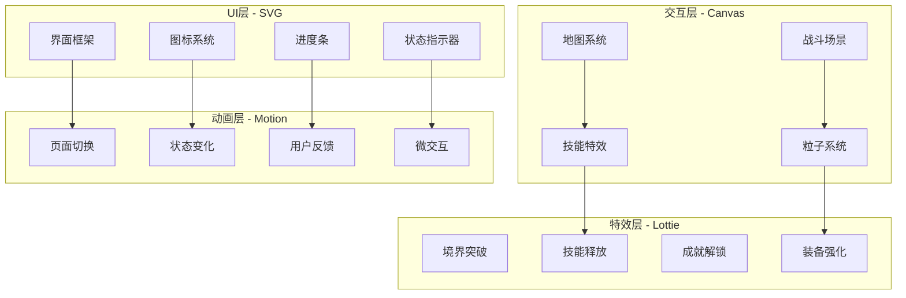

# 轻量化图形实现指南

## 概述

本指南详细介绍Immortality修仙游戏的轻量化图形实现方案，采用SVG + Canvas混合渲染架构，实现极简风格的修仙游戏视觉效果。

## 🎨 **图形技术栈**

### 核心图形库

```typescript
// 图形技术栈组合
const GraphicsStack = {
  // 矢量图形 - 静态UI元素
  svg: 'SVG.js',
  // Canvas渲染 - 动态交互
  canvas: 'react-konva',
  // 动画系统 - 流畅过渡
  animation: 'Framer Motion',
  // JSON动画 - 复杂特效
  lottie: 'Lottie React',
  // 图标系统 - 修仙主题图标
  icons: 'Lucide React + 自定义SVG'
};
```

### 技术选型理由

| 技术 | 适用场景 | 优势 | 劣势 |
|------|----------|------|------|
| **SVG.js** | 静态UI、图标、进度条 | 矢量无损、文件小、易修改 | 复杂动画性能差 |
| **react-konva** | 复杂交互、地图、战斗 | 高性能Canvas、事件处理 | 学习成本高 |
| **Framer Motion** | 页面切换、状态变化 | 声明式动画、易用 | 包体积较大 |
| **Lottie** | 复杂特效、技能动画 | 设计师友好、效果丰富 | 需要AE制作 |

## 🏗️ **架构设计**

### 图形渲染层次



### 组件架构

```typescript
// 图形组件基础架构
interface GraphicsComponentProps {
  // 通用属性
  width?: number;
  height?: number;
  className?: string;
  style?: React.CSSProperties;
  
  // 动画属性
  animate?: boolean;
  duration?: number;
  delay?: number;
  
  // 交互属性
  interactive?: boolean;
  onClick?: () => void;
  onHover?: () => void;
}

// 基础图形组件
abstract class BaseGraphicsComponent<T extends GraphicsComponentProps> 
  extends React.Component<T> {
  
  // 动画控制
  protected animationControls = useAnimation();
  
  // 性能优化
  protected shouldComponentUpdate(nextProps: T): boolean {
    return !isEqual(this.props, nextProps);
  }
  
  // 资源清理
  componentWillUnmount() {
    this.animationControls.stop();
  }
}
```

## 🎮 **修仙游戏图形实现**

### 1. 修炼系统可视化

#### **境界进度环**
```typescript
import { SVG } from '@svgdotjs/svg.js';
import { motion } from 'framer-motion';

interface RealmProgressProps {
  currentRealm: string;
  progress: number; // 0-100
  level: number;
  experience: number;
  maxExperience: number;
}

const RealmProgress: React.FC<RealmProgressProps> = ({
  currentRealm, progress, level, experience, maxExperience
}) => {
  const svgRef = useRef<HTMLDivElement>(null);
  const [svgInstance, setSvgInstance] = useState<SVG.Svg | null>(null);
  
  useEffect(() => {
    if (svgRef.current) {
      const svg = SVG().addTo(svgRef.current).size(300, 300);
      
      // 境界背景圆环
      const backgroundRing = svg.circle(200)
        .center(150, 150)
        .fill('none')
        .stroke({ color: '#2a2a2a', width: 8 });
      
      // 进度圆环
      const progressRing = svg.circle(200)
        .center(150, 150)
        .fill('none')
        .stroke({ 
          color: getRealmColor(currentRealm), 
          width: 8,
          linecap: 'round'
        })
        .attr('stroke-dasharray', `${progress * 6.28} 628`)
        .attr('stroke-dashoffset', 157); // 从顶部开始
      
      // 境界文字
      svg.text(currentRealm)
        .center(150, 130)
        .font({ 
          family: 'serif', 
          size: 24, 
          weight: 'bold',
          fill: getRealmColor(currentRealm)
        });
      
      // 等级显示
      svg.text(`${level}级`)
        .center(150, 160)
        .font({ 
          family: 'sans-serif', 
          size: 16, 
          fill: '#666'
        });
      
      // 经验值显示
      svg.text(`${experience}/${maxExperience}`)
        .center(150, 180)
        .font({ 
          family: 'monospace', 
          size: 12, 
          fill: '#999'
        });
      
      setSvgInstance(svg);
    }
  }, [currentRealm, progress, level, experience, maxExperience]);
  
  return (
    <motion.div 
      className="realm-progress"
      initial={{ opacity: 0, scale: 0.8 }}
      animate={{ opacity: 1, scale: 1 }}
      transition={{ duration: 0.5 }}
    >
      <div ref={svgRef} />
      
      {/* 灵力流动效果 */}
      <motion.div
        className="spiritual-energy"
        animate={{
          opacity: [0.3, 1, 0.3],
          scale: [1, 1.05, 1]
        }}
        transition={{
          duration: 3,
          repeat: Infinity,
          ease: "easeInOut"
        }}
        style={{
          position: 'absolute',
          top: '50%',
          left: '50%',
          transform: 'translate(-50%, -50%)',
          width: '220px',
          height: '220px',
          borderRadius: '50%',
          background: `radial-gradient(circle, ${getRealmColor(currentRealm)}20, transparent)`,
          pointerEvents: 'none'
        }}
      />
    </motion.div>
  );
};

// 境界颜色映射
const getRealmColor = (realm: string): string => {
  const colors = {
    '练气': '#8B4513', // 棕色
    '筑基': '#4169E1', // 蓝色
    '金丹': '#FFD700', // 金色
    '元婴': '#9370DB', // 紫色
    '化神': '#FF6347', // 红色
    '炼虚': '#00CED1', // 青色
    '合体': '#FF1493', // 粉色
    '大乘': '#00FF7F', // 绿色
    '渡劫': '#FF4500'  // 橙红色
  };
  return colors[realm] || '#666';
};
```

#### **修炼动画效果**
```typescript
// 修炼状态动画组件
const CultivationAnimation: React.FC<{
  isActive: boolean;
  intensity: number;
}> = ({ isActive, intensity }) => {
  return (
    <div className="cultivation-container">
      {/* 主要修炼光环 */}
      <motion.div
        className="cultivation-aura"
        animate={isActive ? {
          opacity: [0.2, 0.8, 0.2],
          scale: [1, 1.2, 1],
          rotate: [0, 360]
        } : { opacity: 0 }}
        transition={{
          duration: 4 / intensity,
          repeat: Infinity,
          ease: "linear"
        }}
      />
      
      {/* 灵力粒子 */}
      {Array.from({ length: 12 }).map((_, i) => (
        <motion.div
          key={i}
          className="spiritual-particle"
          animate={isActive ? {
            x: [0, Math.cos(i * 30) * 50, 0],
            y: [0, Math.sin(i * 30) * 50, 0],
            opacity: [0, 1, 0]
          } : { opacity: 0 }}
          transition={{
            duration: 2,
            repeat: Infinity,
            delay: i * 0.1,
            ease: "easeInOut"
          }}
          style={{
            position: 'absolute',
            width: '4px',
            height: '4px',
            borderRadius: '50%',
            background: '#FFD700'
          }}
        />
      ))}
    </div>
  );
};
```

### 2. 战斗系统图形

#### **技能释放特效**
```typescript
import { Stage, Layer, Circle, Line, Text } from 'react-konva';

interface SkillEffectProps {
  skillType: 'fire' | 'water' | 'earth' | 'air' | 'lightning';
  damage: number;
  position: { x: number; y: number };
  onComplete: () => void;
}

const SkillEffect: React.FC<SkillEffectProps> = ({
  skillType, damage, position, onComplete
}) => {
  const [particles, setParticles] = useState<Array<{
    id: number;
    x: number;
    y: number;
    vx: number;
    vy: number;
    life: number;
  }>>([]);
  
  useEffect(() => {
    // 生成粒子
    const newParticles = Array.from({ length: 20 }, (_, i) => ({
      id: i,
      x: position.x,
      y: position.y,
      vx: (Math.random() - 0.5) * 10,
      vy: (Math.random() - 0.5) * 10,
      life: 1
    }));
    
    setParticles(newParticles);
    
    // 动画循环
    const animate = () => {
      setParticles(prev => 
        prev.map(particle => ({
          ...particle,
          x: particle.x + particle.vx,
          y: particle.y + particle.vy,
          life: particle.life - 0.02
        })).filter(p => p.life > 0)
      );
    };
    
    const interval = setInterval(animate, 16);
    const timeout = setTimeout(onComplete, 1000);
    
    return () => {
      clearInterval(interval);
      clearTimeout(timeout);
    };
  }, [position, onComplete]);
  
  const getSkillColor = (type: string) => {
    const colors = {
      fire: '#FF4500',
      water: '#1E90FF',
      earth: '#8B4513',
      air: '#87CEEB',
      lightning: '#FFD700'
    };
    return colors[type] || '#FFF';
  };
  
  return (
    <Stage width={800} height={600}>
      <Layer>
        {/* 主要技能光效 */}
        <Circle
          x={position.x}
          y={position.y}
          radius={30}
          fill={getSkillColor(skillType)}
          opacity={0.8}
          shadowBlur={20}
          shadowColor={getSkillColor(skillType)}
        />
        
        {/* 粒子效果 */}
        {particles.map(particle => (
          <Circle
            key={particle.id}
            x={particle.x}
            y={particle.y}
            radius={3}
            fill={getSkillColor(skillType)}
            opacity={particle.life}
          />
        ))}
        
        {/* 伤害数字 */}
        <Text
          x={position.x - 20}
          y={position.y - 50}
          text={`-${damage}`}
          fontSize={24}
          fontFamily="Arial"
          fill="#FF0000"
          fontStyle="bold"
        />
      </Layer>
    </Stage>
  );
};
```

### 3. 地图系统

#### **修仙世界地图**
```typescript
interface MapRegion {
  id: string;
  name: string;
  type: 'sect' | 'city' | 'wilderness' | 'secret_realm';
  position: { x: number; y: number };
  size: { width: number; height: number };
  unlocked: boolean;
  danger_level: number;
}

const WorldMap: React.FC<{
  regions: MapRegion[];
  playerPosition: { x: number; y: number };
  onRegionClick: (regionId: string) => void;
}> = ({ regions, playerPosition, onRegionClick }) => {
  return (
    <div className="world-map">
      <SVG width={1200} height={800}>
        {/* 地图背景 */}
        <defs>
          <pattern id="mapTexture" patternUnits="userSpaceOnUse" width={50} height={50}>
            <rect width={50} height={50} fill="#f0f8ff" opacity={0.1} />
            <circle cx={25} cy={25} r={1} fill="#ddd" />
          </pattern>
        </defs>
        
        <rect width={1200} height={800} fill="url(#mapTexture)" />
        
        {/* 地区渲染 */}
        {regions.map(region => (
          <g key={region.id}>
            {/* 地区区域 */}
            <rect
              x={region.position.x}
              y={region.position.y}
              width={region.size.width}
              height={region.size.height}
              fill={getRegionColor(region.type)}
              opacity={region.unlocked ? 0.7 : 0.3}
              stroke={region.unlocked ? '#333' : '#999'}
              strokeWidth={2}
              className="region-area"
              onClick={() => region.unlocked && onRegionClick(region.id)}
            />
            
            {/* 地区名称 */}
            <text
              x={region.position.x + region.size.width / 2}
              y={region.position.y + region.size.height / 2}
              textAnchor="middle"
              dominantBaseline="middle"
              fontSize={14}
              fill={region.unlocked ? '#333' : '#999'}
              fontWeight="bold"
            >
              {region.name}
            </text>
            
            {/* 危险等级指示 */}
            {region.unlocked && (
              <g>
                {Array.from({ length: region.danger_level }).map((_, i) => (
                  <polygon
                    key={i}
                    points="0,0 5,10 -5,10"
                    fill="#FF4500"
                    transform={`translate(${region.position.x + 10 + i * 8}, ${region.position.y + 10})`}
                  />
                ))}
              </g>
            )}
          </g>
        ))}
        
        {/* 玩家位置 */}
        <motion.circle
          cx={playerPosition.x}
          cy={playerPosition.y}
          r={8}
          fill="#00FF00"
          stroke="#FFF"
          strokeWidth={2}
          animate={{
            scale: [1, 1.2, 1],
            opacity: [0.8, 1, 0.8]
          }}
          transition={{
            duration: 2,
            repeat: Infinity,
            ease: "easeInOut"
          }}
        />
        
        {/* 路径连接线 */}
        {regions.map(region => 
          region.unlocked && (
            <line
              key={`path-${region.id}`}
              x1={playerPosition.x}
              y1={playerPosition.y}
              x2={region.position.x + region.size.width / 2}
              y2={region.position.y + region.size.height / 2}
              stroke="#666"
              strokeWidth={1}
              strokeDasharray="5,5"
              opacity={0.5}
            />
          )
        )}
      </SVG>
    </div>
  );
};

const getRegionColor = (type: string): string => {
  const colors = {
    sect: '#4169E1',      // 宗门 - 蓝色
    city: '#32CD32',      // 城市 - 绿色
    wilderness: '#8B4513', // 荒野 - 棕色
    secret_realm: '#9370DB' // 秘境 - 紫色
  };
  return colors[type] || '#666';
};
```

### 4. UI组件系统

#### **修仙主题按钮**
```typescript
interface CultivationButtonProps {
  variant: 'primary' | 'secondary' | 'danger' | 'success';
  size: 'sm' | 'md' | 'lg';
  children: React.ReactNode;
  onClick?: () => void;
  disabled?: boolean;
  loading?: boolean;
}

const CultivationButton: React.FC<CultivationButtonProps> = ({
  variant, size, children, onClick, disabled, loading
}) => {
  const baseClasses = "relative overflow-hidden font-medium transition-all duration-200";
  
  const variantClasses = {
    primary: "bg-gradient-to-r from-blue-600 to-purple-600 text-white hover:from-blue-700 hover:to-purple-700",
    secondary: "bg-gradient-to-r from-gray-500 to-gray-600 text-white hover:from-gray-600 hover:to-gray-700",
    danger: "bg-gradient-to-r from-red-500 to-red-600 text-white hover:from-red-600 hover:to-red-700",
    success: "bg-gradient-to-r from-green-500 to-green-600 text-white hover:from-green-600 hover:to-green-700"
  };
  
  const sizeClasses = {
    sm: "px-3 py-1.5 text-sm rounded-md",
    md: "px-4 py-2 text-base rounded-lg",
    lg: "px-6 py-3 text-lg rounded-xl"
  };
  
  return (
    <motion.button
      className={`${baseClasses} ${variantClasses[variant]} ${sizeClasses[size]} ${disabled ? 'opacity-50 cursor-not-allowed' : ''}`}
      onClick={onClick}
      disabled={disabled || loading}
      whileHover={{ scale: disabled ? 1 : 1.05 }}
      whileTap={{ scale: disabled ? 1 : 0.95 }}
    >
      {/* 按钮光效 */}
      <motion.div
        className="absolute inset-0 bg-white opacity-0"
        whileHover={{ opacity: 0.1 }}
        transition={{ duration: 0.2 }}
      />
      
      {/* 加载状态 */}
      {loading && (
        <motion.div
          className="absolute inset-0 flex items-center justify-center"
          initial={{ opacity: 0 }}
          animate={{ opacity: 1 }}
        >
          <div className="w-5 h-5 border-2 border-white border-t-transparent rounded-full animate-spin" />
        </motion.div>
      )}
      
      {/* 按钮内容 */}
      <span className={loading ? 'opacity-0' : 'opacity-100'}>
        {children}
      </span>
      
      {/* 点击波纹效果 */}
      <motion.div
        className="absolute inset-0 bg-white rounded-full opacity-0"
        initial={{ scale: 0 }}
        whileTap={{ scale: 4, opacity: [0, 0.3, 0] }}
        transition={{ duration: 0.3 }}
      />
    </motion.button>
  );
};
```

## 🚀 **性能优化策略**

### 1. 渲染优化

```typescript
// 虚拟化长列表
const VirtualizedList: React.FC<{
  items: any[];
  renderItem: (item: any, index: number) => React.ReactNode;
  itemHeight: number;
}> = ({ items, renderItem, itemHeight }) => {
  const [visibleRange, setVisibleRange] = useState({ start: 0, end: 10 });
  const containerRef = useRef<HTMLDivElement>(null);
  
  const handleScroll = useCallback(
    throttle(() => {
      if (containerRef.current) {
        const scrollTop = containerRef.current.scrollTop;
        const containerHeight = containerRef.current.clientHeight;
        
        const start = Math.floor(scrollTop / itemHeight);
        const end = Math.min(
          start + Math.ceil(containerHeight / itemHeight) + 1,
          items.length
        );
        
        setVisibleRange({ start, end });
      }
    }, 16),
    [itemHeight, items.length]
  );
  
  return (
    <div
      ref={containerRef}
      className="overflow-auto"
      style={{ height: '400px' }}
      onScroll={handleScroll}
    >
      <div style={{ height: items.length * itemHeight, position: 'relative' }}>
        {items.slice(visibleRange.start, visibleRange.end).map((item, index) => (
          <div
            key={visibleRange.start + index}
            style={{
              position: 'absolute',
              top: (visibleRange.start + index) * itemHeight,
              width: '100%',
              height: itemHeight
            }}
          >
            {renderItem(item, visibleRange.start + index)}
          </div>
        ))}
      </div>
    </div>
  );
};
```

### 2. 内存管理

```typescript
// 图形资源管理器
class GraphicsResourceManager {
  private static instance: GraphicsResourceManager;
  private svgCache = new Map<string, SVG.Svg>();
  private textureCache = new Map<string, HTMLImageElement>();
  private animationCache = new Map<string, any>();
  
  static getInstance(): GraphicsResourceManager {
    if (!this.instance) {
      this.instance = new GraphicsResourceManager();
    }
    return this.instance;
  }
  
  // SVG缓存管理
  getSVG(key: string, factory: () => SVG.Svg): SVG.Svg {
    if (!this.svgCache.has(key)) {
      this.svgCache.set(key, factory());
    }
    return this.svgCache.get(key)!;
  }
  
  // 纹理预加载
  async preloadTexture(url: string): Promise<HTMLImageElement> {
    if (this.textureCache.has(url)) {
      return this.textureCache.get(url)!;
    }
    
    const img = new Image();
    img.src = url;
    
    return new Promise((resolve, reject) => {
      img.onload = () => {
        this.textureCache.set(url, img);
        resolve(img);
      };
      img.onerror = reject;
    });
  }
  
  // 清理未使用的资源
  cleanup(): void {
    // 清理超过5分钟未使用的资源
    const now = Date.now();
    const threshold = 5 * 60 * 1000;
    
    for (const [key, resource] of this.svgCache.entries()) {
      if (now - resource.lastUsed > threshold) {
        resource.remove();
        this.svgCache.delete(key);
      }
    }
  }
}
```

### 3. 动画优化

```typescript
// 动画性能监控
const useAnimationPerformance = () => {
  const frameTimeRef = useRef<number[]>([]);
  const [fps, setFps] = useState(60);
  
  useEffect(() => {
    let animationId: number;
    let lastTime = performance.now();
    
    const measureFrame = (currentTime: number) => {
      const deltaTime = currentTime - lastTime;
      frameTimeRef.current.push(deltaTime);
      
      // 保持最近30帧的数据
      if (frameTimeRef.current.length > 30) {
        frameTimeRef.current.shift();
      }
      
      // 计算平均FPS
      const avgFrameTime = frameTimeRef.current.reduce((a, b) => a + b, 0) / frameTimeRef.current.length;
      const currentFps = Math.round(1000 / avgFrameTime);
      setFps(currentFps);
      
      lastTime = currentTime;
      animationId = requestAnimationFrame(measureFrame);
    };
    
    animationId = requestAnimationFrame(measureFrame);
    
    return () => cancelAnimationFrame(animationId);
  }, []);
  
  return { fps, isLowPerformance: fps < 30 };
};

// 自适应动画质量
const AdaptiveAnimation: React.FC<{
  children: React.ReactNode;
  highQuality: any;
  lowQuality: any;
}> = ({ children, highQuality, lowQuality }) => {
  const { isLowPerformance } = useAnimationPerformance();
  
  return (
    <motion.div
      animate={isLowPerformance ? lowQuality : highQuality}
      transition={{
        duration: isLowPerformance ? 0.2 : 0.5,
        ease: isLowPerformance ? "linear" : "easeInOut"
      }}
    >
      {children}
    </motion.div>
  );
};
```

## 📱 **响应式设计**

### 移动端适配

```typescript
// 响应式图形组件
const ResponsiveGraphics: React.FC<{
  children: React.ReactNode;
}> = ({ children }) => {
  const [screenSize, setScreenSize] = useState({
    width: window.innerWidth,
    height: window.innerHeight
  });
  
  useEffect(() => {
    const handleResize = () => {
      setScreenSize({
        width: window.innerWidth,
        height: window.innerHeight
      });
    };
    
    window.addEventListener('resize', handleResize);
    return () => window.removeEventListener('resize', handleResize);
  }, []);
  
  const isMobile = screenSize.width < 768;
  const scale = isMobile ? 0.8 : 1;
  
  return (
    <div 
      className="responsive-graphics"
      style={{
        transform: `scale(${scale})`,
        transformOrigin: 'center',
        width: isMobile ? '100vw' : 'auto',
        overflow: isMobile ? 'hidden' : 'visible'
      }}
    >
      {children}
    </div>
  );
};
```

## 🔧 **开发工具**

### 图形调试工具

```typescript
// 图形性能调试面板
const GraphicsDebugPanel: React.FC = () => {
  const [showDebug, setShowDebug] = useState(false);
  const { fps } = useAnimationPerformance();
  const resourceManager = GraphicsResourceManager.getInstance();
  
  if (!showDebug) {
    return (
      <button 
        className="fixed bottom-4 right-4 bg-black text-white p-2 rounded"
        onClick={() => setShowDebug(true)}
      >
        Debug
      </button>
    );
  }
  
  return (
    <div className="fixed bottom-4 right-4 bg-black text-white p-4 rounded-lg">
      <div className="mb-2">
        <strong>Graphics Debug</strong>
        <button 
          className="ml-2 text-red-400"
          onClick={() => setShowDebug(false)}
        >
          ×
        </button>
      </div>
      
      <div className="text-sm space-y-1">
        <div>FPS: {fps}</div>
        <div>SVG Cache: {resourceManager.svgCache.size}</div>
        <div>Texture Cache: {resourceManager.textureCache.size}</div>
        <div>Memory: {(performance as any).memory?.usedJSHeapSize || 'N/A'}</div>
      </div>
      
      <button 
        className="mt-2 bg-red-600 text-white px-2 py-1 rounded text-xs"
        onClick={() => resourceManager.cleanup()}
      >
        Clear Cache
      </button>
    </div>
  );
};
```

## 📚 **最佳实践**

### 1. 组件设计原则
- **单一职责**: 每个图形组件只负责一个特定功能
- **可复用性**: 通过props配置不同的视觉效果
- **性能优先**: 避免不必要的重渲染和动画
- **渐进增强**: 基础功能优先，特效作为增强

### 2. 动画设计指南
- **缓动函数**: 使用自然的缓动效果
- **持续时间**: 界面动画200-500ms，游戏特效500-1000ms
- **性能监控**: 保持60fps，低于30fps时降级
- **用户控制**: 提供动画开关选项

### 3. 资源管理
- **懒加载**: 按需加载图形资源
- **缓存策略**: 合理使用内存和磁盘缓存
- **资源清理**: 及时清理未使用的资源
- **压缩优化**: SVG文件压缩和优化

### 4. 可访问性
- **语义化**: 使用适当的ARIA标签
- **键盘导航**: 支持键盘操作
- **颜色对比**: 确保足够的颜色对比度
- **动画控制**: 尊重用户的动画偏好设置

## 🎯 **实施计划**

### 第一阶段 (1-2周)
- [ ] 搭建基础图形组件库
- [ ] 实现SVG图标系统
- [ ] 创建基础动画组件
- [ ] 建立性能监控体系

### 第二阶段 (2-3周)
- [ ] 实现修炼系统可视化
- [ ] 开发战斗特效系统
- [ ] 创建地图渲染组件
- [ ] 优化移动端体验

### 第三阶段 (1-2周)
- [ ] 性能优化和调试
- [ ] 可访问性改进
- [ ] 文档完善
- [ ] 测试和验收

通过这套轻量化图形实现方案，我们能够在保持开发效率的同时，为Immortality修仙游戏提供优秀的视觉体验。