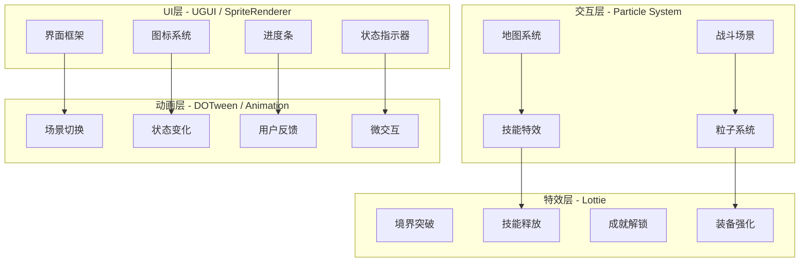

# 轻量化图形实现指南

## 概述

本指南详细介绍Immortality修仙游戏的轻量化图形实现方案，采用Tuanjie 引擎 UGUI + Particle System + TuanjieGI 全局光照渲染架构，实现极简风格的修仙游戏视觉效果。

## 🎨 **图形技术栈**

### 核心图形库

```csharp
// 图形技术栈配置
public static class GraphicsStack
{
    // 精灵渲染 - 静态UI元素
    public const string Sprite = "Unity UI / SpriteRenderer / Vector Graphics";
    // 粒子系统 - 动态交互与特效
    public const string Particles = "Unity Canvas / Particle System";
    // 动画系统 - 流畅过渡
    public const string Animation = "Unity Animation System / DOTween";
    // JSON动画 - 复杂特效
    public const string Lottie = "Lottie for Unity (com.unity.uiextensions)";
    // 图标系统 - 修仙主题图标
    public const string Icons = "Sprite Atlas + 自定义 Sprite";
}
```

### 技术选型理由

| 技术 | 适用场景 | 优势 | 劣势 |
|------|----------|------|------|
| **Unity UI / SpriteRenderer** | 静态UI、图标、进度条 | 矢量无损、Sprite Atlas合并、Draw Call少 | 复杂动画需配合Particle System |
| **Unity Canvas / Particle System** | 复杂交互、地图、战斗 | 高性能GPU粒子、事件处理完善 | 参数调优成本高 |
| **Unity Animation / DOTween** | 场景切换、状态变化 | 声明式动画、代码简洁易用 | 复杂序列动画需Animation Clip |
| **Lottie for Unity** | 复杂特效、技能动画 | 设计师友好、效果丰富 | 需要AE制作导出 |

## 🏗️ **架构设计**

### 图形渲染层次


```mermaid
flowchart TB
    subgraph "UI层 - UGUI / SpriteRenderer"
        A[界面框架]
        B[图标系统]
        C[进度条]
        D[状态指示器]
    end
    
    subgraph "交互层 - Particle System"
        E[地图系统]
        F[战斗场景]
        G[技能特效]
        H[粒子系统]
    end
    
    subgraph "动画层 - DOTween / Animation"
        I[场景切换]
        J[状态变化]
        K[用户反馈]
        L[微交互]
    end
    
    subgraph "特效层 - Lottie"
        M[境界突破]
        N[技能释放]
        O[成就解锁]
        P[装备强化]
    end
    
    A --> I
    B --> J
    C --> K
    D --> L
    
    E --> G
    F --> H
    G --> N
    H --> P
```

### 组件架构

```csharp
// 图形组件基础架构
using UnityEngine;
using DG.Tweening;

public abstract class BaseGraphicsComponent : MonoBehaviour
{
    [Header("通用属性")]
    [SerializeField] protected float width = 300f;
    [SerializeField] protected float height = 200f;
    [SerializeField] protected bool animate = true;
    [SerializeField] protected float duration = 0.5f;
    [SerializeField] protected float delay = 0f;

    // 动画控制
    protected Tweener activeTween;

    // 性能优化 - 避免不必要的更新
    protected virtual bool ShouldUpdate()
    {
        return gameObject.activeInHierarchy;
    }

    // 资源清理
    protected virtual void OnDestroy()
    {
        activeTween?.Kill();
    }

    // 播放进入动画
    protected virtual void PlayEnterAnimation()
    {
        if (!animate) return;

        var canvasGroup = GetComponent<CanvasGroup>();
        if (canvasGroup != null)
        {
            canvasGroup.alpha = 0f;
            canvasGroup.DOFade(1f, duration).SetDelay(delay).SetEase(Ease.OutCubic);
        }

        transform.localScale = Vector3.one * 0.8f;
        transform.DOScale(Vector3.one, duration)
            .SetDelay(delay)
            .SetEase(Ease.OutBack);
    }
}
```

## 🎮 **修仙游戏图形实现**

### 1. 修炼系统可视化

#### **境界进度环**
```csharp
using UnityEngine;
using UnityEngine.UI;
using DG.Tweening;
using TMPro;

public class RealmProgressDisplay : MonoBehaviour
{
    [Header("境界配置")]
    [SerializeField] private string currentRealm;
    [SerializeField] private float progress; // 0-100
    [SerializeField] private int level;
    [SerializeField] private int experience;
    [SerializeField] private int maxExperience;

    [Header("UI引用")]
    [SerializeField] private Image backgroundRing;
    [SerializeField] private Image progressRing;
    [SerializeField] private TMP_Text realmText;
    [SerializeField] private TMP_Text levelText;
    [SerializeField] private TMP_Text experienceText;
    [SerializeField] private GameObject spiritualEnergyEffect;
    [SerializeField] private CultivationTheme theme;

    private void Start()
    {
        UpdateProgressRing();
        UpdateRealmDisplay();
        PlaySpiritualEnergyAnimation();
    }

    private void UpdateProgressRing()
    {
        var realmColor = theme.GetRealmColor(currentRealm);

        // 设置进度环颜色
        progressRing.color = realmColor;

        // 使用 DOTween 实现进度环填充动画
        var targetFill = progress / 100f;
        progressRing.fillAmount = 0f;
        progressRing.fillOrigin = Image.Origin360.Top;
        progressRing.fillClockwise = true;
        progressRing.DOFillAmount(targetFill, 0.5f).SetEase(Ease.OutCubic);
    }

    private void UpdateRealmDisplay()
    {
        var realmColor = theme.GetRealmColor(currentRealm);
        realmText.text = currentRealm;
        realmText.color = realmColor;

        levelText.text = $"{level}级";
        experienceText.text = $"{experience}/{maxExperience}";
    }

    private void PlaySpiritualEnergyAnimation()
    {
        var realmColor = theme.GetRealmColor(currentRealm);

        // 灵力流动效果 - 循环缩放与透明度变化
        var canvasGroup = spiritualEnergyEffect.GetComponent<CanvasGroup>();
        if (canvasGroup == null)
            canvasGroup = spiritualEnergyEffect.AddComponent<CanvasGroup>();

        canvasGroup.alpha = 0.3f;
        canvasGroup.DOFade(1f, 3f)
            .SetLoops(-1, LoopType.Yoyo)
            .SetEase(Ease.InOutSine);

        spiritualEnergyEffect.transform
            .DOScale(1.05f, 3f)
            .SetLoops(-1, LoopType.Yoyo)
            .SetEase(Ease.InOutSine);
    }

    /// <summary>
    /// 更新进度
    /// </summary>
    public void UpdateProgress(string realm, float newProgress, int newLevel,
                                int newExp, int newMaxExp)
    {
        currentRealm = realm;
        progress = newProgress;
        level = newLevel;
        experience = newExp;
        maxExperience = newMaxExp;

        UpdateProgressRing();
        UpdateRealmDisplay();
    }

    private void OnDestroy()
    {
        progressRing.DOKill();
        spiritualEnergyEffect.transform.DOKill();
        var cg = spiritualEnergyEffect.GetComponent<CanvasGroup>();
        cg?.DOKill();
    }
}
```

#### **修炼动画效果**
```csharp
// 修炼状态动画组件 - 使用 Particle System + DOTween
using UnityEngine;
using UnityEngine.UI;
using DG.Tweening;

public class CultivationAnimation : MonoBehaviour
{
    [Header("配置")]
    [SerializeField] private bool isActive;
    [SerializeField] private float intensity = 1f;

    [Header("特效引用")]
    [SerializeField] private GameObject cultivationAura;
    [SerializeField] private ParticleSystem spiritualParticles;
    [SerializeField] private CanvasGroup auraCanvasGroup;

    private void Start()
    {
        UpdateAnimation();
    }

    public void SetActive(bool active, float newIntensity = 1f)
    {
        isActive = active;
        intensity = newIntensity;
        UpdateAnimation();
    }

    private void UpdateAnimation()
    {
        if (isActive)
        {
            // 修炼光环 - 旋转 + 透明度变化
            cultivationAura.transform
                .DORotate(new Vector3(0, 0, 360), 4f / intensity, RotateMode.FastBeyond360)
                .SetLoops(-1, LoopType.Restart)
                .SetEase(Ease.Linear);

            auraCanvasGroup.alpha = 0.2f;
            auraCanvasGroup.DOFade(0.8f, 4f / intensity)
                .SetLoops(-1, LoopType.Yoyo)
                .SetEase(Ease.InOutSine);

            cultivationAura.transform
                .DOScale(1.2f, 4f / intensity)
                .SetLoops(-1, LoopType.Yoyo)
                .SetEase(Ease.InOutSine);

            // 启动灵力粒子
            var mainModule = spiritualParticles.main;
            mainModule.simulationSpeed = intensity;
            spiritualParticles.Play();
        }
        else
        {
            cultivationAura.transform.DOKill();
            auraCanvasGroup.DOKill();
            auraCanvasGroup.alpha = 0f;
            spiritualParticles.Stop();
        }
    }

    private void OnDestroy()
    {
        cultivationAura.transform.DOKill();
        auraCanvasGroup.DOKill();
    }
}
```

### 2. 战斗系统图形

#### **技能释放特效**
```csharp
// 技能释放特效 - Particle System 实现
using UnityEngine;
using DG.Tweening;
using TMPro;

public class SkillEffectController : MonoBehaviour
{
    [Header("技能配置")]
    [SerializeField] private string skillType; // fire, water, earth, air, lightning
    [SerializeField] private int damage;

    [Header("特效引用")]
    [SerializeField] private ParticleSystem skillGlowEffect;
    [SerializeField] private ParticleSystem particleBurstEffect;
    [SerializeField] private TMP_Text damageText;
    [SerializeField] private CanvasGroup damageTextCanvasGroup;

    /// <summary>
    /// 播放技能特效
    /// </summary>
    public void PlaySkillEffect(Vector3 position, string type, int dmg)
    {
        transform.position = position;
        skillType = type;
        damage = dmg;

        var skillColor = GetSkillColor(skillType);

        // 设置主光效颜色
        var mainModule = skillGlowEffect.main;
        mainModule.startColor = skillColor;

        // 设置粒子爆发颜色
        var burstModule = particleBurstEffect.main;
        burstModule.startColor = skillColor;

        // 播放粒子特效
        skillGlowEffect.Play();
        particleBurstEffect.Play();

        // 显示伤害数字
        ShowDamageText(skillColor);

        // 延迟销毁
        Destroy(gameObject, 1f);
    }

    private void ShowDamageText(Color color)
    {
        damageText.text = $"-{damage}";
        damageText.color = Color.red;
        damageText.gameObject.SetActive(true);

        // 伤害数字上浮 + 淡出动画
        damageText.transform
            .DOMoveY(damageText.transform.position.y + 50f, 0.8f)
            .SetEase(Ease.OutBack);

        damageTextCanvasGroup.alpha = 1f;
        damageTextCanvasGroup.DOFade(0f, 0.6f).SetDelay(0.2f);
    }

    private Color GetSkillColor(string type)
    {
        return type switch
        {
            "fire" => new Color(1f, 0.27f, 0f),       // #FF4500
            "water" => new Color(0.12f, 0.56f, 1f),   // #1E90FF
            "earth" => new Color(0.55f, 0.27f, 0.07f),// #8B4513
            "air" => new Color(0.53f, 0.81f, 0.92f),  // #87CEEB
            "lightning" => new Color(1f, 0.84f, 0f),  // #FFD700
            _ => Color.white
        };
    }
}
```

### 3. 地图系统

#### **修仙世界地图**
```csharp
using UnityEngine;
using UnityEngine.UI;
using UnityEngine.EventSystems;
using DG.Tweening;
using TMPro;
using System.Collections.Generic;

public class WorldMapController : MonoBehaviour, IPointerClickHandler
{
    [System.Serializable]
    public class MapRegion
    {
        public string id;
        public string name;
        public RegionType type;
        public RectTransform regionTransform;
        public bool unlocked;
        public int dangerLevel;
    }

    public enum RegionType { Sect, City, Wilderness, SecretRealm }

    [Header("地图配置")]
    [SerializeField] private List<MapRegion> regions = new();
    [SerializeField] private RectTransform playerMarker;
    [SerializeField] private CultivationTheme theme;

    public System.Action<string> OnRegionClicked;

    private void Start()
    {
        RenderRegions();
        UpdatePlayerMarker();
    }

    private void RenderRegions()
    {
        foreach (var region in regions)
        {
            var color = GetRegionColor(region.type);
            var image = region.regionTransform.GetComponent<Image>();

            if (image != null)
            {
                image.color = new Color(color.r, color.g, color.b, region.unlocked ? 0.7f : 0.3f);
            }

            // 地区名称
            var nameText = region.regionTransform.GetComponentInChildren<TMP_Text>();
            if (nameText != null)
            {
                nameText.text = region.name;
                nameText.color = region.unlocked ? Color.white : new Color(0.6f, 0.6f, 0.6f);
            }

            // 危险等级指示
            if (region.unlocked && region.dangerLevel > 0)
            {
                ShowDangerLevel(region);
            }
        }
    }

    private void ShowDangerLevel(MapRegion region)
    {
        var dangerContainer = region.regionTransform.Find("DangerLevel");
        if (dangerContainer == null) return;

        for (int i = 0; i < region.dangerLevel && i < dangerContainer.childCount; i++)
        {
            dangerContainer.GetChild(i).gameObject.SetActive(true);
        }
    }

    private void UpdatePlayerMarker()
    {
        // 玩家位置标记 - 脉冲动画
        playerMarker
            .DOScale(1.2f, 2f)
            .SetLoops(-1, LoopType.Yoyo)
            .SetEase(Ease.InOutSine);

        var markerImage = playerMarker.GetComponent<Image>();
        if (markerImage != null)
        {
            markerImage
                .DOColor(new Color(0f, 1f, 0f, 1f), 2f)
                .SetLoops(-1, LoopType.Yoyo)
                .SetEase(Ease.InOutSine);
        }
    }

    public void OnPointerClick(PointerEventData eventData)
    {
        // 检测点击的地区
        foreach (var region in regions)
        {
            if (region.unlocked &&
                RectTransformUtility.RectangleContainsScreenPoint(
                    region.regionTransform, eventData.position, eventData.pressEventCamera))
            {
                OnRegionClicked?.Invoke(region.id);

                // 点击反馈动画
                region.regionTransform
                    .DOScale(1.05f, 0.1f)
                    .SetLoops(2, LoopType.Yoyo);
                break;
            }
        }
    }

    private Color GetRegionColor(RegionType type)
    {
        return type switch
        {
            RegionType.Sect => new Color(0.25f, 0.41f, 0.88f),      // 宗门 - 蓝色
            RegionType.City => new Color(0.20f, 0.80f, 0.20f),      // 城市 - 绿色
            RegionType.Wilderness => new Color(0.55f, 0.27f, 0.07f), // 荒野 - 棕色
            RegionType.SecretRealm => new Color(0.58f, 0.44f, 0.86f),// 秘境 - 紫色
            _ => Color.gray
        };
    }

    private void OnDestroy()
    {
        playerMarker.DOKill();
    }
}
```

### 4. UI组件系统

#### **修仙主题按钮**
```csharp
using UnityEngine;
using UnityEngine.UI;
using UnityEngine.EventSystems;
using DG.Tweening;
using TMPro;

public class CultivationButton : MonoBehaviour, IPointerClickHandler
{
    public enum ButtonVariant { Primary, Secondary, Danger, Success }
    public enum ButtonSize { Small, Medium, Large }

    [Header("配置")]
    [SerializeField] private ButtonVariant variant = ButtonVariant.Primary;
    [SerializeField] private ButtonSize size = ButtonSize.Medium;
    [SerializeField] private bool disabled;
    [SerializeField] private bool loading;

    [Header("UI引用")]
    [SerializeField] private Image backgroundImage;
    [SerializeField] private Image glowEffect;
    [SerializeField] private TMP_Text label;
    [SerializeField] private GameObject loadingSpinner;
    [SerializeField] private CanvasGroup buttonCanvasGroup;

    public System.Action OnClick;

    private void Start()
    {
        ApplyStyle();
    }

    private void ApplyStyle()
    {
        var primaryColor = variant switch
        {
            ButtonVariant.Primary => new Color(0.24f, 0.47f, 0.85f),
            ButtonVariant.Secondary => new Color(0.44f, 0.44f, 0.44f),
            ButtonVariant.Danger => new Color(0.91f, 0.26f, 0.26f),
            ButtonVariant.Success => new Color(0.20f, 0.80f, 0.20f),
            _ => Color.white
        };

        var secondaryColor = variant switch
        {
            ButtonVariant.Primary => new Color(0.16f, 0.37f, 0.75f),
            ButtonVariant.Secondary => new Color(0.35f, 0.35f, 0.35f),
            ButtonVariant.Danger => new Color(0.81f, 0.16f, 0.16f),
            ButtonVariant.Success => new Color(0.10f, 0.70f, 0.10f),
            _ => Color.gray
        };

        backgroundImage.color = disabled ? new Color(0.5f, 0.5f, 0.5f, 0.5f) : primaryColor;

        label.fontSize = size switch
        {
            ButtonSize.Small => 14,
            ButtonSize.Medium => 16,
            ButtonSize.Large => 20,
            _ => 16
        };

        loadingSpinner.SetActive(loading);
        buttonCanvasGroup.alpha = loading ? 0.5f : 1f;
    }

    public void OnPointerClick(PointerEventData eventData)
    {
        if (disabled || loading) return;

        // 点击波纹效果
        transform.DOScale(0.95f, 0.05f)
            .SetLoops(2, LoopType.Yoyo)
            .SetEase(Ease.OutQuad);

        // 按钮光效闪烁
        if (glowEffect != null)
        {
            glowEffect.gameObject.SetActive(true);
            var glowCG = glowEffect.GetComponent<CanvasGroup>();
            if (glowCG == null)
                glowCG = glowEffect.gameObject.AddComponent<CanvasGroup>();
            glowCG.alpha = 0f;
            glowCG.DOFade(0.3f, 0.1f).OnComplete(() =>
            {
                glowCG.DOFade(0f, 0.2f).OnComplete(() =>
                    glowEffect.gameObject.SetActive(false));
            });
        }

        OnClick?.Invoke();
    }

    public void SetLoading(bool isLoading)
    {
        loading = isLoading;
        ApplyStyle();
    }

    public void SetDisabled(bool isDisabled)
    {
        disabled = isDisabled;
        ApplyStyle();
    }

    public void SetText(string text)
    {
        label.text = text;
    }

    private void OnDestroy()
    {
        transform.DOKill();
    }
}
```

## 🚀 **性能优化策略**

### 1. 渲染优化

```csharp
// 虚拟化长列表 - 使用 ScrollRect + 对象池
using UnityEngine;
using UnityEngine.UI;
using System.Collections.Generic;

public class VirtualizedScrollView : MonoBehaviour
{
    [Header("配置")]
    [SerializeField] private ScrollRect scrollRect;
    [SerializeField] private RectTransform content;
    [SerializeField] private GameObject itemPrefab;
    [SerializeField] private float itemHeight = 60f;
    [SerializeField] private int bufferSize = 2;

    private List<object> _items = new();
    private readonly Dictionary<int, GameObject> _activeItems = new();
    private readonly Queue<GameObject> _itemPool = new();

    private int _visibleCount;
    private int _lastStartIndex = -1;

    public void SetItems(List<object> items)
    {
        _items = items;

        // 设置内容区域高度
        var contentSize = content.sizeDelta;
        contentSize.y = _items.Count * itemHeight;
        content.sizeDelta = contentSize;

        _visibleCount = Mathf.CeilToInt(scrollRect.viewport.rect.height / itemHeight) + bufferSize;
        UpdateVisibleItems();
    }

    private void OnEnable()
    {
        scrollRect.onValueChanged.AddListener(OnScroll);
    }

    private void OnDisable()
    {
        scrollRect.onValueChanged.RemoveListener(OnScroll);
    }

    private void OnScroll(Vector2 position)
    {
        UpdateVisibleItems();
    }

    private void UpdateVisibleItems()
    {
        var contentY = content.anchoredPosition.y;
        var startIndex = Mathf.Max(0, Mathf.FloorToInt(contentY / itemHeight) - bufferSize);
        var endIndex = Mathf.Min(_items.Count, startIndex + _visibleCount + bufferSize);

        if (startIndex == _lastStartIndex) return;
        _lastStartIndex = startIndex;

        // 回收不可见的项
        var keysToRemove = new List<int>();
        foreach (var kvp in _activeItems)
        {
            if (kvp.Key < startIndex || kvp.Key >= endIndex)
            {
                kvp.Value.SetActive(false);
                _itemPool.Enqueue(kvp.Value);
                keysToRemove.Add(kvp.Key);
            }
        }
        foreach (var key in keysToRemove)
            _activeItems.Remove(key);

        // 创建/激活可见项
        for (int i = startIndex; i < endIndex; i++)
        {
            if (!_activeItems.ContainsKey(i))
            {
                var item = GetItemFromPool();
                var rect = item.GetComponent<RectTransform>();
                rect.anchoredPosition = new Vector2(0, -i * itemHeight);
                item.SetActive(true);
                _activeItems[i] = item;

                // 更新项内容
                UpdateItemContent(item, _items[i], i);
            }
        }
    }

    private GameObject GetItemFromPool()
    {
        if (_itemPool.Count > 0)
            return _itemPool.Dequeue();
        return Instantiate(itemPrefab, content);
    }

    private void UpdateItemContent(GameObject item, object data, int index)
    {
        // 更新列表项显示内容
    }
}
```

### 2. 内存管理

```csharp
// 图形资源管理器 - 使用 Addressable Assets 缓存
using System.Collections.Generic;
using UnityEngine;
using UnityEngine.AddressableAssets;
using UnityEngine.ResourceManagement.AsyncOperations;

public class GraphicsResourceManager : MonoBehaviour
{
    public static GraphicsResourceManager Instance { get; private set; }

    private readonly Dictionary<string, AsyncOperationHandle> _assetCache = new();
    private readonly Dictionary<string, float> _lastUsedTimestamps = new();
    private const float CleanupThreshold = 300f; // 5分钟未使用则清理

    private void Awake()
    {
        if (Instance == null)
        {
            Instance = this;
            DontDestroyOnLoad(gameObject);
        }
        else
        {
            Destroy(gameObject);
        }
    }

    // Sprite 资源加载与缓存
    public async System.Threading.Tasks.Task<Sprite> LoadSpriteAsync(string assetKey)
    {
        if (_assetCache.TryGetValue(assetKey, out var existingHandle))
        {
            _lastUsedTimestamps[assetKey] = Time.time;
            if (existingHandle.IsDone)
                return existingHandle.Result as Sprite;
        }

        var handle = Addressables.LoadAssetAsync<Sprite>(assetKey);
        _assetCache[assetKey] = handle;
        _lastUsedTimestamps[assetKey] = Time.time;

        await handle.Task;
        return handle.Result;
    }

    // Lottie 动画资源预加载
    public async System.Threading.Tasks.Task<UnityEngine.Object> LoadLottieAsync(string assetKey)
    {
        if (_assetCache.TryGetValue(assetKey, out var existingHandle))
        {
            _lastUsedTimestamps[assetKey] = Time.time;
            if (existingHandle.IsDone)
                return existingHandle.Result;
        }

        var handle = Addressables.LoadAssetAsync<UnityEngine.Object>(assetKey);
        _assetCache[assetKey] = handle;
        _lastUsedTimestamps[assetKey] = Time.time;

        await handle.Task;
        return handle.Result;
    }

    // 释放指定资源
    public void ReleaseAsset(string assetKey)
    {
        if (_assetCache.TryGetValue(assetKey, out var handle))
        {
            Addressables.Release(handle);
            _assetCache.Remove(assetKey);
            _lastUsedTimestamps.Remove(assetKey);
        }
    }

    // 清理未使用的资源
    public void Cleanup()
    {
        var keysToRemove = new List<string>();
        var now = Time.time;

        foreach (var kvp in _lastUsedTimestamps)
        {
            if (now - kvp.Value > CleanupThreshold)
            {
                keysToRemove.Add(kvp.Key);
            }
        }

        foreach (var key in keysToRemove)
        {
            ReleaseAsset(key);
        }

        // 触发资源卸载
        Addressables.CleanUnloadedAssets();
    }

    // 获取缓存统计
    public int CachedAssetCount => _assetCache.Count;
}
```

### 3. 动画优化

```csharp
// 动画性能监控
using UnityEngine;
using System.Collections.Generic;

public class AnimationPerformanceMonitor : MonoBehaviour
{
    public static AnimationPerformanceMonitor Instance { get; private set; }

    private readonly Queue<float> _frameTimes = new();
    private const int MaxFrameSamples = 30;

    public int Fps { get; private set; } = 60;
    public bool IsLowPerformance => Fps < 30;

    public enum AnimationQuality { High, Medium, Low }
    public AnimationQuality CurrentQuality { get; private set; } = AnimationQuality.High;

    private void Awake()
    {
        if (Instance == null)
        {
            Instance = this;
            DontDestroyOnLoad(gameObject);
        }
        else
        {
            Destroy(gameObject);
        }
    }

    private void Update()
    {
        var deltaTime = Time.unscaledDeltaTime;
        _frameTimes.Enqueue(deltaTime);

        if (_frameTimes.Count > MaxFrameSamples)
            _frameTimes.Dequeue();

        // 计算平均 FPS
        var total = 0f;
        foreach (var t in _frameTimes)
            total += t;

        Fps = Mathf.RoundToInt(MaxFrameSamples / total);

        // 自适应动画质量
        CurrentQuality = Fps switch
        {
            >= 50 => AnimationQuality.High,
            >= 30 => AnimationQuality.Medium,
            _ => AnimationQuality.Low
        };
    }

    public float GetAnimationDuration(float baseDuration)
    {
        return CurrentQuality switch
        {
            AnimationQuality.High => baseDuration,
            AnimationQuality.Medium => baseDuration * 0.7f,
            AnimationQuality.Low => baseDuration * 0.4f,
            _ => baseDuration
        };
    }

    public bool ShouldPlayParticles()
    {
        return CurrentQuality != AnimationQuality.Low;
    }
}
```

```csharp
// 自适应动画组件
using UnityEngine;
using DG.Tweening;

public class AdaptiveAnimation : MonoBehaviour
{
    [SerializeField] private float highQualityScale = 1.2f;
    [SerializeField] private float lowQualityScale = 1.05f;
    [SerializeField] private float highQualityDuration = 0.5f;
    [SerializeField] private float lowQualityDuration = 0.2f;

    private void OnEnable()
    {
        PlayAnimation();
    }

    private void PlayAnimation()
    {
        var monitor = AnimationPerformanceMonitor.Instance;
        if (monitor == null) return;

        var scale = monitor.IsLowPerformance ? lowQualityScale : highQualityScale;
        var duration = monitor.GetAnimationDuration(
            monitor.IsLowPerformance ? lowQualityDuration : highQualityDuration);

        transform
            .DOScale(scale, duration)
            .SetLoops(-1, LoopType.Yoyo)
            .SetEase(monitor.IsLowPerformance ? Ease.Linear : Ease.InOutSine);
    }

    private void OnDestroy()
    {
        transform.DOKill();
    }
}
```

## 📱 **响应式设计**

### 屏幕适配

```csharp
// 响应式图形组件
using UnityEngine;
using UnityEngine.UI;

public class ResponsiveGraphics : MonoBehaviour
{
    [SerializeField] private CanvasScaler canvasScaler;
    [SerializeField] private RectTransform targetTransform;

    private void Update()
    {
        var screenWidth = Screen.width;
        var isMobile = screenWidth < 768;

        // 适配 Canvas Scale
        if (isMobile)
        {
            canvasScaler.referenceResolution = new Vector2(750, 1334);
            canvasScaler.matchWidthOrHeight = 0.5f;
            targetTransform.localScale = Vector3.one * 0.8f;
        }
        else
        {
            canvasScaler.referenceResolution = new Vector2(1920, 1080);
            canvasScaler.matchWidthOrHeight = 1f;
            targetTransform.localScale = Vector3.one;
        }
    }

    // 根据屏幕方向调整布局
    public void OnOrientationChanged(bool isPortrait)
    {
        var layoutGroup = GetComponent<HorizontalOrVerticalLayoutGroup>();
        if (layoutGroup is VerticalLayoutGroup vertical)
        {
            // 竖屏时使用垂直布局，横屏时使用水平布局
            var horizontal = gameObject.GetComponent<HorizontalLayoutGroup>();
            if (isPortrait)
            {
                vertical.enabled = true;
                if (horizontal != null) horizontal.enabled = false;
            }
            else
            {
                vertical.enabled = false;
                if (horizontal == null)
                    horizontal = gameObject.AddComponent<HorizontalLayoutGroup>();
                horizontal.enabled = true;
            }
        }
    }
}
```

## 🔧 **开发工具**

### 图形调试工具

```csharp
// 图形性能调试面板
using UnityEngine;
using UnityEngine.UI;
using TMPro;

public class GraphicsDebugPanel : MonoBehaviour
{
    [Header("UI引用")]
    [SerializeField] private GameObject panelRoot;
    [SerializeField] private Button toggleButton;
    [SerializeField] private TMP_Text fpsText;
    [SerializeField] private TMP_Text cacheCountText;
    [SerializeField] private TMP_Text memoryText;
    [SerializeField] private Button clearCacheButton;

    private bool _showDebug = false;

    private void Start()
    {
        toggleButton.onClick.AddListener(ToggleDebug);
        clearCacheButton.onClick.AddListener(ClearCache);
        panelRoot.SetActive(false);
    }

    private void Update()
    {
        if (!_showDebug) return;

        var monitor = AnimationPerformanceMonitor.Instance;
        if (monitor != null)
        {
            fpsText.text = $"FPS: {monitor.Fps} ({monitor.CurrentQuality})";
        }

        var resourceManager = GraphicsResourceManager.Instance;
        if (resourceManager != null)
        {
            cacheCountText.text = $"Cached Assets: {resourceManager.CachedAssetCount}";
        }

        // 内存使用
        var memoryMB = System.GC.GetTotalMemory(false) / 1024f / 1024f;
        memoryText.text = $"Memory: {memoryMB:F1} MB";
    }

    private void ToggleDebug()
    {
        _showDebug = !_showDebug;
        panelRoot.SetActive(_showDebug);
    }

    private void ClearCache()
    {
        GraphicsResourceManager.Instance?.Cleanup();
        System.GC.Collect();
    }
}
```

## 📚 **最佳实践**

### 1. 组件设计原则
- **单一职责**: 每个图形组件只负责一个特定功能
- **可复用性**: 通过 SerializeField 配置不同的视觉效果
- **性能优先**: 避免不必要的重渲染和动画
- **渐进增强**: 基础功能优先，特效作为增强

### 2. 动画设计指南
- **缓动函数**: 使用自然的缓动效果（Ease.InOutSine, Ease.OutBack）
- **持续时间**: 界面动画200-500ms，游戏特效500-1000ms
- **性能监控**: 保持60fps，低于30fps时自动降级
- **用户控制**: 提供动画开关选项

### 3. 资源管理
- **Addressable Assets**: 按需加载图形资源
- **Sprite Atlas**: 合并精灵图集，减少 Draw Call
- **对象池**: 合理使用内存和缓存池
- **资源清理**: 及时释放未使用的 Addressable Assets

### 4. 可访问性
- **UGUI 导航**: 支持 EventSystem 导航
- **键盘操作**: 支持 Input System 键盘操作
- **颜色对比**: 确保足够的颜色对比度
- **动画控制**: 提供动画开关与质量降级选项

## 🎯 **实施计划**

### 第一阶段 (1-2周)
- [ ] 搭建基础图形组件库
- [ ] 实现 Sprite 图标系统
- [ ] 创建基础动画组件（DOTween 封装）
- [ ] 建立性能监控体系

### 第二阶段 (2-3周)
- [ ] 实现修炼系统可视化
- [ ] 开发战斗特效系统（Particle System）
- [ ] 创建地图渲染组件
- [ ] 优化多分辨率适配

### 第三阶段 (1-2周)
- [ ] 性能优化和调试
- [ ] Addressable Assets 资源管理
- [ ] 文档完善
- [ ] 测试和验收

通过这套轻量化图形实现方案，我们能够在保持开发效率的同时，为Immortality修仙游戏提供优秀的视觉体验。
