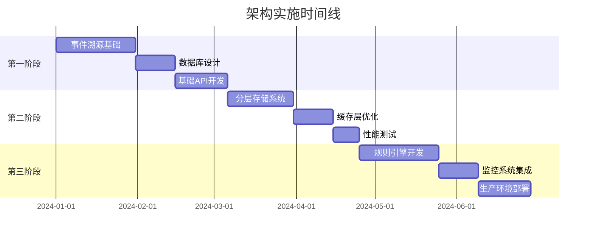
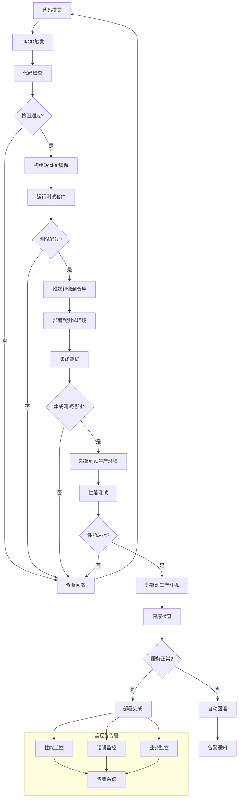
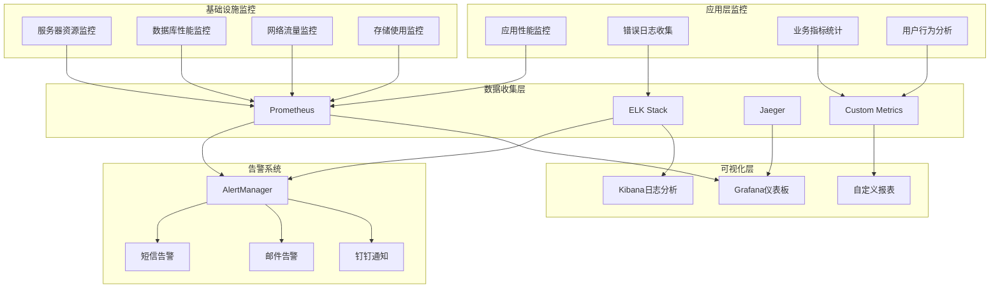
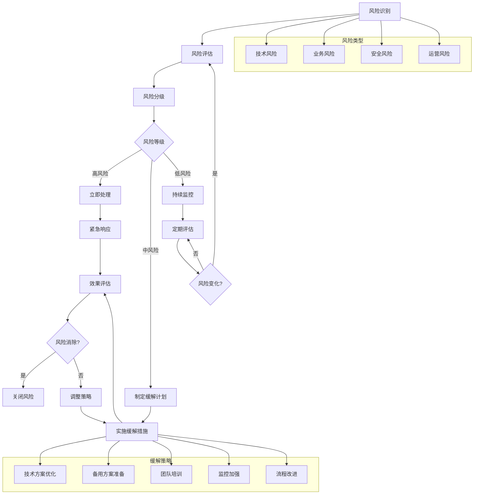
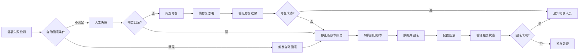

# Immortality架构实施计划

## 实施概览

本实施计划将新架构的部署分为三个阶段，每个阶段都有明确的目标、交付物和成功指标。


```mermaid
gantt
    title 架构实施时间线
    dateFormat  YYYY-MM-DD
    section 第一阶段
    事件溯源基础        :a1, 2024-01-01, 30d
    数据库设计         :a2, after a1, 15d
    基础API开发        :a3, after a2, 20d
    
    section 第二阶段
    分层存储系统        :b1, after a3, 25d
    缓存层优化         :b2, after b1, 15d
    性能测试          :b3, after b2, 10d
    
    section 第三阶段
    规则引擎开发        :c1, after b3, 30d
    监控系统集成        :c2, after c1, 15d
    生产环境部署        :c3, after c2, 20d
```

## 第一阶段：事件溯源基础架构 (30天)

### 目标
建立事件驱动的核心架构，实现基础的事件存储和状态重建功能。

### 核心任务

#### 1. 事件存储系统设计

**数据库表结构**:
```sql
-- 事件存储表
CREATE TABLE game_events (
    id UUID PRIMARY KEY DEFAULT gen_random_uuid(),
    player_id UUID NOT NULL,
    event_type VARCHAR(100) NOT NULL,
    event_data JSONB NOT NULL,
    schema_version VARCHAR(10) NOT NULL DEFAULT '1.0',
    event_hash VARCHAR(64) NOT NULL,
    created_at TIMESTAMP WITH TIME ZONE DEFAULT NOW(),
    sequence_number BIGSERIAL
);

-- 玩家状态快照表
CREATE TABLE player_snapshots (
    id UUID PRIMARY KEY DEFAULT gen_random_uuid(),
    player_id UUID NOT NULL,
    snapshot_data JSONB NOT NULL,
    event_sequence BIGINT NOT NULL,
    created_at TIMESTAMP WITH TIME ZONE DEFAULT NOW()
);

-- 索引优化
CREATE INDEX idx_events_player_time ON game_events(player_id, created_at);
CREATE INDEX idx_events_type ON game_events(event_type);
CREATE INDEX idx_snapshots_player ON player_snapshots(player_id);
```

#### 2. 事件处理服务

**核心代码实现**:
```csharp
// 事件服务类
using System.Security.Cryptography;
using System.Text;
using System.Text.Json;
using Npgsql;
using StackExchange.Redis;

public class EventService
{
    private readonly NpgsqlConnection _db;
    private readonly IConnectionMultiplexer _cache;

    public EventService(NpgsqlConnection database, IConnectionMultiplexer redis)
    {
        _db = database;
        _cache = redis;
    }

    // 记录事件
    public async Task<GameEvent> RecordEventAsync(Guid playerId, string eventType, JsonDocument eventData)
    {
        var eventRecord = new GameEvent
        {
            Id = Guid.NewGuid(),
            PlayerId = playerId,
            EventType = eventType,
            EventData = eventData,
            SchemaVersion = "1.0",
            EventHash = GenerateHash(eventData),
            CreatedAt = DateTime.UtcNow
        };

        // 存储到数据库
        await using var cmd = _db.CreateCommand();
        cmd.CommandText = @"
            INSERT INTO game_events (id, player_id, event_type, event_data, schema_version, event_hash, created_at) 
            VALUES (@id, @playerId, @eventType, @eventData, @schemaVersion, @eventHash, @createdAt)";
        cmd.Parameters.AddWithValue("@id", eventRecord.Id);
        cmd.Parameters.AddWithValue("@playerId", eventRecord.PlayerId);
        cmd.Parameters.AddWithValue("@eventType", eventRecord.EventType);
        cmd.Parameters.AddWithValue("@eventData", eventRecord.EventData.RootElement.GetRawText());
        cmd.Parameters.AddWithValue("@schemaVersion", eventRecord.SchemaVersion);
        cmd.Parameters.AddWithValue("@eventHash", eventRecord.EventHash);
        cmd.Parameters.AddWithValue("@createdAt", eventRecord.CreatedAt);
        await cmd.ExecuteNonQueryAsync();

        // 更新缓存
        await UpdatePlayerCacheAsync(playerId, eventRecord);
        
        return eventRecord;
    }

    // 重建玩家状态
    public async Task<PlayerState> RebuildPlayerStateAsync(Guid playerId, DateTime? toTimestamp = null)
    {
        await using var cmd = _db.CreateCommand();
        if (toTimestamp.HasValue)
        {
            cmd.CommandText = @"
                SELECT * FROM game_events 
                WHERE player_id = @playerId AND created_at <= @toTimestamp 
                ORDER BY sequence_number";
            cmd.Parameters.AddWithValue("@playerId", playerId);
            cmd.Parameters.AddWithValue("@toTimestamp", toTimestamp.Value);
        }
        else
        {
            cmd.CommandText = @"
                SELECT * FROM game_events 
                WHERE player_id = @playerId 
                ORDER BY sequence_number";
            cmd.Parameters.AddWithValue("@playerId", playerId);
        }

        var events = new List<GameEvent>();
        await using var reader = await cmd.ExecuteReaderAsync();
        while (await reader.ReadAsync())
        {
            events.Add(MapToGameEvent(reader));
        }

        var playerState = GetInitialState();
        foreach (var evt in events)
        {
            playerState = ApplyEvent(playerState, evt);
        }
        
        return playerState;
    }

    // 应用事件到状态
    private PlayerState ApplyEvent(PlayerState state, GameEvent evt)
    {
        return evt.EventType switch
        {
            "PLAYER_CREATED" => state with
            {
                // 合并事件数据到状态
                PlayerId = evt.PlayerId,
            },
            "CULTIVATION_PROGRESS" => state with
            {
                Experience = state.Experience + evt.EventData.RootElement.GetProperty("experience").GetInt32(),
                Level = evt.EventData.RootElement.TryGetProperty("level", out var level) 
                    ? level.GetInt32() 
                    : state.Level
            },
            "ITEM_ACQUIRED" => state with
            {
                Inventory = state.Inventory.Append(evt.EventData.RootElement.GetProperty("item").GetString()).ToList()
            },
            _ => state
        };
    }

    private string GenerateHash(JsonDocument data)
    {
        var json = data.RootElement.GetRawText();
        var hashBytes = SHA256.HashData(Encoding.UTF8.GetBytes(json));
        return Convert.ToHexString(hashBytes).ToLowerInvariant();
    }

    private PlayerState GetInitialState() => new()
    {
        PlayerId = Guid.Empty,
        Level = 1,
        Experience = 0,
        Realm = "凡人",
        Inventory = new List<string>()
    };

    private async Task UpdatePlayerCacheAsync(Guid playerId, GameEvent evt)
    {
        var db = _cache.GetDatabase();
        var cacheKey = $"player:{playerId}:events";
        await db.ListRightPushAsync(cacheKey, JsonSerializer.Serialize(evt));
    }

    private GameEvent MapToGameEvent(NpgsqlDataReader reader)
    {
        return new GameEvent
        {
            Id = reader.GetGuid(reader.GetOrdinal("id")),
            PlayerId = reader.GetGuid(reader.GetOrdinal("player_id")),
            EventType = reader.GetString(reader.GetOrdinal("event_type")),
            EventData = JsonDocument.Parse(reader.GetString(reader.GetOrdinal("event_data"))),
            SchemaVersion = reader.GetString(reader.GetOrdinal("schema_version")),
            EventHash = reader.GetString(reader.GetOrdinal("event_hash")),
            CreatedAt = reader.GetDateTime(reader.GetOrdinal("created_at"))
        };
    }
}
```

#### 3. API接口开发

**ASP.NET Core 控制器设计**:
```csharp
using Microsoft.AspNetCore.Mvc;
using System.Text.Json;

[ApiController]
[Route("api/players/{playerId:guid}")]
public class PlayerEventController : ControllerBase
{
    private readonly EventService _eventService;

    public PlayerEventController(EventService eventService)
    {
        _eventService = eventService;
    }

    // 玩家状态API
    [HttpGet("state")]
    public async Task<IActionResult> GetPlayerState(Guid playerId, [FromQuery] DateTime? timestamp)
    {
        try
        {
            var state = await _eventService.RebuildPlayerStateAsync(playerId, timestamp);
            return Ok(new { success = true, data = state });
        }
        catch (Exception error)
        {
            return StatusCode(500, new { success = false, error = error.Message });
        }
    }

    // 事件记录API
    [HttpPost("events")]
    public async Task<IActionResult> RecordEvent(Guid playerId, [FromBody] RecordEventRequest request)
    {
        try
        {
            var eventData = JsonDocument.Parse(request.EventData.GetRawText());
            var evt = await _eventService.RecordEventAsync(playerId, request.EventType, eventData);
            return Ok(new { success = true, data = evt });
        }
        catch (Exception error)
        {
            return StatusCode(500, new { success = false, error = error.Message });
        }
    }
}

public record RecordEventRequest(string EventType, JsonDocument EventData);
```

### 交付物
- [x] 事件存储数据库设计
- [x] 事件处理服务代码
- [x] 基础API接口
- [x] 单元测试用例
- [x] 技术文档

### 成功指标
- 事件写入性能 > 1000 TPS
- 状态重建时间 < 100ms (1000个事件)
- API响应时间 < 50ms
- 测试覆盖率 > 80%

## 第二阶段：分层存储优化 (25天)

### 目标
实现智能的数据分层存储，优化存储成本和查询性能。

### 核心任务

#### 1. 存储层架构

**存储策略配置**:
```csharp
// 存储策略配置
public class StorageConfig
{
    public StorageTier HotTier { get; set; } = new()
    {
        Retention = TimeSpan.FromDays(30),
        Storage = "redis",
        Compression = false,
        Indexing = "full"
    };

    public StorageTier WarmTier { get; set; } = new()
    {
        Retention = TimeSpan.FromDays(365 * 5),
        Storage = "postgresql",
        Compression = "gzip",
        Indexing = "selective"
    };

    public StorageTier ColdTier { get; set; } = new()
    {
        Retention = TimeSpan.MaxValue, // permanent
        Storage = "file_system",
        Compression = "lz4",
        Indexing = "minimal"
    };
}

public class StorageTier
{
    public TimeSpan Retention { get; set; }
    public string Storage { get; set; } = string.Empty;
    public bool Compression { get; set; }
    public string Indexing { get; set; } = string.Empty;
}
```

#### 2. 数据迁移服务

```csharp
using Cronos;
using StackExchange.Redis;

public class DataMigrationService
{
    private readonly StorageConfig _config;
    private readonly IConnectionMultiplexer _redis;
    private readonly NpgsqlConnection _db;
    private Timer? _scheduler;

    public DataMigrationService(StorageConfig config, IConnectionMultiplexer redis, NpgsqlConnection db)
    {
        _config = config;
        _redis = redis;
        _db = db;
    }

    public void Start()
    {
        // 每天凌晨2点执行迁移
        var cron = CronExpression.Parse("0 2 * * *");
        var next = cron.GetNextOccurrence(DateTimeOffset.UtcNow, TimeZoneInfo.Utc);
        if (next.HasValue)
        {
            var delay = next.Value - DateTimeOffset.UtcNow;
            _scheduler = new Timer(async _ => await RunMigrationAsync(), null, delay, TimeSpan.FromDays(1));
        }
    }

    public async Task RunMigrationAsync()
    {
        // 热数据到温数据迁移
        await MigrateHotToWarmAsync();
        
        // 温数据到冷数据迁移
        await MigrateWarmToColdAsync();
        
        // 清理过期数据
        await CleanupExpiredDataAsync();
    }

    public async Task MigrateHotToWarmAsync()
    {
        var cutoffDate = DateTime.UtcNow - _config.HotTier.Retention;
        var db = _redis.GetDatabase();
        
        var server = _redis.GetServer(_redis.GetEndPoints()[0]);
        var keys = server.KeysAsync(pattern: "player:*");
        
        await foreach (var key in keys)
        {
            var hashEntries = await db.HashGetAllAsync(key);
            var data = hashEntries.ToStringDictionary();
            
            if (data.TryGetValue("lastAccess", out var lastAccessStr) 
                && DateTime.TryParse(lastAccessStr, out var lastAccess) 
                && lastAccess < cutoffDate)
            {
                await MoveToWarmStorageAsync(key, data);
                await db.KeyDeleteAsync(key);
            }
        }
    }

    private async Task MoveToWarmStorageAsync(RedisKey key, Dictionary<string, string> data)
    {
        await using var cmd = _db.CreateCommand();
        cmd.CommandText = @"
            INSERT INTO archived_player_data (key, data, archived_at) 
            VALUES (@key, @data, @archivedAt)";
        cmd.Parameters.AddWithValue("@key", key.ToString());
        cmd.Parameters.AddWithValue("@data", JsonSerializer.Serialize(data));
        cmd.Parameters.AddWithValue("@archivedAt", DateTime.UtcNow);
        await cmd.ExecuteNonQueryAsync();
    }

    private async Task MigrateWarmToColdAsync()
    {
        // 温数据到冷数据迁移逻辑
        var cutoffDate = DateTime.UtcNow - _config.WarmTier.Retention;
        await using var cmd = _db.CreateCommand();
        cmd.CommandText = @"
            SELECT * FROM archived_player_data WHERE archived_at <= @cutoffDate";
        cmd.Parameters.AddWithValue("@cutoffDate", cutoffDate);
        
        await using var reader = await cmd.ExecuteReaderAsync();
        while (await reader.ReadAsync())
        {
            // 写入文件系统冷存储
            var archivePath = Path.Combine("/data/archive/events", $"{reader.GetGuid(0)}.json.gz");
            await File.WriteAllTextAsync(archivePath, reader.GetString(1));
        }
    }

    private async Task CleanupExpiredDataAsync()
    {
        // 清理过期数据
        await using var cmd = _db.CreateCommand();
        cmd.CommandText = "DELETE FROM archived_player_data WHERE archived_at <= @cutoffDate";
        cmd.Parameters.AddWithValue("@cutoffDate", DateTime.UtcNow - _config.WarmTier.Retention);
        await cmd.ExecuteNonQueryAsync();
    }
}
```

#### 3. 缓存优化

**多级缓存策略**:
```csharp
using Microsoft.Extensions.Caching.Memory;
using StackExchange.Redis;

public class CacheManager
{
    private readonly IConnectionMultiplexer _redis;
    private readonly IMemoryCache _memory;

    public CacheManager(IConnectionMultiplexer redis, IMemoryCache memory)
    {
        _redis = redis;
        _memory = memory;
    }

    public async Task<string?> GetAsync(string key)
    {
        // L1: 内存缓存
        if (_memory.TryGetValue(key, out string? value))
            return value;
        
        // L2: Redis缓存
        var redisValue = await _redis.GetDatabase().StringGetAsync(key);
        if (redisValue.HasValue)
        {
            _memory.Set(key, redisValue.ToString(), TimeSpan.FromMinutes(5)); // 5分钟
            return redisValue.ToString();
        }
        
        return null;
    }

    public async Task SetAsync(string key, string value, CacheOptions? options = null)
    {
        options ??= new CacheOptions();
        
        // 同时更新两级缓存
        _memory.Set(key, value, TimeSpan.FromSeconds(options.MemoryTtl ?? 300));
        await _redis.GetDatabase().StringSetAsync(key, value, TimeSpan.FromSeconds(options.RedisTtl ?? 3600));
    }
}

public record CacheOptions(int? MemoryTtl = null, int? RedisTtl = null);
```

### 交付物
- [x] 分层存储架构设计
- [x] 数据迁移服务
- [x] 缓存优化方案
- [x] 性能测试报告
- [x] 存储成本分析

### 成功指标
- 存储成本降低 > 70%
- 热数据查询延迟 < 10ms
- 温数据查询延迟 < 100ms
- 数据迁移成功率 > 99.9%

## 第三阶段：规则引擎与监控 (30天)

### 目标
实现灵活的游戏规则配置系统和完善的监控体系。

### 核心任务

#### 1. 规则引擎开发

**规则执行引擎**:
```csharp
using System.Collections.Concurrent;

public class RuleEngine
{
    private readonly ConcurrentDictionary<string, GameRule> _rules = new();
    private readonly ConcurrentDictionary<string, Func<GameContext, bool>> _triggers = new();

    // 注册规则
    public void RegisterRule(RuleConfig ruleConfig)
    {
        var rule = new GameRule
        {
            Id = ruleConfig.Id,
            Name = ruleConfig.Name,
            Trigger = CompileTrigger(ruleConfig.Trigger),
            Conditions = ruleConfig.Conditions.Select(CompileCondition).ToList(),
            Effects = ruleConfig.Effects.Select(CompileEffect).ToList()
        };
        
        _rules[rule.Id] = rule;
    }

    // 执行规则检查
    public async Task<List<RuleExecutionResult>> ExecuteRulesAsync(GameContext context)
    {
        var results = new List<RuleExecutionResult>();
        
        foreach (var rule in _rules.Values)
        {
            if (rule.Trigger(context))
            {
                var conditionsMet = rule.Conditions.All(c => c(context));
                
                if (conditionsMet)
                {
                    var effects = new List<Effect>();
                    foreach (var effect in rule.Effects)
                    {
                        var effectResult = await effect(context);
                        effects.Add(effectResult);
                    }
                    results.Add(new RuleExecutionResult(rule.Id, effects));
                }
            }
        }
        
        return results;
    }

    // 编译触发器
    private Func<GameContext, bool> CompileTrigger(TriggerConfig triggerConfig)
    {
        return triggerConfig.Type switch
        {
            "experience_threshold" => context => context.Experience >= triggerConfig.Value,
            "kill_count" => context => context.KillCount >= triggerConfig.Value,
            _ => throw new ArgumentException($"Unknown trigger type: {triggerConfig.Type}")
        };
    }

    private Func<GameContext, bool> CompileCondition(ConditionConfig config)
    {
        // 编译条件
        return context => true; // 简化实现
    }

    private Func<GameContext, Task<Effect>> CompileEffect(EffectConfig config)
    {
        // 编译效果
        return context => Task.FromResult(new Effect(config.Type, config.Value));
    }
}
```

#### 2. 监控系统集成

**性能监控**:
```csharp
using Prometheus;
using Microsoft.AspNetCore.Mvc;

// 定义指标
public static class MetricsRegistry
{
    public static readonly Histogram HttpRequestDuration = Metrics.CreateHistogram(
        "http_request_duration_seconds",
        "Duration of HTTP requests in seconds",
        new HistogramConfiguration
        {
            LabelNames = new[] { "method", "route", "status" }
        });

    public static readonly Counter EventProcessingRate = Metrics.CreateCounter(
        "events_processed_total",
        "Total number of events processed",
        new CounterConfiguration
        {
            LabelNames = new[] { "event_type" }
        });
}

// ASP.NET Core 中间件
public class PrometheusMiddleware
{
    private readonly RequestDelegate _next;

    public PrometheusMiddleware(RequestDelegate next)
    {
        _next = next;
    }

    public async Task InvokeAsync(HttpContext context)
    {
        var start = DateTime.UtcNow;
        
        context.Response.OnCompleted(() =>
        {
            var duration = (DateTime.UtcNow - start).TotalSeconds;
            var route = context.Request.Path.Value ?? context.Request.Path.ToString();
            MetricsRegistry.HttpRequestDuration
                .WithLabels(context.Request.Method, route, context.Response.StatusCode.ToString())
                .Observe(duration);
            
            return Task.CompletedTask;
        });
        
        await _next(context);
    }
}

// 注册中间件
// app.UseMiddleware<PrometheusMiddleware>();
```

**业务监控**:
```csharp
using Prometheus;

public class BusinessMetrics
{
    private readonly Gauge _playersOnline = Metrics.CreateGauge(
        "players_online",
        "Number of players currently online");

    private readonly Counter _cultivationEvents = Metrics.CreateCounter(
        "cultivation_events_total",
        "Total cultivation events",
        new CounterConfiguration
        {
            LabelNames = new[] { "level_range" }
        });

    public void UpdatePlayerCount(int count)
    {
        _playersOnline.Set(count);
    }

    public void RecordCultivationEvent(int level)
    {
        var range = GetLevelRange(level);
        _cultivationEvents.WithLabels(range).Inc();
    }

    private string GetLevelRange(int level)
    {
        return level switch
        {
            <= 10 => "0-10",
            <= 30 => "11-30",
            <= 50 => "31-50",
            <= 70 => "51-70",
            <= 90 => "71-90",
            _ => "91+"
        };
    }
}
```

### 交付物
- [x] 规则引擎核心代码
- [x] 规则配置管理界面
- [x] 监控指标定义
- [x] 告警规则配置
- [x] 部署脚本

### 成功指标
- 规则执行延迟 < 5ms
- 监控数据收集率 > 99%
- 告警响应时间 < 1分钟
- 系统可用性 > 99.9%

## 部署策略

### 部署流程图


```mermaid
flowchart TD
    A[代码提交] --> B[CI/CD触发]
    B --> C[代码检查]
    C --> D{检查通过?}
    D -->|否| E[修复问题]
    E --> A
    D -->|是| F[构建Docker镜像]
    F --> G[运行测试套件]
    G --> H{测试通过?}
    H -->|否| E
    H -->|是| I[推送镜像到仓库]
    I --> J[部署到测试环境]
    J --> K[集成测试]
    K --> L{集成测试通过?}
    L -->|否| E
    L -->|是| M[部署到预生产环境]
    M --> N[性能测试]
    N --> O{性能达标?}
    O -->|否| E
    O -->|是| P[部署到生产环境]
    P --> Q[健康检查]
    Q --> R{服务正常?}
    R -->|否| S[自动回滚]
    R -->|是| T[部署完成]
    S --> U[告警通知]
    
    subgraph "监控与告警"
        V[性能监控]
        W[错误监控]
        X[业务监控]
        Y[告警系统]
    end
    
    T --> V
    T --> W
    T --> X
    V --> Y
    W --> Y
    X --> Y
```

### 监控架构图


```mermaid
flowchart TB
    subgraph "应用层监控"
        A1[应用性能监控]
        A2[错误日志收集]
        A3[业务指标统计]
        A4[用户行为分析]
    end
    
    subgraph "基础设施监控"
        B1[服务器资源监控]
        B2[数据库性能监控]
        B3[网络流量监控]
        B4[存储使用监控]
    end
    
    subgraph "数据收集层"
        C1[Prometheus]
        C2[ELK Stack]
        C3[Jaeger]
        C4[Custom Metrics]
    end
    
    subgraph "可视化层"
        D1[Grafana仪表板]
        D2[Kibana日志分析]
        D3[自定义报表]
    end
    
    subgraph "告警系统"
        E1[AlertManager]
        E2[钉钉通知]
        E3[邮件告警]
        E4[短信告警]
    end
    
    A1 --> C1
    A2 --> C2
    A3 --> C4
    A4 --> C4
    
    B1 --> C1
    B2 --> C1
    B3 --> C1
    B4 --> C1
    
    C1 --> D1
    C2 --> D2
    C3 --> D1
    C4 --> D3
    
    C1 --> E1
    C2 --> E1
    E1 --> E2
    E1 --> E3
    E1 --> E4
```

### 环境准备

**开发环境**:
```yaml
# docker-compose.dev.yml
version: '3.8'
services:
  postgres:
    image: postgres:15
    environment:
      POSTGRES_DB: immortality_dev
      POSTGRES_USER: dev_user
      POSTGRES_PASSWORD: dev_pass
    ports:
      - "5432:5432"
    volumes:
      - postgres_data:/var/lib/postgresql/data

  redis:
    image: redis:7-alpine
    ports:
      - "6379:6379"
    command: redis-server --appendonly yes
    volumes:
      - redis_data:/data

  app:
    build: .
    ports:
      - "5000:5000"
    environment:
      ASPNETCORE_ENVIRONMENT: Development
      ConnectionStrings__DefaultConnection: Host=postgres;Database=immortality_dev;Username=dev_user;Password=dev_pass
      ConnectionStrings__Redis: redis:6379
    depends_on:
      - postgres
      - redis
    volumes:
      - .:/app
      - /app/bin
      - /app/obj

volumes:
  postgres_data:
  redis_data:
```

**生产环境**:
```yaml
# docker-compose.prod.yml
version: '3.8'
services:
  nginx:
    image: nginx:alpine
    ports:
      - "80:80"
      - "443:443"
    volumes:
      - ./nginx.conf:/etc/nginx/nginx.conf
      - ./ssl:/etc/nginx/ssl
    depends_on:
      - app

  app:
    image: immortality:latest
    deploy:
      replicas: 3
    environment:
      ASPNETCORE_ENVIRONMENT: Production
      ConnectionStrings__DefaultConnection: ${DATABASE_URL}
      ConnectionStrings__Redis: ${REDIS_URL}
    depends_on:
      - postgres
      - redis

  postgres:
    image: postgres:15
    environment:
      POSTGRES_DB: ${POSTGRES_DB}
      POSTGRES_USER: ${POSTGRES_USER}
      POSTGRES_PASSWORD: ${POSTGRES_PASSWORD}
    volumes:
      - postgres_data:/var/lib/postgresql/data
      - ./backups:/backups

  redis:
    image: redis:7-alpine
    command: redis-server --appendonly yes --requirepass ${REDIS_PASSWORD}
    volumes:
      - redis_data:/data

  prometheus:
    image: prom/prometheus
    ports:
      - "9090:9090"
    volumes:
      - ./prometheus.yml:/etc/prometheus/prometheus.yml

  grafana:
    image: grafana/grafana
    ports:
      - "3001:3000"
    environment:
      GF_SECURITY_ADMIN_PASSWORD: ${GRAFANA_PASSWORD}
    volumes:
      - grafana_data:/var/lib/grafana

volumes:
  postgres_data:
  redis_data:
  grafana_data:
```

### CI/CD流程

```yaml
# .github/workflows/deploy.yml
name: Deploy to Production

on:
  push:
    branches: [main]

jobs:
  test:
    runs-on: ubuntu-latest
    steps:
      - uses: actions/checkout@v3
      - uses: actions/setup-dotnet@v3
        with:
          dotnet-version: '8.0'
      - run: dotnet restore
      - run: dotnet test --no-restore
      - run: dotnet format --verify-no-changes

  build:
    needs: test
    runs-on: ubuntu-latest
    steps:
      - uses: actions/checkout@v3
      - name: Build Docker image
        run: |
          docker build -t immortality:${{ github.sha }} .
          docker tag immortality:${{ github.sha }} immortality:latest
      - name: Push to registry
        run: |
          echo ${{ secrets.DOCKER_PASSWORD }} | docker login -u ${{ secrets.DOCKER_USERNAME }} --password-stdin
          docker push immortality:${{ github.sha }}
          docker push immortality:latest

  deploy:
    needs: build
    runs-on: ubuntu-latest
    steps:
      - name: Deploy to production
        run: |
          ssh ${{ secrets.PROD_USER }}@${{ secrets.PROD_HOST }} '
            cd /opt/immortality &&
            docker-compose -f docker-compose.prod.yml pull &&
            docker-compose -f docker-compose.prod.yml up -d
          '
```

## 风险管控

### 风险管控流程


```mermaid
flowchart TD
    A[风险识别] --> B[风险评估]
    B --> C[风险分级]
    C --> D{风险等级}
    
    D -->|高风险| E[立即处理]
    D -->|中风险| F[制定缓解计划]
    D -->|低风险| G[持续监控]
    
    E --> H[紧急响应]
    F --> I[实施缓解措施]
    G --> J[定期评估]
    
    H --> K[效果评估]
    I --> K
    J --> L{风险变化?}
    L -->|是| B
    L -->|否| J
    
    K --> M{风险消除?}
    M -->|是| N[关闭风险]
    M -->|否| O[调整策略]
    O --> I
    
    subgraph "风险类型"
        P1[技术风险]
        P2[业务风险]
        P3[安全风险]
        P4[运营风险]
    end
    
    A --> P1
    A --> P2
    A --> P3
    A --> P4
    
    subgraph "缓解策略"
        Q1[技术方案优化]
        Q2[备用方案准备]
        Q3[团队培训]
        Q4[监控加强]
        Q5[流程改进]
    end
    
    I --> Q1
    I --> Q2
    I --> Q3
    I --> Q4
    I --> Q5
```

### 回滚策略


```mermaid
flowchart LR
    A[部署失败检测] --> B{自动回滚条件}
    B -->|满足| C[触发自动回滚]
    B -->|不满足| D[人工决策]
    
    C --> E[停止新版本服务]
    D --> F{需要回滚?}
    F -->|是| E
    F -->|否| G[问题修复]
    
    E --> H[切换到旧版本]
    H --> I[数据库回滚]
    I --> J[配置回滚]
    J --> K[验证服务状态]
    K --> L{回滚成功?}
    L -->|是| M[通知相关人员]
    L -->|否| N[紧急处理]
    
    G --> O[热修复部署]
    O --> P[验证修复效果]
    P --> Q{修复成功?}
    Q -->|是| M
    Q -->|否| E
```

### 数据安全
- 定期数据备份
- 加密传输和存储
- 访问权限控制
- 审计日志记录

### 性能保障
- 负载测试验证
- 容量规划
- 自动扩缩容
- 性能监控告警

## 总结

本实施计划通过三个阶段的渐进式部署，确保新架构的平稳上线。每个阶段都有明确的目标和成功指标，同时包含了完整的技术实现细节和部署策略。通过这种方式，我们能够在控制风险的同时，逐步实现架构的现代化升级。