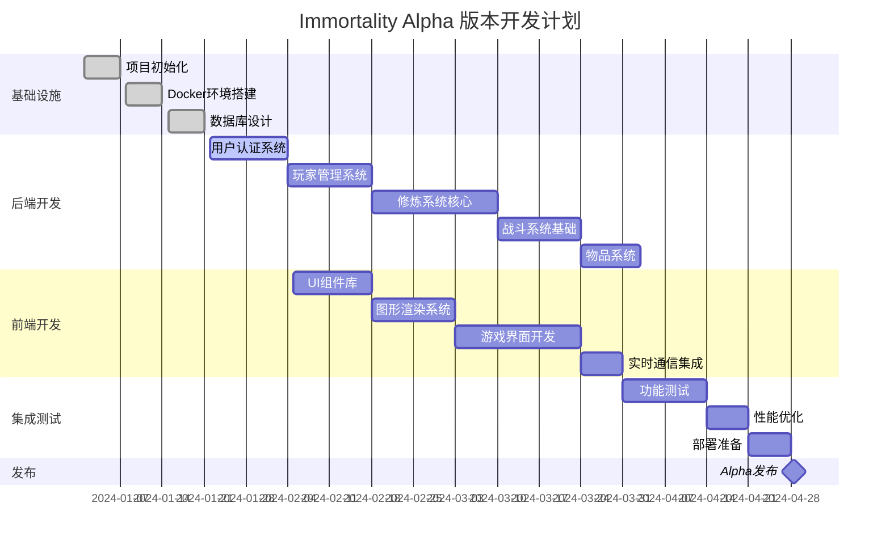

# 项目管理文档 - Alpha 版本开发计划

## 概述

本文档详细规划了Immortality修仙游戏Alpha版本的开发里程碑、交付计划、资源分配和风险管理策略。Alpha版本专注于核心游戏机制的实现和技术架构的验证，为后续版本奠定坚实基础。

## 🎯 **Alpha 版本目标**

### 核心目标
- **技术架构验证**: 验证事件溯源 + 微服务架构的可行性
- **核心玩法实现**: 实现修炼、战斗、物品系统的基础功能
- **轻量化图形**: 建立SVG + Canvas的图形渲染体系
- **实时通信**: 实现WebSocket实时数据同步
- **性能基准**: 建立性能监控和优化基准

### 功能范围

#### ✅ **包含功能**
- 用户注册、登录、角色创建
- 基础修炼系统（练气期 → 筑基期）
- 简单战斗系统（玩家 vs 怪物）
- 基础物品和装备系统
- 轻量化图形界面（SVG图标 + 简单动画）
- 实时状态同步
- 基础排行榜系统

#### ❌ **不包含功能**
- 复杂的社交系统
- 公会和团队功能
- 高级图形特效
- 移动端适配
- 支付系统
- 复杂的任务系统

## 📅 **开发时间线**

### 总体规划
- **开发周期**: 12周（3个月）
- **团队规模**: 1-2人（全栈开发）
- **发布目标**: 2024年Q2

### 详细里程碑



## 🏗️ **开发阶段详解**

### 第一阶段：基础设施搭建（第1-3周）

#### 目标
- 完成开发环境配置
- 建立CI/CD流水线
- 完成数据库设计和初始化

#### 交付物
- [x] Docker开发环境
- [x] 数据库架构设计
- [x] 项目脚手架
- [x] 代码质量工具配置

#### 验收标准
- 开发环境一键启动
- 数据库迁移脚本正常运行
- 代码提交触发自动化检查

### 第二阶段：核心后端开发（第4-8周）

#### 第4-5周：用户认证系统

**目标**: 实现完整的用户管理和认证机制

**任务清单**:
- [ ] JWT认证中间件
- [ ] 用户注册/登录API
- [ ] 密码加密和验证
- [ ] 会话管理
- [ ] 权限控制系统

**技术实现**:
```typescript
// 认证服务架构
@Module({
  imports: [
    JwtModule.register({
      secret: process.env.JWT_SECRET,
      signOptions: { expiresIn: '7d' },
    }),
    PassportModule,
  ],
  providers: [AuthService, JwtStrategy, LocalStrategy],
  controllers: [AuthController],
})
export class AuthModule {}
```

**验收标准**:
- 用户可以注册新账号
- 用户可以登录获取JWT令牌
- API接口正确验证用户权限
- 密码安全存储（bcrypt加密）

#### 第6周：玩家管理系统

**目标**: 实现玩家角色的创建和基础属性管理

**任务清单**:
- [ ] 玩家实体设计
- [ ] 角色创建API
- [ ] 属性计算系统
- [ ] 玩家状态管理
- [ ] 基础数据CRUD

**核心功能**:
```typescript
// 玩家实体
@Entity()
export class Player {
  @PrimaryGeneratedColumn('uuid')
  id: string;
  
  @Column()
  name: string;
  
  @Column({ default: 1 })
  level: number;
  
  @Column({ default: '练气期' })
  realm: string;
  
  @Column({ type: 'bigint', default: 0 })
  experience: number;
  
  // 基础属性
  @Column({ default: 10 })
  strength: number;
  
  @Column({ default: 10 })
  agility: number;
  
  @Column({ default: 10 })
  intelligence: number;
  
  @Column({ default: 10 })
  constitution: number;
}
```

**验收标准**:
- 用户可以创建游戏角色
- 角色属性正确计算和显示
- 支持多角色管理
- 角色数据持久化存储

#### 第7-8周：修炼系统核心

**目标**: 实现修炼机制的核心逻辑

**任务清单**:
- [ ] 修炼会话管理
- [ ] 经验值计算系统
- [ ] 境界突破逻辑
- [ ] 修炼技法系统
- [ ] 事件溯源集成

**修炼系统架构**:
```typescript
// 修炼服务
@Injectable()
export class CultivationService {
  async startCultivation(playerId: string, techniqueId: string): Promise<CultivationSession> {
    // 1. 验证玩家状态
    // 2. 检查能量消耗
    // 3. 创建修炼会话
    // 4. 发布修炼开始事件
  }
  
  async processCultivationProgress(sessionId: string): Promise<void> {
    // 1. 计算修炼进度
    // 2. 更新经验值
    // 3. 检查境界突破
    // 4. 发布进度事件
  }
}
```

**验收标准**:
- 玩家可以开始修炼会话
- 修炼进度实时更新
- 经验值正确累积
- 境界突破机制正常工作
- 修炼历史完整记录

#### 第9周：战斗系统基础

**目标**: 实现玩家与怪物的基础战斗

**任务清单**:
- [ ] 战斗会话管理
- [ ] 伤害计算系统
- [ ] 技能释放机制
- [ ] 战斗AI（简单）
- [ ] 战利品系统

**战斗系统设计**:
```typescript
// 战斗管理器
@Injectable()
export class CombatManager {
  async initiateCombat(challengerId: string, targetId: string): Promise<Combat> {
    // 1. 创建战斗实例
    // 2. 初始化参与者状态
    // 3. 开始回合制战斗
  }
  
  async executeAction(combatId: string, action: CombatAction): Promise<CombatResult> {
    // 1. 验证动作合法性
    // 2. 计算伤害/效果
    // 3. 更新战斗状态
    // 4. 检查战斗结束条件
  }
}
```

**验收标准**:
- 玩家可以挑战怪物
- 战斗流程完整运行
- 伤害计算准确
- 战斗结果正确记录
- 经验和奖励正常发放

#### 第10周：物品系统

**目标**: 实现基础的物品和装备管理

**任务清单**:
- [ ] 物品模板系统
- [ ] 背包管理
- [ ] 装备穿戴
- [ ] 物品使用
- [ ] 属性加成计算

**物品系统架构**:
```typescript
// 物品管理服务
@Injectable()
export class ItemService {
  async addItemToInventory(playerId: string, itemId: string, quantity: number): Promise<void> {
    // 1. 验证物品存在
    // 2. 检查背包空间
    // 3. 添加到背包
    // 4. 发布物品获得事件
  }
  
  async equipItem(playerId: string, itemId: string, slot: EquipmentSlot): Promise<void> {
    // 1. 验证装备条件
    // 2. 卸下当前装备
    // 3. 穿戴新装备
    // 4. 重新计算属性
  }
}
```

**验收标准**:
- 玩家可以获得和使用物品
- 装备系统正常工作
- 属性加成正确计算
- 背包管理功能完整

### 第三阶段：前端开发（第5-10周）

#### 第5-6周：UI组件库

**目标**: 建立统一的UI组件库

**任务清单**:
- [ ] 基础组件（Button, Input, Modal等）
- [ ] 游戏专用组件（ProgressBar, StatusPanel等）
- [ ] 图标系统（SVG图标库）
- [ ] 主题系统（暗色主题）
- [ ] 响应式布局

**组件示例**:
```tsx
// 修炼进度条组件
export const CultivationProgress: React.FC<{
  progress: number;
  realm: string;
  technique: string;
}> = ({ progress, realm, technique }) => {
  return (
    <div className="cultivation-progress">
      <div className="realm-indicator">
        <RealmIcon realm={realm} />
        <span>{realm}</span>
      </div>
      <ProgressBar 
        value={progress} 
        max={100}
        className="cultivation-bar"
        animated
      />
      <div className="technique-info">
        <TechniqueIcon technique={technique} />
        <span>{technique}</span>
      </div>
    </div>
  );
};
```

#### 第7-8周：图形渲染系统

**目标**: 实现轻量化图形渲染

**任务清单**:
- [ ] SVG图标系统
- [ ] Canvas渲染引擎
- [ ] 动画系统（Framer Motion）
- [ ] 粒子效果（简单）
- [ ] 图形资源管理

**图形系统架构**:
```tsx
// 图形渲染管理器
export class GraphicsManager {
  private svgRenderer: SVGRenderer;
  private canvasRenderer: CanvasRenderer;
  private animationController: AnimationController;
  
  renderPlayerAvatar(player: Player): React.ReactElement {
    return (
      <motion.div
        initial={{ scale: 0 }}
        animate={{ scale: 1 }}
        className="player-avatar"
      >
        <SVGAvatar 
          realm={player.realm}
          level={player.level}
          equipment={player.equipment}
        />
      </motion.div>
    );
  }
  
  renderCultivationEffect(technique: string): React.ReactElement {
    return (
      <Canvas>
        <ParticleSystem 
          type="cultivation"
          technique={technique}
          intensity={0.7}
        />
      </Canvas>
    );
  }
}
```

#### 第9-10周：游戏界面开发

**目标**: 实现完整的游戏用户界面

**主要界面**:
- [ ] 登录/注册界面
- [ ] 角色创建界面
- [ ] 主游戏界面
- [ ] 修炼界面
- [ ] 战斗界面
- [ ] 背包界面
- [ ] 排行榜界面

**界面布局**:
```tsx
// 主游戏界面
export const GameMainScreen: React.FC = () => {
  return (
    <div className="game-main">
      <Header>
        <PlayerStatus />
        <NavigationMenu />
      </Header>
      
      <main className="game-content">
        <aside className="left-panel">
          <PlayerAvatar />
          <QuickActions />
        </aside>
        
        <section className="center-area">
          <GameCanvas />
          <ActionPanel />
        </section>
        
        <aside className="right-panel">
          <ChatPanel />
          <SystemNotifications />
        </aside>
      </main>
      
      <Footer>
        <SystemStatus />
      </Footer>
    </div>
  );
};
```

#### 第11周：实时通信集成

**目标**: 集成WebSocket实时通信

**任务清单**:
- [ ] WebSocket连接管理
- [ ] 实时状态同步
- [ ] 事件广播系统
- [ ] 断线重连机制
- [ ] 消息队列处理

**WebSocket集成**:
```tsx
// WebSocket Hook
export const useWebSocket = () => {
  const [socket, setSocket] = useState<Socket | null>(null);
  const [connectionStatus, setConnectionStatus] = useState<'connecting' | 'connected' | 'disconnected'>('disconnected');
  
  useEffect(() => {
    const newSocket = io(process.env.VITE_WS_URL, {
      auth: {
        token: getAuthToken(),
      },
      transports: ['websocket'],
    });
    
    newSocket.on('connect', () => {
      setConnectionStatus('connected');
    });
    
    newSocket.on('player:status:update', (data) => {
      // 更新玩家状态
    });
    
    newSocket.on('cultivation:progress', (data) => {
      // 更新修炼进度
    });
    
    setSocket(newSocket);
    
    return () => {
      newSocket.close();
    };
  }, []);
  
  return { socket, connectionStatus };
};
```

### 第四阶段：集成测试与优化（第11-12周）

#### 第11周：功能测试

**目标**: 全面测试系统功能

**测试范围**:
- [ ] 单元测试（覆盖率 > 80%）
- [ ] 集成测试
- [ ] API测试
- [ ] 前端组件测试
- [ ] 端到端测试

**测试策略**:
```typescript
// 修炼系统集成测试
describe('Cultivation System Integration', () => {
  it('should complete full cultivation cycle', async () => {
    // 1. 创建测试玩家
    const player = await createTestPlayer();
    
    // 2. 开始修炼
    const session = await cultivationService.startCultivation(
      player.id, 
      'basic-qi-cultivation'
    );
    
    // 3. 模拟修炼进度
    await simulateCultivationProgress(session.id, 100);
    
    // 4. 验证结果
    const updatedPlayer = await playerService.findById(player.id);
    expect(updatedPlayer.experience).toBeGreaterThan(player.experience);
  });
});
```

#### 第12周：性能优化与部署准备

**目标**: 优化性能并准备生产部署

**优化任务**:
- [ ] 数据库查询优化
- [ ] 前端代码分割
- [ ] 图片资源优化
- [ ] 缓存策略优化
- [ ] 监控系统集成

**性能指标**:
- API响应时间 < 200ms
- 页面加载时间 < 3s
- 内存使用 < 512MB
- CPU使用率 < 70%

## 📊 **资源分配**

### 人力资源

| 角色 | 工作量 | 主要职责 |
|------|--------|----------|
| 全栈开发者 | 100% | 后端API开发、前端界面开发、系统集成 |
| 产品设计师 | 20% | UI/UX设计、游戏平衡性设计 |
| 测试工程师 | 30% | 功能测试、性能测试、自动化测试 |

### 技术资源

| 资源类型 | 配置 | 用途 |
|----------|------|------|
| 开发服务器 | 4核8GB | 开发环境部署 |
| 测试服务器 | 2核4GB | 测试环境部署 |
| 数据库服务器 | 2核4GB | PostgreSQL + EventStoreDB |
| 对象存储 | 100GB | 静态资源存储 |

## ⚠️ **风险管理**

### 技术风险

| 风险 | 概率 | 影响 | 缓解措施 |
|------|------|------|----------|
| EventStoreDB学习曲线陡峭 | 中 | 高 | 提前技术调研，准备降级方案 |
| WebSocket连接稳定性问题 | 中 | 中 | 实现断线重连，降级到HTTP轮询 |
| 性能不达标 | 低 | 高 | 早期性能测试，渐进式优化 |
| 第三方依赖问题 | 低 | 中 | 版本锁定，准备替代方案 |

### 进度风险

| 风险 | 概率 | 影响 | 缓解措施 |
|------|------|------|----------|
| 功能范围蔓延 | 高 | 高 | 严格控制功能范围，推迟到Beta版本 |
| 技术难点耗时过长 | 中 | 高 | 时间盒限制，准备简化方案 |
| 测试发现重大问题 | 中 | 中 | 早期集成测试，持续质量监控 |
| 人员变动 | 低 | 高 | 文档完善，知识共享 |

### 应急预案

1. **技术降级方案**
   - EventStoreDB → 传统关系型数据库
   - 复杂图形 → 简单UI组件
   - 实时通信 → 定时刷新

2. **功能裁剪方案**
   - 移除战斗系统 → 专注修炼系统
   - 简化物品系统 → 基础属性管理
   - 取消排行榜 → 个人进度追踪

3. **时间延期方案**
   - 延期2周：完成核心功能
   - 延期4周：包含所有计划功能
   - 延期6周：包含额外优化

## 📈 **成功指标**

### 技术指标
- [ ] 系统稳定运行7天无重大故障
- [ ] API响应时间95%分位数 < 200ms
- [ ] 前端页面加载时间 < 3秒
- [ ] 代码测试覆盖率 > 80%
- [ ] 数据库查询性能达标

### 功能指标
- [ ] 用户可以完成完整的注册-创角-修炼流程
- [ ] 修炼系统正常运行，支持境界突破
- [ ] 战斗系统基础功能完整
- [ ] 实时状态同步正常工作
- [ ] 物品和装备系统可用

### 用户体验指标
- [ ] 界面响应流畅，无明显卡顿
- [ ] 图形渲染效果符合预期
- [ ] 操作逻辑清晰易懂
- [ ] 错误处理友好
- [ ] 移动端基础适配

## 🚀 **后续版本规划**

### Beta 版本（Alpha + 3个月）
- 社交系统（好友、聊天）
- 公会系统
- 任务系统
- 更丰富的图形效果
- 移动端完整适配

### 正式版本（Beta + 6个月）
- 完整的游戏内容
- 支付系统
- 运营工具
- 数据分析系统
- 客服系统

### 长期规划
- 多服务器架构
- 跨平台客户端
- AI驱动的游戏内容
- 区块链集成（可选）

## 📋 **交付清单**

### Alpha版本交付物

#### 代码交付
- [ ] 前端代码库（React + TypeScript）
- [ ] 后端代码库（NestJS + TypeScript）
- [ ] 数据库迁移脚本
- [ ] Docker部署配置
- [ ] CI/CD流水线配置

#### 文档交付
- [x] 技术架构文档
- [x] API接口文档
- [x] 数据库设计文档
- [x] 开发环境配置指南
- [ ] 用户操作手册
- [ ] 运维部署手册

#### 测试交付
- [ ] 单元测试套件
- [ ] 集成测试套件
- [ ] 性能测试报告
- [ ] 安全测试报告
- [ ] 用户验收测试报告

#### 部署交付
- [ ] 生产环境部署包
- [ ] 监控配置
- [ ] 日志收集配置
- [ ] 备份恢复方案
- [ ] 运维手册

通过这个详细的项目管理计划，我们可以确保Alpha版本的顺利交付，为Immortality修仙游戏的后续发展奠定坚实的基础。